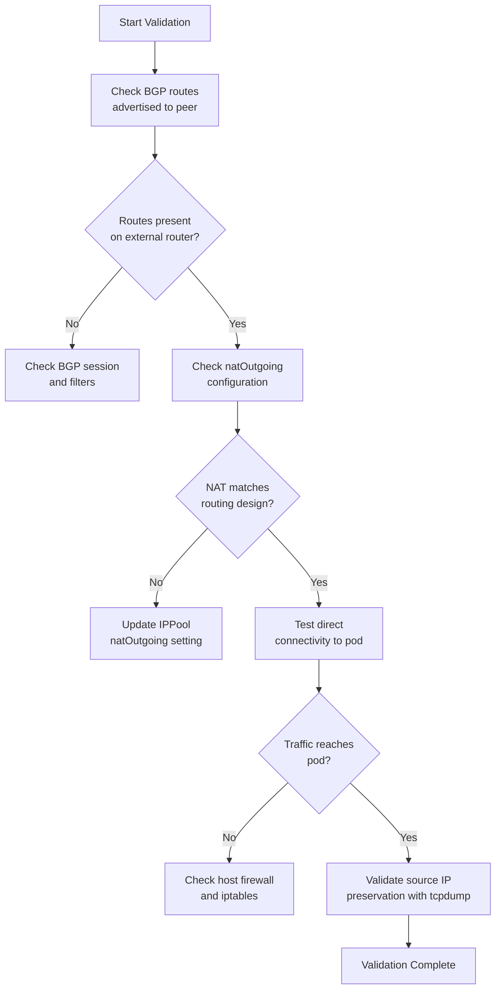

# How to Validate BGP to Workload Connectivity in Calico

Author: [nawazdhandala](https://github.com/nawazdhandala)

Tags: Calico, Kubernetes, BGP, Networking, Validation

Description: Validate that BGP-advertised pod routes enable direct workload connectivity by verifying route propagation, NAT behavior, and end-to-end packet flows.

---

## Introduction

Validating BGP-to-workload connectivity in Calico goes beyond confirming that BGP sessions are established. You need to verify that pod IP routes are correctly propagated to external routers, that Calico outbound NAT settings match your intended routing model, and that packets arriving at pods carry the correct source IP from external clients.

A common mistake is deploying workloads expecting directly routed pod egress, only to discover that `natOutgoing: true` on the IP pool is masquerading pod-initiated traffic to the node IP when the destination is outside all Calico IP pools. While this does not prevent inbound connectivity to pod IPs, it means external systems do not see the real pod IP for pod-initiated connections.

This guide covers the complete validation workflow for BGP-to-workload connectivity in Calico.

## Prerequisites

- Calico BGP mode with at least one external BGP peer
- Test workloads running in the cluster
- Access to the external BGP peer for route verification

## Validate Route Propagation

Check that pod block routes appear in the BGP routing table on the external peer:

```bash
# On Calico node: check what routes are being advertised

NODE_POD=$(kubectl get pod -n calico-system -l k8s-app=calico-node -o name | head -1)
kubectl exec -n calico-system ${NODE_POD} -c calico-node -- birdcl -s /run/calico/bird.ctl show protocols
kubectl exec -n calico-system ${NODE_POD} -c calico-node -- birdcl -s /run/calico/bird.ctl show route export <protocol_name>

# Check kernel route table on node
ip route | grep -E '^10\.'
```

## Validate NAT Configuration

Confirm NAT is disabled for the pod pool if you require direct, non-masqueraded pod egress to external networks:

```bash
calicoctl get ippools -o yaml | grep -A3 natOutgoing
```

Verify whether SNAT rules are applied to pod traffic:

```bash
iptables -t nat -L cali-nat-outgoing -n
```

For pods on this pool with `natOutgoing: false`, the output should show no MASQUERADE rules matching the pod CIDR as the source.

## End-to-End Packet Capture

Deploy a test pod and capture packets to verify source IP preservation:

```bash
kubectl run nettest --image=nicolaka/netshoot --restart=Never --command -- sh -c 'while true; do printf "HTTP/1.1 200 OK\r\nContent-Length: 2\r\n\r\nOK" | nc -l 80; done'
POD_IP=$(kubectl get pod nettest -o jsonpath='{.status.podIP}')

# Start packet capture on the pod
kubectl exec -it nettest -- tcpdump -i eth0 -n 'tcp port 80'
```

From an external host, connect to the pod:

```bash
curl http://${POD_IP}:80
```

In the tcpdump output, verify the source IP is the actual client IP, not a NAT address.

## Validate Return Path Routing

Verify that return traffic from the pod reaches the external client by checking routing on the pod:

```bash
kubectl exec -it nettest -- ip route
# Should show default route via the node gateway
# Pod's return packets go through node, then BGP routes guide them externally
```

## Connectivity Validation Checklist


```mermaid
flowchart TD
    A[Start Validation] --> B[Check BGP routes\nadvertised to peer]
    B --> C{Routes present\non external router?}
    C -- No --> D[Check BGP session\nand filters]
    C -- Yes --> E[Check natOutgoing\nconfiguration]
    E --> F{NAT matches\nrouting design?}
    F -- No --> G[Update IPPool\nnatOutgoing setting]
    F -- Yes --> H[Test direct\nconnectivity to pod]
    H --> I{Traffic reaches\npod?}
    I -- No --> J[Check host firewall\nand iptables]
    I -- Yes --> K[Validate source IP\npreservation with tcpdump]
    K --> L[Validation Complete]
```

## Conclusion

Validating BGP-to-workload connectivity requires checking route propagation, NAT configuration, and actual packet flows. Use `birdcl` on Calico nodes to verify what routes are advertised, confirm the relevant IP pool's `natOutgoing` setting matches your routed pod design, and use `tcpdump` inside pods to verify that external clients appear with their real IP addresses. These validations together confirm that your BGP-to-workload connectivity is functioning correctly.
