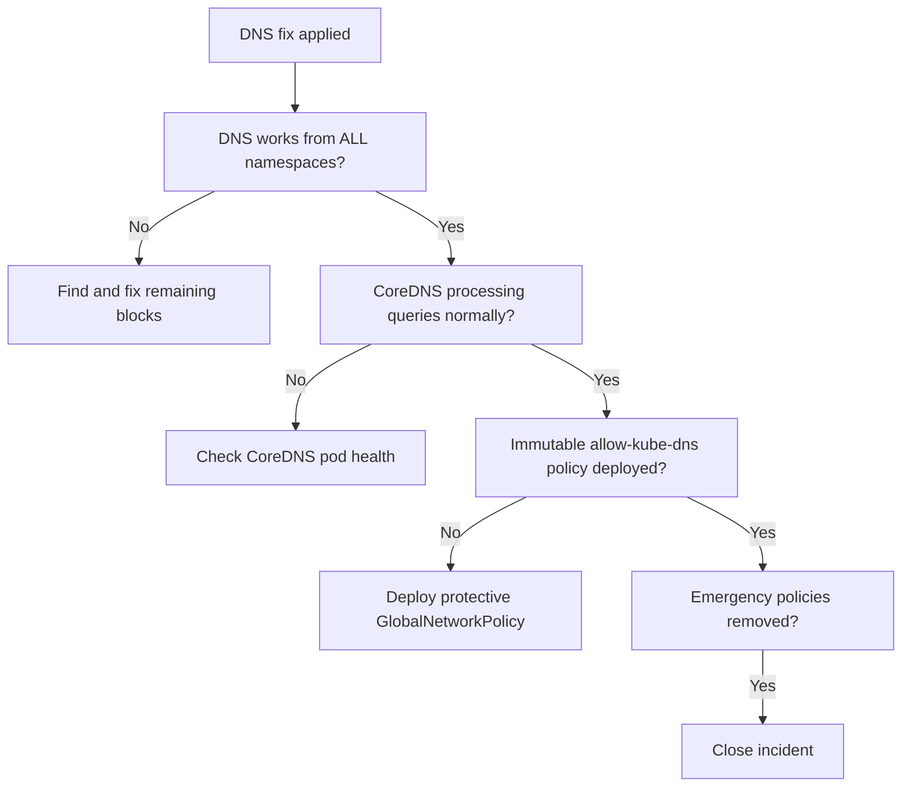

# How to Validate Resolution of Calico Blocking kube-dns

Author: [nawazdhandala](https://github.com/nawazdhandala)

Tags: Calico, Kubernetes, Networking, Troubleshooting

Description: Validate that Calico is no longer blocking kube-dns by testing DNS resolution from all namespaces and confirming CoreDNS metrics have returned to normal.

---

## Introduction

Validating that kube-dns is unblocked requires confirming DNS works from every namespace, not just the one where the test was run during the incident. Because this is a cluster-wide issue, validation must be cluster-wide.

## Symptoms

- DNS restored in default namespace but still failing in others
- CoreDNS metrics not returning to normal after fix

## Root Causes

- Emergency fix applied but permanent fix not in place
- Multiple policies were blocking, only one removed

## Diagnosis Steps

```bash
kubectl get networkpolicy -n kube-system | grep emergency
calicoctl get globalnetworkpolicy | grep emergency
```

## Solution

**Validation Step 1: DNS works from all namespaces**

```bash
FAILED=0
for NS in $(kubectl get namespaces -o jsonpath='{.items[*].metadata.name}'); do
  RESULT=$(kubectl run dns-val --image=busybox -n $NS --restart=Never --rm -i \
    --timeout=10s -- nslookup kubernetes.default 2>&1)
  if echo "$RESULT" | grep -q "Address"; then
    echo "PASS: $NS"
  else
    echo "FAIL: $NS"
    FAILED=1
  fi
done
echo "DNS validation: $([ $FAILED -eq 0 ] && echo PASSED || echo FAILED)"
```

**Validation Step 2: CoreDNS processing queries normally**

```bash
kubectl exec -n kube-system \
  $(kubectl get pods -n kube-system -l k8s-app=kube-dns -o name | head -1) \
  -- wget -qO- http://localhost:9153/metrics \
  | grep "coredns_dns_requests_total" | tail -5
# Expected: increasing counter (queries being processed)
```

**Validation Step 3: Immutable DNS allow policy deployed**

```bash
calicoctl get globalnetworkpolicy immutable-allow-kube-dns -o yaml 2>/dev/null \
  && echo "PASS: Protective policy is in place" \
  || echo "TODO: Deploy immutable-allow-kube-dns GlobalNetworkPolicy"
```

**Validation Step 4: Emergency policy removed after permanent fix**

```bash
kubectl get networkpolicy emergency-allow-dns-queries -n kube-system 2>/dev/null \
  && echo "TODO: Remove emergency policy after permanent fix" \
  || echo "PASS: No emergency policy"
```



## Prevention

- Run cluster-wide DNS test as part of incident closure checklist
- Deploy protective GlobalNetworkPolicy as a post-incident improvement
- Add cluster DNS availability to primary monitoring dashboard

## Conclusion

Validating kube-dns unblocking requires testing DNS from all namespaces, confirming CoreDNS metrics show active query processing, deploying the protective GlobalNetworkPolicy for future prevention, and removing emergency policies. All four conditions must pass before closing the incident.
