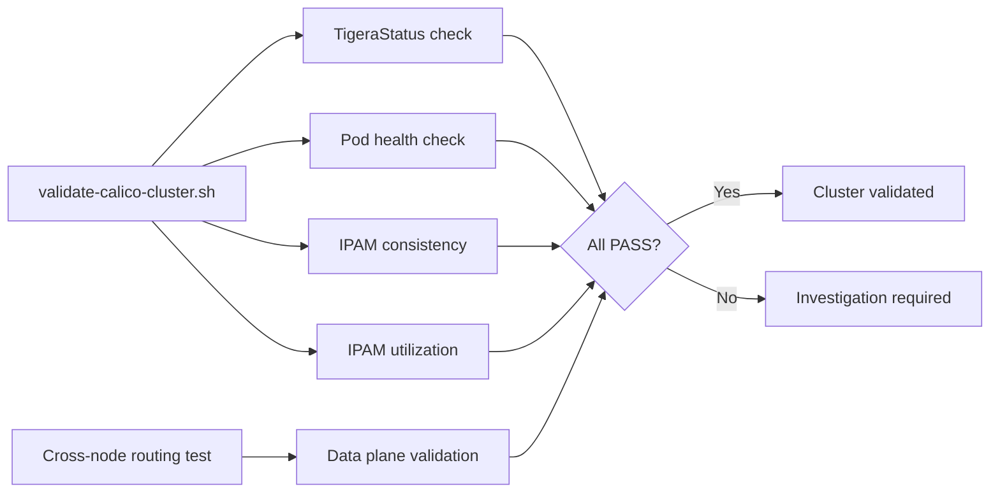

# How to Validate Calico Cluster Diagnostics

Author: [nawazdhandala](https://github.com/nawazdhandala)

Tags: Calico, Kubernetes, Networking, Diagnostics, Validation

Description: Validate cluster-wide Calico health by running comprehensive checks on TigeraStatus, IPAM consistency, cross-node connectivity, and policy enforcement to confirm the entire Calico installation is...

---

## Introduction

Validating Calico cluster health requires more than checking that pods are Running. A healthy-looking cluster can have silent failures: IPAM inconsistencies that cause future pod scheduling failures, BGP route propagation gaps that affect specific pod CIDR ranges, or policy count mismatches between kube-controllers and calicoctl. Comprehensive cluster validation catches these before they cause incidents.

## Cluster Validation Script

```bash
#!/bin/bash
# validate-calico-cluster.sh
PASS=0
FAIL=0
WARN=0

check_pass() { echo "PASS: $1"; PASS=$((PASS + 1)); }
check_fail() { echo "FAIL: $1"; FAIL=$((FAIL + 1)); }
check_warn() { echo "WARN: $1"; WARN=$((WARN + 1)); }

# 1. TigeraStatus
NOT_AVAILABLE=$(kubectl get tigerastatus --no-headers 2>/dev/null | \
  awk '$2 != "True"' | wc -l)
[ "${NOT_AVAILABLE}" -eq 0 ] && \
  check_pass "All TigeraStatus components Available" || \
  check_fail "${NOT_AVAILABLE} TigeraStatus components not Available"

# 2. calico-system pods
NOT_RUNNING=$(kubectl get pods -n calico-system --no-headers | \
  grep -cv "Running" || echo 0)
[ "${NOT_RUNNING}" -eq 0 ] && \
  check_pass "All calico-system pods Running" || \
  check_fail "${NOT_RUNNING} calico-system pods not Running"

# 3. IPAM consistency
IPAM_CHECK=$(calicoctl ipam check 2>&1)
if echo "${IPAM_CHECK}" | grep -q "IPAM is consistent"; then
  check_pass "IPAM consistent"
else
  check_fail "IPAM inconsistency detected"
fi

# 4. IPAM utilization
IPAM_USED=$(calicoctl ipam show 2>/dev/null | \
  grep -oP '\d+%' | head -1 | tr -d '%')
if [ -n "${IPAM_USED}" ] && [ "${IPAM_USED}" -gt 85 ]; then
  check_warn "IPAM utilization at ${IPAM_USED}% (>85%)"
else
  check_pass "IPAM utilization at ${IPAM_USED}%"
fi

echo ""
echo "Validation: ${PASS} passed, ${WARN} warnings, ${FAIL} failed"
[ "${FAIL}" -gt 0 ] && exit 1 || exit 0
```

## Validate Cross-Node Routing

```bash
# Deploy test pods on different nodes
kubectl run net-test-a --image=nicolaka/netshoot \
  --overrides='{"spec":{"nodeName":"<node-a>"}}' \
  --restart=Never -- sleep 300

kubectl run net-test-b --image=nicolaka/netshoot \
  --overrides='{"spec":{"nodeName":"<node-b>"}}' \
  --restart=Never -- sleep 300

IP_B=$(kubectl get pod net-test-b -o jsonpath='{.status.podIP}')
kubectl exec net-test-a -- ping -c 3 "${IP_B}"

# Cleanup
kubectl delete pod net-test-a net-test-b
```

## Validation Architecture



## Conclusion

Cluster validation runs five checks: TigeraStatus, pod health, IPAM consistency, IPAM utilization, and cross-node routing. The IPAM consistency check is the most important - `calicoctl ipam check` detects leaked IP allocations that won't appear in any other health signal until the cluster runs out of IPs. Run the validation script weekly in production and after any major change (Calico upgrade, node replacement, IPPool modification).
