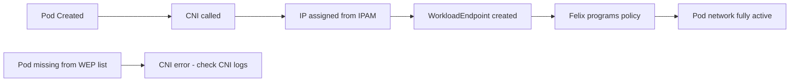

# Validate Calico CNI Plugin Configuration

Author: [nawazdhandala](https://github.com/nawazdhandala)

Tags: Calico, Kubernetes, Networking, CNI, Plugin, Validation

Description: How to validate the Calico CNI plugin configuration to ensure pods receive correct IP addresses, have proper network connectivity, and CNI policy enforcement is active.

---

## Introduction

Validating the Calico CNI plugin involves confirming that the configuration file is correctly deployed on all nodes, that new pods receive IPs from the expected CIDR ranges, that container networking is properly configured, and that CNI-level policy enforcement (WorkloadEndpoint creation in Calico) is functioning. A misconfigured CNI plugin may cause pods to fail to start or silently receive incorrect network configurations.

## Prerequisites

- Calico installed with CNI plugin deployed
- `kubectl` with cluster admin access
- Node-level access to inspect CNI configuration

## Step 1: Verify CNI Configuration File

```bash
# Check CNI config on each node
kubectl get nodes -o name | while read node; do
  node_name=$(echo $node | cut -d/ -f2)
  echo "=== $node_name ==="
  kubectl debug node/$node_name -it --image=busybox -- \
    cat /host/etc/cni/net.d/10-calico.conflist 2>/dev/null | grep -E "type|ipam|mtu"
done
```

## Step 2: Verify CNI Binaries Are Installed

```bash
# Check for Calico CNI binary on nodes
kubectl exec -n calico-system ds/calico-node -- ls -la /host/opt/cni/bin/ | grep calico
# Should show: calico, calico-ipam
```

## Step 3: Test Pod IP Assignment

```bash
# Create test pods on different nodes
kubectl run cni-test-1 --image=busybox --overrides='{"spec":{"nodeName":"worker-1"}}' -- sleep 60
kubectl run cni-test-2 --image=busybox --overrides='{"spec":{"nodeName":"worker-2"}}' -- sleep 60

# Verify IPs from expected CIDR
kubectl get pods cni-test-1 cni-test-2 -o wide
# Both should have IPs in the 192.168.0.0/16 range (or your configured pool)
```

## Step 4: Verify WorkloadEndpoint Creation

When a pod is created, Calico CNI creates a WorkloadEndpoint resource:

```bash
calicoctl get workloadendpoints -n default | grep cni-test

# Inspect the WEP
calicoctl get wep -n default cni-test-1-eth0 -o yaml
```



## Step 5: Validate Container Network Configuration

```bash
# Check inside a pod
kubectl exec cni-test-1 -- ip addr show eth0
# Should show assigned pod IP

kubectl exec cni-test-1 -- ip route show
# Should show:
# default via 169.254.1.1 dev eth0  (Calico's link-local gateway)
# 169.254.1.1 dev eth0 scope link
```

## Step 6: Test CNI-Enforced Connectivity

```bash
# Basic pod-to-pod test
POD2_IP=$(kubectl get pod cni-test-2 -o jsonpath='{.status.podIP}')
kubectl exec cni-test-1 -- ping -c 3 $POD2_IP

# Test cluster DNS
kubectl exec cni-test-1 -- nslookup kubernetes.default.svc.cluster.local

# Test internet access
kubectl exec cni-test-1 -- wget -q -O- http://checkip.amazonaws.com
```

## Step 7: Check CNI Logs

```bash
# Check CNI plugin logs on a specific node
kubectl exec -n calico-system ds/calico-node -- \
  tail -50 /var/log/calico/cni/cni.log
# Look for any errors during pod creation
```

## Cleanup

```bash
kubectl delete pod cni-test-1 cni-test-2
```

## Conclusion

Validating the Calico CNI plugin requires a multi-level approach: verify the configuration file is correct on all nodes, test pod IP assignment from the expected CIDR, confirm WorkloadEndpoint creation in Calico, verify container network configuration inside pods, and run end-to-end connectivity tests. CNI log inspection on nodes provides the most detailed information when validation fails.
