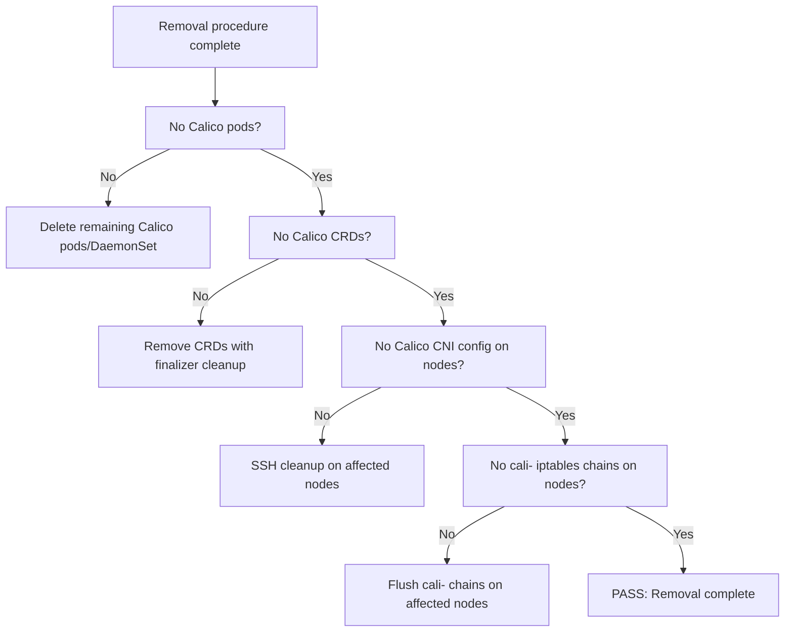

# How to Validate Calico CNI Removal is Complete

Author: [nawazdhandala](https://github.com/nawazdhandala)

Tags: Calico, Kubernetes, Networking, Troubleshooting

Description: Verification checklist to confirm Calico CNI has been completely removed from a Kubernetes cluster including CRD cleanup, node state verification, and new CNI readiness checks.

---

## Introduction

Validating that Calico CNI removal is complete requires checking all layers where Calico leaves state: Kubernetes resources, CRDs, node-level files, and iptables rules. A removal that appears complete at the Kubernetes resource layer may still have node-level state that will interfere with a new CNI plugin.

This validation checklist is designed to be run after the removal procedure before installing a new CNI plugin. Each check is binary - pass or fail - making the overall validation status clear.

## Symptoms

- New CNI fails to initialize after apparent Calico removal
- Nodes show networking errors after CNI migration despite Calico removal
- IPAM conflicts between Calico remnants and new CNI

## Root Causes

- Node-level cleanup not completed on all nodes
- CRD deletion verified but node-level iptables not checked
- calico-config ConfigMap not deleted, confusing new CNI

## Diagnosis Steps

```bash
# Quick summary check
echo "=== Calico Removal Verification ==="
kubectl get pods -n kube-system | grep calico | wc -l && echo "calico pods (expect 0)"
kubectl get crd | grep calico | wc -l && echo "calico CRDs (expect 0)"
```

## Solution

**Validation Step 1: No Calico pods running**

```bash
CALICO_PODS=$(kubectl get pods --all-namespaces | grep calico | wc -l)
if [ "$CALICO_PODS" -eq 0 ]; then
  echo "PASS: No Calico pods running"
else
  echo "FAIL: $CALICO_PODS Calico pods still present"
  kubectl get pods --all-namespaces | grep calico
fi
```

**Validation Step 2: No Calico CRDs**

```bash
CALICO_CRDS=$(kubectl get crd | grep calico | wc -l)
if [ "$CALICO_CRDS" -eq 0 ]; then
  echo "PASS: No Calico CRDs present"
else
  echo "FAIL: $CALICO_CRDS Calico CRDs still present"
  kubectl get crd | grep calico
fi
```

**Validation Step 3: No Calico RBAC**

```bash
kubectl get clusterrole | grep calico | wc -l | \
  xargs -I{} sh -c '[ {} -eq 0 ] && echo "PASS: No Calico ClusterRoles" || echo "FAIL: Calico ClusterRoles remain"'
```

**Validation Step 4: Node-level CNI config absent**

```bash
NODES_WITH_CALICO_CNI=0
for NODE in $(kubectl get nodes -o jsonpath='{.items[*].metadata.name}'); do
  HAS_CALICO=$(ssh $NODE "ls /etc/cni/net.d/ | grep calico | wc -l" 2>/dev/null)
  if [ "${HAS_CALICO:-0}" -gt 0 ]; then
    echo "FAIL: $NODE still has Calico CNI config"
    NODES_WITH_CALICO_CNI=$((NODES_WITH_CALICO_CNI+1))
  fi
done
[ $NODES_WITH_CALICO_CNI -eq 0 ] && echo "PASS: No nodes have Calico CNI config"
```

**Validation Step 5: iptables cali-* chains absent**

```bash
NODES_WITH_CALI_CHAINS=0
for NODE in $(kubectl get nodes -o jsonpath='{.items[*].metadata.name}'); do
  CHAINS=$(ssh $NODE "sudo iptables -L | grep -c cali-" 2>/dev/null || echo "0")
  if [ "${CHAINS:-0}" -gt 0 ]; then
    echo "FAIL: $NODE still has $CHAINS cali-* iptables chains"
    NODES_WITH_CALI_CHAINS=$((NODES_WITH_CALI_CHAINS+1))
  fi
done
[ $NODES_WITH_CALI_CHAINS -eq 0 ] && echo "PASS: No cali-* iptables chains on nodes"
```

**Validation Step 6: New CNI (if applicable) is healthy**

```bash
# If installing a new CNI, verify it is working
kubectl get pods --all-namespaces | grep -v Running | grep -v Completed | head -10
```



## Prevention

- Run this validation script as the final step of the removal procedure
- Include node-level checks in the removal progress monitoring
- Store the validation script alongside the removal procedure in the runbook

## Conclusion

Validating complete Calico CNI removal requires checking five layers: pods, CRDs, RBAC, node CNI config files, and node iptables chains. All five must pass before the cluster is ready for a new CNI installation. Node-level checks are the most frequently missed - always SSH to nodes to confirm cleanup.
