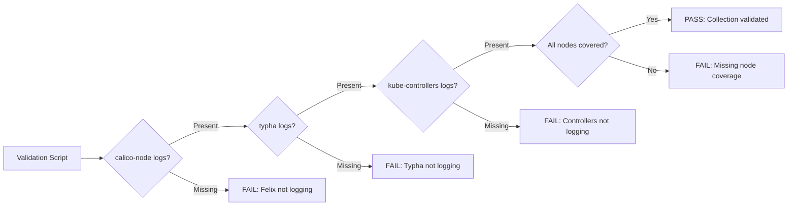

# How to Validate Calico Component Log Collection

Author: [nawazdhandala](https://github.com/nawazdhandala)

Tags: Calico, Kubernetes, Networking, Logging, Validation

Description: Validate that Calico log collection is complete and reliable by testing log pipeline continuity, verifying all components are represented, and confirming log retention policies are met.

---

## Introduction

Validating Calico log collection goes beyond checking that Fluent Bit is running. You need to confirm that logs from all three components (calico-node, calico-typha, kube-controllers) are reaching your aggregation backend, that no pods are silently missing from collection, and that the log format is parseable by your query tools. Validation should run after any log infrastructure change.

## Validate All Components Are Logging

```bash
#!/bin/bash
# validate-calico-log-collection.sh
PASS=0
FAIL=0

check_component() {
  local label="$1"
  local container="$2"
  local ns="calico-system"

  LOG_LINES=$(kubectl logs -n "${ns}" -l "app=${label}" \
    -c "${container}" --tail=10 2>/dev/null | wc -l)

  if [ "${LOG_LINES}" -gt 0 ]; then
    echo "PASS: ${label} (${container}) - ${LOG_LINES} log lines available"
    PASS=$((PASS + 1))
  else
    echo "FAIL: ${label} (${container}) - no logs available"
    FAIL=$((FAIL + 1))
  fi
}

check_component "calico-node" "calico-node"
check_component "calico-typha" "calico-typha"
check_component "calico-kube-controllers" "calico-kube-controllers"

echo ""
echo "Results: ${PASS} passed, ${FAIL} failed"
exit ${FAIL}
```

## Validate Log Coverage Across All Nodes

```bash
# Count calico-node pods vs nodes to ensure no pod is missing
NODE_COUNT=$(kubectl get nodes --no-headers | wc -l)
CALICO_NODE_COUNT=$(kubectl get pods -n calico-system \
  -l app=calico-node --no-headers | grep Running | wc -l)

echo "Nodes: ${NODE_COUNT}"
echo "calico-node pods Running: ${CALICO_NODE_COUNT}"

if [ "${NODE_COUNT}" -ne "${CALICO_NODE_COUNT}" ]; then
  echo "MISMATCH: Some nodes are missing calico-node pods"
  # Find which nodes are missing
  kubectl get pods -n calico-system -l app=calico-node \
    -o jsonpath='{range .items[*]}{.spec.nodeName}{"\n"}{end}' | sort > /tmp/pods-on-nodes.txt
  kubectl get nodes --no-headers -o custom-columns='NAME:.metadata.name' | sort > /tmp/all-nodes.txt
  diff /tmp/all-nodes.txt /tmp/pods-on-nodes.txt
fi
```

## Validate Log Format Parseability

```bash
# Verify calico-node logs are parseable as structured text
kubectl logs -n calico-system -l app=calico-node -c calico-node --tail=5 | \
  while IFS= read -r line; do
    # Calico logs include timestamp, level, and component
    if echo "${line}" | grep -qE "^[0-9]{4}-[0-9]{2}-[0-9]{2}"; then
      echo "FORMAT OK: ${line:0:50}..."
    else
      echo "FORMAT UNKNOWN: ${line:0:50}..."
    fi
  done
```

## Validation Architecture



## Validate Log Retention Policy

```bash
# Verify logs are retained for required duration (e.g., 30 days)
# This check depends on your backend (Elasticsearch index lifecycle, Loki retention)

# For Loki: check retention configuration
kubectl get configmap loki -n logging -o jsonpath='{.data.loki\.yaml}' | \
  grep -A3 "retention"

# For Elasticsearch: check index lifecycle policy
curl -s http://elasticsearch:9200/_ilm/policy/calico-logs | python3 -m json.tool
```

## Conclusion

Validating Calico log collection requires confirming that all three components are actively logging, that every node has a calico-node pod writing logs, and that the log format is parseable by your aggregation backend. The coverage check (comparing node count to calico-node pod count) catches a common silent failure where a node's calico-node pod is crash-looping and missing from log collection. Run the validation script after any infrastructure change and include it in your weekly operational health check.
