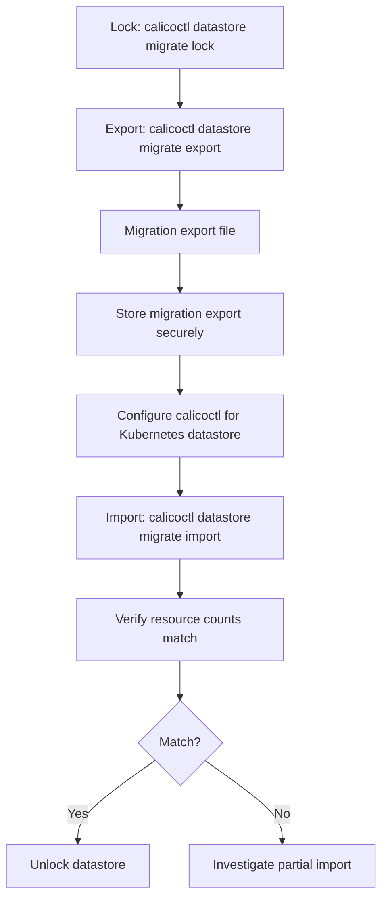

# How to Validate Calico Datastore Export and Import

Author: [nawazdhandala](https://github.com/nawazdhandala)

Tags: Calico, Kubernetes, Networking, Operation

Description: Validate Calico datastore export and import operations by comparing resource counts before and after, verifying configuration integrity, and testing policy enforcement after import.

---

## Introduction

Validating a datastore migration import requires confirming that all exported resources are present in the destination, that resource configurations match the source, and that Calico is correctly enforcing policies using the imported configuration. A mismatch in resource counts can indicate a partial import or verification issue.

## Key Commands

```bash
# Lock source datastore for migration
calicoctl datastore migrate lock

# Export Calico etcdv3 datastore for migration

export_file="calico-migration-$(date +%Y%m%d).yaml"
calicoctl datastore migrate export > "$export_file"

# Verify export content
echo "Resources in export: $(grep -c '^[[:space:]-]*kind:' "$export_file")"
grep "^[[:space:]-]*kind:" "$export_file" | sort | uniq -c

# Reconfigure calicoctl to access the Kubernetes datastore, then import
calicoctl datastore migrate import -f "$export_file"

# Verify import
calicoctl get felixconfiguration
calicoctl get globalnetworkpolicy | wc -l

# Unlock after verifying the migration
calicoctl datastore migrate unlock
```

## Operation Flow



## Operational Checklist

```markdown
Before export:
[ ] Confirm source datastore connectivity
[ ] Confirm source etcd credentials
[ ] Verify sufficient disk space for export file
[ ] Note current resource counts for post-export verification

After import:
[ ] Compare resource counts: source vs destination
[ ] Verify Calico components are operational
[ ] Test pod connectivity (cross-namespace, cross-node)
[ ] Verify network policies are being enforced
```

## Conclusion

Calico datastore migration export and import operations require careful verification at both ends: confirm resource counts before and after, verify connectivity and policy enforcement after import, and store migration exports in access-controlled storage until the migration is complete. Test migrations in a non-production environment help ensure that the process is practically verified before it is used on a production cluster.
