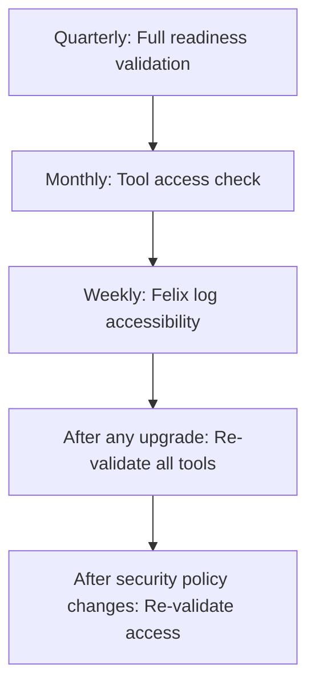

# How to Validate Calico eBPF Troubleshooting Readiness

Author: [nawazdhandala](https://github.com/nawazdhandala)

Tags: Calico, Kubernetes, Networking, eBPF, Troubleshooting, Validation

Description: Validate that your Calico eBPF troubleshooting toolkit is ready and functional before incidents occur, ensuring fast response when issues arise.

---

## Introduction

Validating your troubleshooting readiness means testing all diagnostic tools and access paths in a controlled environment before an actual incident forces you to discover they don't work. A functional troubleshooting toolkit has: accessible debug pods, working bpftool access, verified Felix debug logging, and tested BPF map inspection commands.

Run this validation after initial setup and after any changes to security policies, node configurations, or Kubernetes upgrades that might affect tool access.

## Prerequistes

- Calico eBPF active
- Debug tools configured (from setup guide)
- `kubectl` with cluster-admin access

## Validation Checklist Script

```bash
#!/bin/bash
# validate-ebpf-troubleshooting-readiness.sh
FAILURES=0

check() {
  local desc="${1}"
  local cmd="${2}"
  if eval "${cmd}" > /dev/null 2>&1; then
    echo "OK:   ${desc}"
  else
    echo "FAIL: ${desc}"
    FAILURES=$((FAILURES + 1))
  fi
}

echo "=== eBPF Troubleshooting Readiness Validation ==="
echo ""

echo "--- Tool Access ---"
# bpftool via calico-node pod
check "bpftool accessible in calico-node" \
  "kubectl exec -n calico-system ds/calico-node -c calico-node -- bpftool version"

# Calico's built-in BPF commands
check "calico-node bpf-nat-dump works" \
  "kubectl exec -n calico-system ds/calico-node -c calico-node -- calico-node -bpf-nat-dump"

check "calico-node bpf-list-progs works" \
  "kubectl exec -n calico-system ds/calico-node -c calico-node -- calico-node -bpf-list-progs"

echo ""
echo "--- Felix Logging ---"
current_severity=$(kubectl get felixconfiguration default \
  -o jsonpath='{.spec.logSeverityScreen}' 2>/dev/null || echo "unset")
echo "INFO: Current Felix log severity: ${current_severity}"

# Test that logs are flowing
check "Felix logs accessible" \
  "kubectl logs -n calico-system ds/calico-node -c calico-node --tail=5"

echo ""
echo "--- BPF State Inspection ---"
check "BPF programs list works" \
  "kubectl exec -n calico-system ds/calico-node -c calico-node -- bpftool prog list"

check "BPF maps list works" \
  "kubectl exec -n calico-system ds/calico-node -c calico-node -- bpftool map list"

echo ""
echo "--- Diagnostic Bundle ---"
check "Diagnostic bundle script exists" \
  "test -f ./collect-calico-ebpf-diagnostics.sh"

echo ""
echo "=== Validation Complete: ${FAILURES} failure(s) ==="

if [[ "${FAILURES}" -gt 0 ]]; then
  echo ""
  echo "Fix the above failures to ensure full troubleshooting capability."
fi
exit ${FAILURES}
```

## Validating Debug Pod Access

```bash
# Verify debug pods can be deployed (check RBAC and admission)
kubectl run validate-debug --image=ubuntu:22.04 \
  --overrides='{"spec":{"hostNetwork":true,"tolerations":[{"operator":"Exists"}]}}' \
  --restart=Never -- sleep 5

kubectl wait pod/validate-debug --for=condition=Ready --timeout=30s \
  && echo "OK: Debug pods can be deployed" \
  || echo "FAIL: Cannot deploy debug pods (check RBAC/PSA)"

kubectl delete pod validate-debug
```

## Regular Validation Schedule



## Conclusion

Validating your eBPF troubleshooting readiness regularly ensures that your diagnostic toolkit works when you need it most. The readiness validation script tests all critical diagnostic paths: bpftool access, Felix debug logging, BPF program inspection, and debug pod deployment. Run this script quarterly and after any security policy changes that might affect container permissions or BPF filesystem access. A 5-minute validation run is worth far less than 30 minutes of debugging tool access issues during an actual incident.
