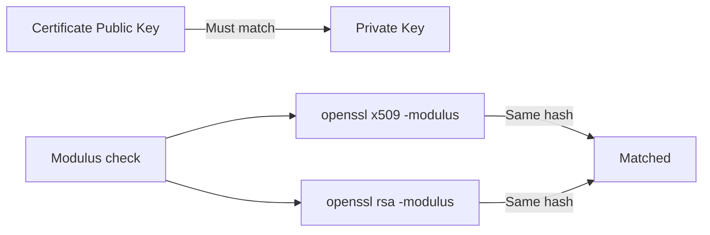

# Validate Calico etcd Certificate Generation

Author: [nawazdhandala](https://github.com/nawazdhandala)

Tags: Calico, Kubernetes, Networking, etcd, TLS, Certificates, Validation

Description: How to validate that Calico etcd TLS certificates are correctly generated, have the right extensions, and are properly trusted for mutual TLS authentication.

---

## Introduction

Certificate validation for Calico etcd connections is more nuanced than simply checking that a certificate file exists. A certificate may be syntactically valid but have the wrong Subject Alternative Names, missing key usage extensions, or be signed by a CA that etcd does not trust. Any of these issues will cause authentication failures that can be difficult to diagnose from error messages alone.

Systematic certificate validation involves inspecting certificate attributes, verifying chain of trust, testing actual TLS handshakes against etcd, and confirming that Calico components accept the certificates. This guide covers each validation step.

## Prerequisites

- TLS certificates generated for Calico etcd connections
- OpenSSL installed on the management host
- etcd running with TLS enabled
- `kubectl` access to the cluster

## Step 1: Inspect Certificate Contents

Verify the certificate's subject, issuer, validity, and extensions:

```bash
# Inspect CA certificate
openssl x509 -in calico-etcd-ca.crt -noout \
  -subject -issuer -dates -serial

# Inspect Felix client certificate
openssl x509 -in calico-felix.crt -noout \
  -subject -issuer -dates -extensions

# Full details
openssl x509 -in calico-felix.crt -text -noout | grep -A20 "Extensions"
```

Expected output for a client certificate:

```
Subject: CN=calico-felix, O=calico
Issuer: CN=calico-etcd-ca
Not Before: Mar 13 00:00:00 2026 GMT
Not After : Apr 12 00:00:00 2026 GMT
X509v3 Key Usage: Digital Signature, Non Repudiation, Key Encipherment
X509v3 Extended Key Usage: TLS Web Client Authentication
```

## Step 2: Verify Certificate Chain

```bash
# Verify the client cert is signed by the CA
openssl verify -CAfile calico-etcd-ca.crt calico-felix.crt
# Expected: calico-felix.crt: OK

# Verify the etcd server cert
openssl verify -CAfile calico-etcd-ca.crt etcd-server.crt
# Expected: etcd-server.crt: OK
```

## Step 3: Check Certificate and Key Match



```bash
# Certificate and key must have matching public key
CERT_MOD=$(openssl x509 -in calico-felix.crt -modulus -noout | md5sum)
KEY_MOD=$(openssl rsa -in calico-felix.key -modulus -noout | md5sum)

if [ "$CERT_MOD" = "$KEY_MOD" ]; then
  echo "Certificate and key match"
else
  echo "MISMATCH: Certificate and key do not match!"
fi
```

## Step 4: Test TLS Handshake Against etcd

```bash
# Test that the Felix certificate authenticates to etcd
openssl s_client \
  -connect etcd:2379 \
  -CAfile calico-etcd-ca.crt \
  -cert calico-felix.crt \
  -key calico-felix.key \
  -verify_return_error 2>&1 | grep -E "Verify|Certificate|error"

# Expected: Verify return code: 0 (ok)
```

## Step 5: Test via etcdctl

```bash
etcdctl --endpoints=https://etcd:2379 \
  --cacert=calico-etcd-ca.crt \
  --cert=calico-felix.crt \
  --key=calico-felix.key \
  endpoint health
# Expected: https://etcd:2379 is healthy: successfully committed proposal
```

## Step 6: Validate Secrets in Kubernetes

```bash
# Verify the secret contents are base64-encoded correctly
kubectl get secret calico-etcd-certs -n kube-system -o jsonpath='{.data.etcd-cert}' | \
  base64 -d | openssl x509 -noout -subject -dates
```

## Conclusion

Validating Calico etcd certificates requires checking the certificate contents for correct extensions and subject, verifying the chain of trust, confirming certificate-key pair matching, and testing actual TLS handshakes. A certificate that passes all these checks will reliably authenticate Calico components to etcd. Automate this validation in your CI pipeline to catch certificate issues before they reach production.
