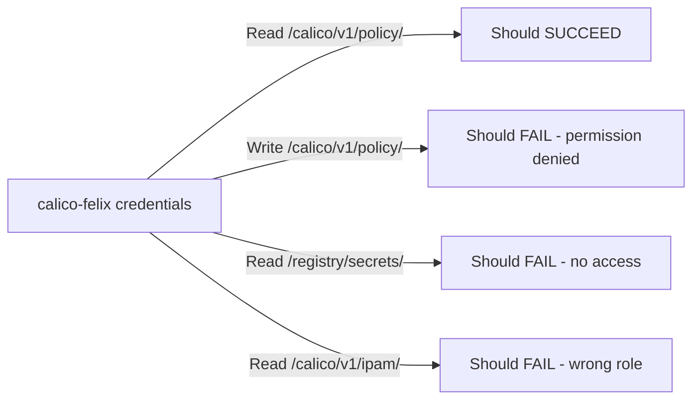

# Validate Calico etcd RBAC

Author: [nawazdhandala](https://github.com/nawazdhandala)

Tags: Calico, Kubernetes, Networking, etcd, RBAC, Validation

Description: How to validate that Calico etcd RBAC roles and permissions are correctly configured so each Calico component can only access its required etcd key paths.

---

## Introduction

After configuring etcd RBAC for Calico, validation is essential to confirm that each component has exactly the access it needs and no more. Validation catches permission gaps that would cause Calico components to fail, as well as overly broad permissions that weaken the least-privilege model.

A systematic validation process tests both the positive cases (permissions that should be granted) and the negative cases (paths that should be denied). This two-sided testing approach ensures your RBAC configuration is neither too restrictive nor too permissive.

## Prerequisites

- etcd v3.x with RBAC enabled and Calico roles configured
- etcdctl with root credentials for validation
- Calico running and connected to etcd
- Access to Calico component logs

## Step 1: List etcd Roles and Users

Verify the roles and user assignments are in place:

```bash
# List all roles
etcdctl --endpoints=https://etcd:2379 \
  --cacert=/etc/etcd/ca.crt --cert=/etc/etcd/root.crt --key=/etc/etcd/root.key \
  role list

# List all users
etcdctl ... user list

# Show role details
etcdctl ... role get calico-felix
etcdctl ... role get calico-cni
etcdctl ... role get calico-admin
```

Expected output for `calico-felix`:

```
Role calico-felix
KV Read:
  [/calico/v1/config/, /calico/v1/config/0) (prefix /calico/v1/config/)
  [/calico/v1/policy/, /calico/v1/policy/0) (prefix /calico/v1/policy/)
KV Write:
  [/calico/v1/host/, /calico/v1/host/0) (prefix /calico/v1/host/)
  [/calico/felix/v1/, /calico/felix/v1/0) (prefix /calico/felix/v1/)
```

## Step 2: Test Permitted Access

Use the calico-felix credentials to verify allowed operations succeed:

```bash
# Should succeed: read policy path
etcdctl --endpoints=https://etcd:2379 \
  --cacert=/etc/etcd/ca.crt \
  --cert=/etc/calico/etcd/felix.crt \
  --key=/etc/calico/etcd/felix.key \
  get /calico/v1/policy/ --prefix

# Should succeed: write to host path
etcdctl ... put /calico/v1/host/test-key "test-value"
etcdctl ... del /calico/v1/host/test-key
```

## Step 3: Test Denied Access



```bash
# Should fail: write to policy path (read-only for felix)
etcdctl ... put /calico/v1/policy/test "value"
# Expected: Error: etcdserver: permission denied

# Should fail: access Kubernetes paths
etcdctl ... get /registry/secrets/ --prefix
# Expected: Error: etcdserver: permission denied
```

## Step 4: Verify Calico Component Connectivity

Check that Calico components can connect to etcd with their assigned credentials:

```bash
# Check Felix etcd connection
kubectl logs -n kube-system ds/calico-node --tail=50 | grep -i "etcd\|connected\|error"

# Check CNI connectivity
ls -la /var/log/calico/cni/
tail -50 /var/log/calico/cni/cni.log | grep "etcd"
```

## Step 5: Test User-to-Role Binding

Verify that users are assigned to the correct roles:

```bash
etcdctl ... user get calico-felix
# Expected output shows: Roles: calico-felix

etcdctl ... user get calico-cni
# Expected: Roles: calico-cni
```

## Conclusion

Validating Calico etcd RBAC requires testing both permitted and denied access paths for each component credential. A complete validation confirms that Felix can read policies and write host data, that the CNI plugin can manage IPAM, and that neither can access Kubernetes secrets or each other's write paths. Run this validation after any changes to etcd roles or Calico credentials.
