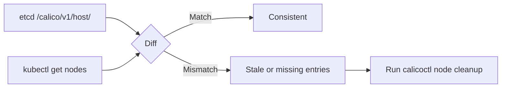

# Validate Calico etcdv3 Paths

Author: [nawazdhandala](https://github.com/nawazdhandala)

Tags: Calico, Kubernetes, Networking, Etcd, etcdv3, Validation, Datastore

Description: How to validate Calico etcdv3 path contents to ensure data consistency between the etcd datastore and actual cluster state across networking, policy, and IPAM data.

---

## Introduction

Calico's etcdv3 datastore is the source of truth for all network configuration in clusters using the etcd backend. Validation of etcdv3 paths ensures that the data stored in etcd accurately reflects the intended cluster state - that all policies present in etcd are valid, that IPAM records correspond to actual running workloads, and that host entries exist for all active nodes.

Data inconsistencies between etcd and the cluster state can cause silent failures: Felix may program stale policies, IP allocations may conflict, or host endpoints may reference nodes that no longer exist. Systematic path validation helps detect these inconsistencies before they cause operational problems.

## Prerequisites

- Calico using etcd datastore
- etcdctl configured with Calico read credentials
- `kubectl` and `calicoctl` with cluster admin access

## Step 1: Validate Policy Path Consistency

Verify that policies in etcd match what calicoctl reports:

```bash
# Count policies via etcd
ETCD_POLICY_COUNT=$(etcdctl get /calico/v1/policy/ --prefix --keys-only | wc -l)

# Count policies via calicoctl
CALICOCTL_COUNT=$(calicoctl get networkpolicies --all-namespaces -o json | \
  python3 -c "import json,sys; print(len(json.load(sys.stdin)['items']))")

echo "etcd: $ETCD_POLICY_COUNT, calicoctl: $CALICOCTL_COUNT"
```

## Step 2: Validate Host Paths

Verify that host entries in etcd correspond to active Kubernetes nodes:

```bash
# Get nodes from etcd
ETCD_NODES=$(etcdctl get /calico/v1/host/ --prefix --keys-only | \
  awk -F'/' '{print $5}' | sort -u)

# Get nodes from Kubernetes
K8S_NODES=$(kubectl get nodes -o jsonpath='{.items[*].metadata.name}' | tr ' ' '\n' | sort)

# Compare
diff <(echo "$ETCD_NODES") <(echo "$K8S_NODES")
```



## Step 3: Validate IPAM Path Consistency

Check that IPAM allocations in etcd correspond to running pods:

```bash
# List all allocated IPs from etcd
etcdctl get /calico/v1/ipam/v2/ --prefix --keys-only | grep "assignment"

# Compare with actual pod IPs
kubectl get pods -A -o jsonpath='{range .items[*]}{.status.podIP}{"\n"}{end}' | sort
```

## Step 4: Check for Orphaned Entries

Identify etcd entries for deleted resources:

```bash
# Find host entries for nodes not in Kubernetes
for host in $(etcdctl get /calico/v1/host/ --prefix --keys-only | \
  awk -F'/' '{print $5}' | sort -u); do
  if ! kubectl get node "$host" &>/dev/null; then
    echo "Orphaned host entry: $host"
  fi
done
```

Cleanup orphaned entries:

```bash
calicoctl node status
# Use calicoctl to clean stale node data
```

## Step 5: Validate Config Paths

Verify Felix global configuration is accessible:

```bash
etcdctl get /calico/v1/config/ --prefix

# Should return entries like:
# /calico/v1/config/InterfacePrefix
# /calico/v1/config/LogSeverityScreen
```

## Step 6: Full Consistency Check with calicoctl

```bash
# calicoctl provides a node check command
calicoctl node status

# Check datastore connectivity and data health
calicoctl get nodes -o wide
calicoctl get ippool -o wide
calicoctl get felixconfiguration default -o yaml
```

## Conclusion

Validating Calico etcdv3 paths involves cross-referencing etcd contents with Kubernetes cluster state to detect orphaned entries, missing records, and count mismatches. Regular validation - ideally automated as a scheduled job - ensures that the etcd datastore remains a consistent and accurate representation of your cluster's network configuration. Address discrepancies with calicoctl rather than direct etcd manipulation to maintain data integrity.
