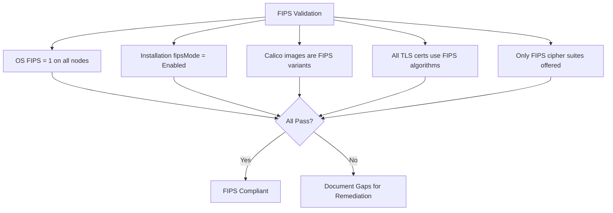

# How to Validate Calico FIPS Mode

Author: [nawazdhandala](https://github.com/nawazdhandala)

Tags: Calico, Kubernetes, Networking, FIPS, Validation, Compliance

Description: Validate that Calico is correctly operating in FIPS 140-2 mode by verifying cryptographic algorithms, TLS configurations, and compliance status across all components.

---

## Introduction

Validating Calico FIPS mode is not just about checking a configuration flag — it requires proving that all cryptographic operations across all Calico components actually use FIPS-approved algorithms. Simply setting `fipsMode: Enabled` in the Installation resource does not guarantee compliance if non-FIPS images, certificates, or cipher suites are in use.

A complete FIPS validation covers four dimensions: OS-level FIPS enforcement, Calico image FIPS compliance, TLS certificate algorithm validation, and runtime cipher suite verification. Each dimension catches different categories of FIPS violations, and all four must pass for your deployment to be genuinely FIPS 140-2 compliant.

## Prerequisites

- Calico deployed with `fipsMode: Enabled` in the Installation resource
- `kubectl` with cluster-admin access
- `openssl` and `ssldump` or `nmap` for TLS inspection
- Node-level debugging access

## Validation 1: OS FIPS Status

```bash
#!/bin/bash
# validate-os-fips.sh
echo "=== OS FIPS Validation ==="

for node in $(kubectl get nodes -o jsonpath='{.items[*].metadata.name}'); do
  echo -n "Node ${node}: "

  # Create a debug pod on the specific node
  result=$(kubectl debug node/${node} \
    --image=registry.access.redhat.com/ubi8/ubi \
    --quiet -it -- \
    bash -c 'cat /proc/sys/crypto/fips_enabled' 2>/dev/null | tr -d '\r\n')

  if [[ "${result}" == "1" ]]; then
    echo "FIPS ENABLED"
  else
    echo "FIPS DISABLED (value: ${result})"
  fi
done
```

## Validation 2: Calico Installation FIPS Setting

```bash
# Check the operator Installation resource
fips_mode=$(kubectl get installation default -o jsonpath='{.spec.fipsMode}')
echo "Installation fipsMode: ${fips_mode}"

# Verify operator processed FIPS mode
kubectl get tigerastatus calico -o jsonpath='{.status.conditions}' | jq '.'

# Check operator logs for FIPS handling
kubectl logs -n tigera-operator deploy/tigera-operator | grep -i fips
```

## Validation 3: TLS Certificate Algorithm Verification

```bash
#!/bin/bash
# validate-calico-certs-fips.sh
echo "=== Calico TLS Certificate FIPS Validation ==="

SECRETS=(
  "calico-typha-tls"
  "calico-node-tls"
  "calico-apiserver-certs"
)

FIPS_APPROVED_ALGOS=("sha256WithRSAEncryption" "ecdsa-with-SHA256" "ecdsa-with-SHA384")

for secret in "${SECRETS[@]}"; do
  echo ""
  echo "Checking secret: ${secret}"

  cert=$(kubectl get secret -n calico-system "${secret}" \
    -o jsonpath='{.data.tls\.crt}' 2>/dev/null | base64 -d)

  if [[ -z "${cert}" ]]; then
    echo "  Secret not found or no tls.crt"
    continue
  fi

  sig_algo=$(echo "${cert}" | openssl x509 -noout -text 2>/dev/null | \
    grep "Signature Algorithm" | head -1 | awk '{print $NF}')

  is_fips=false
  for approved in "${FIPS_APPROVED_ALGOS[@]}"; do
    if [[ "${sig_algo}" == "${approved}" ]]; then
      is_fips=true
      break
    fi
  done

  if ${is_fips}; then
    echo "  OK: Algorithm ${sig_algo} is FIPS-approved"
  else
    echo "  FAIL: Algorithm ${sig_algo} is NOT FIPS-approved"
  fi
done
```

## Validation 4: Runtime TLS Cipher Suite Check

```bash
# Test what cipher suites are offered by Felix's health endpoint
kubectl exec -n calico-system ds/calico-node -c calico-node -- \
  nmap --script ssl-enum-ciphers -p 9091 localhost 2>/dev/null | \
  grep -E "TLS_|cipher"

# FIPS-approved cipher suites:
# TLS_ECDHE_RSA_WITH_AES_128_GCM_SHA256
# TLS_ECDHE_RSA_WITH_AES_256_GCM_SHA384
# TLS_ECDHE_ECDSA_WITH_AES_128_GCM_SHA256
# TLS_ECDHE_ECDSA_WITH_AES_256_GCM_SHA384

# Non-FIPS cipher suites that should NOT appear:
# RC4, DES, 3DES, MD5, SHA1 in TLS 1.0/1.1
```

## Validation Checklist



## Complete Validation Report Script

```bash
#!/bin/bash
# generate-fips-compliance-report.sh
REPORT_FILE="fips-compliance-report-$(date +%Y%m%d).txt"

{
  echo "CALICO FIPS COMPLIANCE REPORT"
  echo "Generated: $(date)"
  echo "Cluster: $(kubectl config current-context)"
  echo ""

  echo "--- OS FIPS Status ---"
  ./validate-os-fips.sh

  echo ""
  echo "--- Calico Installation FIPS Setting ---"
  kubectl get installation default -o jsonpath='{.spec.fipsMode}'

  echo ""
  echo "--- TLS Certificate Algorithms ---"
  ./validate-calico-certs-fips.sh

  echo ""
  echo "--- TigeraStatus ---"
  kubectl get tigerastatus
} | tee "${REPORT_FILE}"

echo ""
echo "Report saved to: ${REPORT_FILE}"
```

## Conclusion

Validating Calico FIPS mode requires evidence at each cryptographic layer: OS enforcement, operator configuration, image build flags, certificate algorithms, and runtime cipher suites. The validation scripts in this guide produce audit-ready evidence that can be submitted to compliance teams as proof of FIPS 140-2 posture. Run the complete validation report before and after any Calico upgrade to confirm FIPS compliance is maintained throughout the change.
