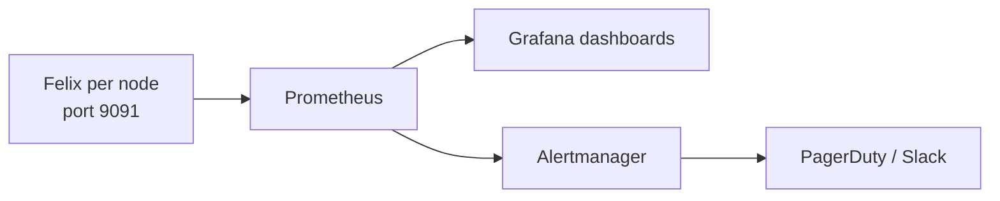

# How to Validate the Calico Flow Logs API in Production

Author: [nawazdhandala](https://github.com/nawazdhandala)

Tags: Calico, Kubernetes, Networking, Observability

Description: Validate that the Calico Flow Logs API returns accurate and complete data by querying known test connections and verifying API results match actual traffic.

---

## Introduction

Validating Felix metrics requires confirming that each calico-node exposes its Prometheus endpoint, that Prometheus can scrape it through Kubernetes service discovery, and that key Felix metrics appear with current values. A discrepancy between node health and metrics results indicates a scrape, endpoint, or metrics pipeline issue.

## Key Commands

```bash
# Enable Felix metrics (if not already enabled)

kubectl patch felixconfiguration default --type=merge -p '{"spec":{"prometheusMetricsEnabled":true,"prometheusMetricsPort":9091}}'

# Test Felix metrics endpoint
CALICO_POD=$(kubectl get pods -n calico-system -l k8s-app=calico-node -o jsonpath='{.items[0].metadata.name}')

kubectl exec -n calico-system "${CALICO_POD}" -c calico-node -- wget -qO- http://localhost:9091/metrics | head -30

# Key Felix metrics to check:
kubectl exec -n calico-system "${CALICO_POD}" -c calico-node -- wget -qO- http://localhost:9091/metrics | grep -E "^felix_iptables_restore_errors|^felix_ipset_errors|^felix_int_dataplane_apply_time_seconds|^felix_calc_graph_update_time_seconds"
```

## ServiceMonitor for Felix

```yaml
apiVersion: v1
kind: Service
metadata:
  name: calico-felix-metrics
  namespace: calico-system
  labels:
    k8s-app: calico-node
spec:
  clusterIP: None
  selector:
    k8s-app: calico-node
  ports:
    - name: http-metrics
      port: 9091
      targetPort: 9091
---
apiVersion: monitoring.coreos.com/v1
kind: ServiceMonitor
metadata:
  name: calico-felix-metrics
  namespace: calico-system
spec:
  selector:
    matchLabels:
      k8s-app: calico-node
  endpoints:
    - port: http-metrics
      path: /metrics
      interval: 30s
```

## Architecture



## Conclusion

Felix metrics provide operational visibility into the Calico data plane. Enable the Prometheus endpoint via FelixConfiguration, expose calico-node metrics through a Service, configure a ServiceMonitor to scrape that Service, and build dashboards focused on dataplane errors and policy calculation latency. These metric categories detect impactful Calico failure modes before they cause visible pod connectivity issues.
