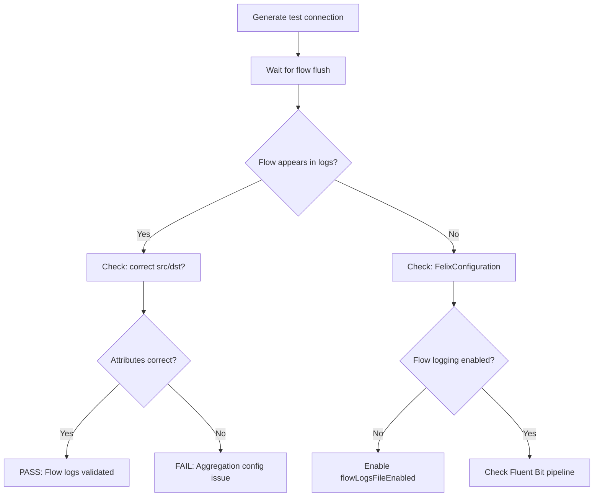

# How to Validate Calico Flow Logs in Production

Author: [nawazdhandala](https://github.com/nawazdhandala)

Tags: Calico, Kubernetes, Networking, Observability

Description: Validate that Calico flow logs are accurately capturing connection data in production by cross-checking flow records against application-level connection tests and verifying denied flows match policy expectations.

---

## Introduction

Validating flow log accuracy requires comparing what flow logs record against what you know happened. Generate a test connection, verify it appears in flow logs with the correct source, destination, and policy decision. Also verify that the aggregation level is correctly applied — per-flow logs should show individual connection records, per-pod aggregation should group them.

## Step 1: Generate a Known Test Connection

```bash
# Create a test client pod
kubectl run flow-test-client --image=nicolaka/netshoot \
  --restart=Never -- sleep 300

# Connect to a known service
kubectl exec flow-test-client -- curl -s http://<service-name>.<namespace>:80

# Note the timestamp
echo "Test connection at: $(date -u +%Y-%m-%dT%H:%M:%SZ)"
```

## Step 2: Verify the Flow Appears in Logs

```bash
# Wait for flow flush interval (check felixconfiguration flowLogsFlushInterval)
sleep 20

# Find the flow on the node where flow-test-client is running
CLIENT_NODE=$(kubectl get pod flow-test-client \
  -o jsonpath='{.spec.nodeName}')
CALICO_POD=$(kubectl get pods -n calico-system -l k8s-app=calico-node \
  --field-selector="spec.nodeName=${CLIENT_NODE}" \
  -o jsonpath='{.items[0].metadata.name}')

kubectl exec -n calico-system "${CALICO_POD}" -c calico-node -- \
  grep "flow-test-client" /var/log/calico/flowlogs/flows.log 2>/dev/null | tail -5
```

## Step 3: Validate Denied Traffic Capture

```bash
# Apply a restrictive NetworkPolicy and test
kubectl apply -f - << 'YAML'
apiVersion: networking.k8s.io/v1
kind: NetworkPolicy
metadata:
  name: deny-test
  namespace: default
spec:
  podSelector:
    matchLabels:
      run: flow-test-target
  policyTypes: ["Ingress"]
  ingress: []  # No ingress = deny all
YAML

kubectl run flow-test-target --image=nginx --labels=run=flow-test-target --restart=Never

# Try to connect (should be denied)
kubectl exec flow-test-client -- curl --connect-timeout 3 http://flow-test-target:80

# Verify deny appears in flow logs
sleep 20
kubectl exec -n calico-system "${CALICO_POD}" -c calico-node -- \
  grep -i "deny\|flow-test-target" /var/log/calico/flowlogs/flows.log | tail -5
```

## Validation Architecture



## Step 4: Verify Flow Logs in Centralized Storage

```bash
# If using Elasticsearch/Loki, verify the flow appears there too
# For Elasticsearch:
curl -s http://elasticsearch:9200/calico-flows/_search \
  -H 'Content-Type: application/json' \
  -d '{"query":{"match":{"src_name":"flow-test-client"}}}' | \
  python3 -m json.tool | grep -A5 "hits"
```

## Conclusion

Flow log validation requires end-to-end testing: generate a known connection, verify it appears in the local flow log file, and verify it propagates to the centralized storage system. Missing flows indicate a pipeline break at one of three points: Felix not writing flows (FelixConfiguration issue), Fluent Bit not collecting them (path configuration), or the storage backend not ingesting them (output plugin error). Test all three points to confirm the complete pipeline is functional.
