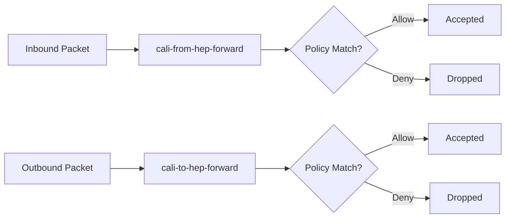

# Validate Calico Host Endpoint Security

Author: [nawazdhandala](https://github.com/nawazdhandala)

Tags: Calico, Kubernetes, Networking, Security, Host Endpoint, Validation

Description: Learn how to validate that your Calico host endpoint security policies are correctly applied and enforcing traffic rules on Kubernetes node interfaces.

---

## Introduction

After configuring Calico host endpoint security, validating that policies behave as intended is critical before rolling them out cluster-wide. A misconfigured host endpoint policy can inadvertently block legitimate cluster traffic - including API server communication, kubelet health checks, or even SSH access - rendering nodes inaccessible.

Validation involves verifying that HostEndpoint resources are active, that associated GlobalNetworkPolicy objects are programmed into the kernel via iptables or eBPF, and that traffic tests confirm the expected allow and deny behavior. This systematic approach catches errors early and builds confidence in your security posture.

This guide covers the key commands and techniques for validating host endpoint security configurations across Calico deployments.

## Prerequisites

- Calico host endpoints configured on one or more nodes
- `calicoctl` and `kubectl` with cluster admin access
- Access to run commands on cluster nodes (SSH or `kubectl exec`)
- Basic familiarity with iptables or eBPF dataplane concepts

## Step 1: Verify HostEndpoint Resources

List all configured host endpoints and confirm they reference the correct nodes and interfaces:

```bash
calicoctl get hostendpoints -o wide
```

Expected output:

```plaintext
NAME           NODE    INTERFACE   IPS           PROFILES
node1-eth0     node1   eth0        10.0.1.10     []
node2-eth0     node2   eth0        10.0.1.11     []
```

Describe a specific endpoint to inspect its full spec:

```bash
calicoctl get hostendpoint node1-eth0 -o yaml
```

## Step 2: Check Felix Policy Programming

Felix is the Calico agent that programs policies into the kernel. Check Felix logs for host endpoint processing:

```bash
kubectl logs -n calico-system -l k8s-app=calico-node --tail=100 | grep -i "hostendpoint\|policy"
```

Verify Felix status on a node:

```bash
kubectl exec -n calico-system ds/calico-node -- calico-node -felix-live
```

## Step 3: Inspect iptables Rules

For the iptables dataplane, inspect the chains that Calico creates for host endpoints:

```bash
# SSH to a node and inspect Calico chains
sudo iptables -L cali-to-hep-forward -n -v
sudo iptables -L cali-from-hep-forward -n -v
```



## Step 4: Test Traffic Behavior

Use `netcat` or `curl` from an external host to confirm allow/deny rules work:

```bash
# Should succeed (allowed port)
nc -zv 10.0.1.10 22

# Should fail (blocked port)
nc -zv 10.0.1.10 8888
```

From inside the cluster, test pod-to-node communication:

```bash
kubectl run test-pod --image=busybox --rm -it -- wget -T 3 10.0.1.10:10250
```

## Step 5: Validate with Calico Policy Audit

Use the Calico Enterprise policy recommendation engine or the open-source audit mode to review policy hits:

```bash
calicoctl get globalnetworkpolicies -o wide
```

Check for zero-match policies that may indicate misconfiguration:

```bash
calicoctl get globalnetworkpolicy allow-cluster-internal -o yaml | grep -A5 "ingress"
```

## Conclusion

Validating Calico host endpoint security requires checking the resource definitions, Felix programming logs, kernel-level iptables chains, and actual traffic behavior. By systematically working through each layer, you can confirm that your host endpoint policies are correctly enforced and that no critical cluster traffic is inadvertently blocked.
