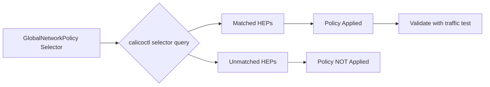

# Validate Calico Host Endpoint Selectors

Author: [nawazdhandala](https://github.com/nawazdhandala)

Tags: Calico, Kubernetes, Networking, Host Endpoint, Selectors, Validation

Description: How to validate that Calico host endpoint selectors are correctly matching the intended nodes and that policies are being applied to the right HostEndpoint resources.

---

## Introduction

A host endpoint selector that looks correct in a policy definition may not actually match the HostEndpoint resources you intend. Label typos, missing labels on HostEndpoint resources, or subtle differences in selector syntax can cause policies to either silently not apply or apply to unintended endpoints. Validation ensures that the mapping between policies and endpoints is exactly what you expect.

Validating selectors involves checking node labels, confirming HostEndpoint label propagation, using calicoctl to inspect policy-to-endpoint mappings, and testing that actual traffic behavior matches your intended policy. This is especially important before rolling out new policies to production nodes.

## Prerequisites

- Calico host endpoints configured with labeled resources
- `calicoctl` and `kubectl` with cluster admin access
- Understanding of the policies you want to validate

## Step 1: Check Node Labels

Verify that nodes have the expected labels:

```bash
kubectl get nodes --show-labels | grep -E "node-role|security-tier"
```

Or for a specific node:

```bash
kubectl describe node worker-1 | grep -A20 "Labels:"
```

## Step 2: Verify HostEndpoint Labels

Confirm that HostEndpoint resources carry the correct labels:

```bash
calicoctl get hostendpoints -o yaml | grep -A10 "labels:"
```

If you are using automatic host endpoint creation, labels may need to be applied manually:

```bash
calicoctl patch hostendpoint worker-1-eth0 \
  --patch='{"metadata":{"labels":{"node-role":"worker"}}}'
```

## Step 3: Test Selector Matching

Use `calicoctl` to query HostEndpoints that match a specific selector expression:

```bash
# List all endpoints matching a selector
calicoctl get hostendpoints --selector="node-role == 'worker'" -o wide
```



## Step 4: Inspect Policy Application via Felix

Felix logs show which policies are applied to which endpoints:

```bash
kubectl logs -n calico-system -l app=calico-node --tail=200 | grep "selector\|endpoint"
```

## Step 5: Check for Selector Mismatches

A common issue is a policy selector that does not match any endpoints:

```bash
# Check if policy has 0 matching endpoints
calicoctl get globalnetworkpolicy control-plane-ingress -o yaml
```

If the selector field contains a typo, no endpoints will match:

```yaml
# Incorrect - typo in value
selector: "node-role == 'controll-plane'"

# Correct
selector: "node-role == 'control-plane'"
```

## Step 6: Validate with Traffic Test

After confirming selector matches, run a targeted traffic test:

```bash
# Get the IP of a matched node
NODE_IP=$(kubectl get node worker-1 -o jsonpath='{.status.addresses[0].address}')

# Test allowed port
nc -zv $NODE_IP 10250

# Test should-be-denied port
nc -zv $NODE_IP 8443
```

## Step 7: Use Calico Policy Tester (Enterprise)

For Calico Enterprise, the policy recommendation tool can simulate which policies apply:

```bash
calicoctl policy-test --from 10.0.0.1 --to 10.0.1.20 --proto tcp --port 22
```

## Conclusion

Validating Calico host endpoint selectors requires checking labels at both the node and HostEndpoint levels, using selector queries to confirm which endpoints match your policies, and running traffic tests to verify that the expected allow/deny behavior is enforced. Systematic validation before production rollout prevents misconfiguration-induced outages and security gaps.
