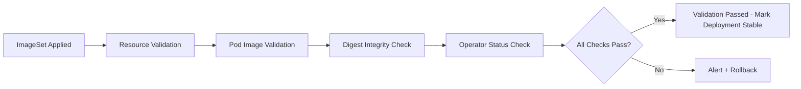

# How to Validate Calico ImageSet Management

Author: [nawazdhandala](https://github.com/nawazdhandala)

Tags: Calico, Kubernetes, Networking, ImageSet, Validation

Description: Learn how to validate that Calico ImageSet management is working correctly by verifying image sources, digest integrity, and operator reconciliation status.

---

## Introduction

Validating your Calico ImageSet configuration ensures that all components are running from the intended private registry with the correct image digests. Without validation, you might believe your air-gapped setup is working while some components still pull from public registries, or worse, run images that don't match the pinned digests in your security policy.

Validation should happen at multiple levels: the Kubernetes resource configuration, the runtime pod images, the network-level pull behavior, and the cryptographic digest integrity. Each level catches different classes of misconfiguration. A complete validation suite runs in CI/CD after every Calico upgrade to confirm the change was applied correctly.

This guide provides a comprehensive validation checklist and automated test scripts you can integrate into your deployment pipeline.

## Prerequisites

- Calico installed via the Tigera Operator with an active ImageSet
- `kubectl` with cluster-admin access
- `crane` CLI for digest verification
- Access to cluster nodes (optional, for network-level validation)

## Validation Level 1: Resource Configuration

```bash
# Verify ImageSet exists and has all required images
kubectl get imageset -o yaml

# Validate Installation registry setting
kubectl get installation default -o jsonpath='{.spec.registry}'
echo ""

# Check the operator has recognized the ImageSet
kubectl get installation default -o jsonpath='{.status.imageSet}'
echo ""
```

Expected output: the `status.imageSet` field should reference your ImageSet name.

## Validation Level 2: Running Pod Images

```bash
#!/bin/bash
# validate-pod-images.sh
EXPECTED_REGISTRY="${1:-registry.internal.example.com/calico}"
NAMESPACE="calico-system"

echo "=== Validating pod images in ${NAMESPACE} ==="
FAILURES=0

while IFS= read -r line; do
  pod=$(echo "$line" | awk '{print $1}')
  image=$(echo "$line" | awk '{print $2}')

  if [[ "${image}" != "${EXPECTED_REGISTRY}"* ]]; then
    echo "FAIL: Pod ${pod} using unexpected image: ${image}"
    FAILURES=$((FAILURES + 1))
  else
    echo "OK:   Pod ${pod} using ${image}"
  fi
done < <(kubectl get pods -n "${NAMESPACE}" -o jsonpath='{range .items[*]}{.metadata.name}{"\t"}{range .spec.containers[*]}{.image}{"\n"}{end}{end}')

if [[ "${FAILURES}" -eq 0 ]]; then
  echo ""
  echo "All pods validated. Using expected registry."
else
  echo ""
  echo "${FAILURES} pod(s) using unexpected registries!"
  exit 1
fi
```

## Validation Level 3: Digest Integrity

```bash
#!/bin/bash
# validate-digests.sh
REGISTRY="${1:-registry.internal.example.com/calico}"
CALICO_VERSION="${2:-v3.27.0}"
IMAGESET_NAME="calico-${CALICO_VERSION}"

echo "=== Validating image digests against ImageSet ==="
FAILURES=0

images=("cni" "node" "kube-controllers" "typha" "pod2daemon-flexvol" "apiserver")
for img in "${images[@]}"; do
  expected_digest=$(kubectl get imageset "${IMAGESET_NAME}" \
    -o jsonpath="{.spec.images[?(@.image==\"calico/${img}\")].digest}")

  actual_digest=$(crane digest "${REGISTRY}/${img}:${CALICO_VERSION}" 2>/dev/null)

  if [[ "${expected_digest}" == "${actual_digest}" ]]; then
    echo "OK:   calico/${img} digest matches"
  else
    echo "FAIL: calico/${img} digest mismatch"
    echo "      Expected: ${expected_digest}"
    echo "      Actual:   ${actual_digest}"
    FAILURES=$((FAILURES + 1))
  fi
done

[[ "${FAILURES}" -eq 0 ]] && echo "All digests verified." || exit 1
```

## Validation Level 4: Operator Status

```bash
# Check TigeraStatus for any degraded conditions
kubectl get tigerastatus

# Detailed status check
kubectl describe tigerastatus calico | grep -A3 "Conditions:"

# Ensure no components are degraded
kubectl get tigerastatus -o jsonpath='{range .items[*]}{.metadata.name}{"\t"}{.status.conditions[?(@.type=="Degraded")].status}{"\n"}{end}'
```

Expected: all components show `Degraded: False`.

## Validation Pipeline Integration



## Complete Validation Script

```bash
#!/bin/bash
# full-validate-imageset.sh
set -euo pipefail

REGISTRY="${REGISTRY:-registry.internal.example.com/calico}"
CALICO_VERSION="${CALICO_VERSION:-v3.27.0}"

echo "Running full ImageSet validation..."
./validate-pod-images.sh "${REGISTRY}"
./validate-digests.sh "${REGISTRY}" "${CALICO_VERSION}"

# Check for any calico-system pods not in Running state
not_running=$(kubectl get pods -n calico-system --no-headers | grep -v Running | wc -l)
if [[ "${not_running}" -gt 0 ]]; then
  echo "ERROR: ${not_running} pods not in Running state"
  kubectl get pods -n calico-system | grep -v Running
  exit 1
fi

echo "Full validation passed."
```

## Conclusion

Multi-level validation of Calico ImageSet management catches configuration drift, digest mismatches, and partial rollouts that could leave your cluster in an inconsistent state. By running resource configuration checks, pod image verification, digest integrity validation, and operator status checks in sequence, you build confidence that every Calico component is running exactly as intended. Integrating these scripts into your CI/CD pipeline ensures validation happens automatically after every upgrade.
