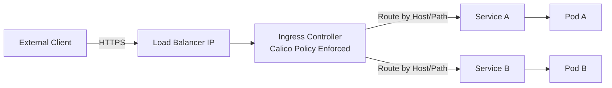

# How to Validate the Calico Ingress Gateway

Author: [nawazdhandala](https://github.com/nawazdhandala)

Tags: Calico, Kubernetes, Ingress, Gateway, Networking

Description: Validate Calico ingress gateway routing rules, service connectivity, and traffic flow from external clients.

---

## Introduction

Calico can secure ingress traffic in two common ways: by using Calico Enterprise or Calico Cloud's Calico Ingress Gateway, or by combining open-source Calico network policy with a standard Kubernetes Ingress controller. The ingress controller or gateway sits at the boundary between external networks and the Kubernetes pod network, performing routing decisions and, when configured, TLS termination, while Calico enforces network policy for the resulting pod traffic.

For open-source Calico, ingress functionality is implemented by a Kubernetes Ingress controller such as ingress-nginx or an Envoy-based controller, with Calico providing the underlying network policy enforcement. Calico Enterprise and Calico Cloud add Calico Ingress Gateway, a hardened Envoy Gateway distribution based on the Kubernetes Gateway API.

## Prerequisites

- Calico installed
- An ingress controller such as ingress-nginx or an Envoy-based Kubernetes Ingress controller for the examples below
- kubectl access
- DNS for external access

## Configure Ingress Resource

```yaml
apiVersion: networking.k8s.io/v1
kind: Ingress
metadata:
  name: app-ingress
  namespace: production
  annotations:
    nginx.ingress.kubernetes.io/rewrite-target: /
spec:
  ingressClassName: nginx
  rules:
  - host: app.example.com
    http:
      paths:
      - path: /
        pathType: Prefix
        backend:
          service:
            name: my-app
            port:
              number: 80
```

## Apply Calico Network Policy for Ingress

```yaml
apiVersion: projectcalico.org/v3
kind: NetworkPolicy
metadata:
  name: allow-ingress-to-app
  namespace: production
spec:
  selector: app == 'my-app'
  types:
  - Ingress
  ingress:
  - action: Allow
    protocol: TCP
    source:
      namespaceSelector: projectcalico.org/name == 'ingress-nginx'
      selector: app.kubernetes.io/component == 'controller'
    destination:
      ports:
      - 80
```

## Verify Gateway Functionality

```bash
# Check ingress controller pods

kubectl get pods -n ingress-nginx

# Test ingress routing
curl -H "Host: app.example.com" http://$(kubectl get svc -n ingress-nginx ingress-nginx-controller -o jsonpath='{.status.loadBalancer.ingress[0].ip}{.status.loadBalancer.ingress[0].hostname}')/

# Check ingress status
kubectl describe ingress app-ingress -n production
```

## Ingress Architecture



## Conclusion

Kubernetes ingress controllers combined with Calico network policy, or Calico Ingress Gateway in Calico Enterprise and Calico Cloud, provide secure, controlled external access to cluster services. Configure ingress resources for routing rules, create Calico network policies to restrict which pods the ingress controller can reach, and monitor ingress metrics to ensure reliable external access.
