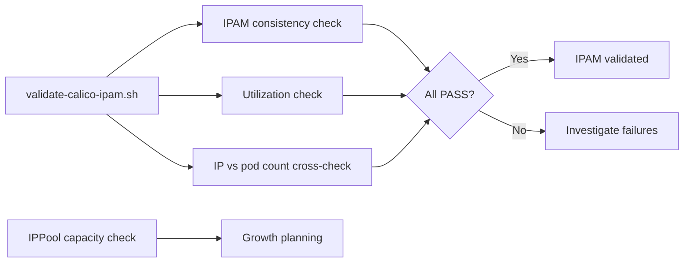

# How to Validate Calico IPAM Checks

Author: [nawazdhandala](https://github.com/nawazdhandala)

Tags: Calico, Kubernetes, Networking, IPAM, Validation

Description: Validate Calico IPAM health by confirming consistency checks pass, cross-checking IP allocation counts against running pod counts, and verifying IPPool capacity is adequate for expected cluster...

---

## Introduction

Validating Calico IPAM health goes beyond running `calicoctl ipam check` and reading "consistent". True validation requires cross-checking that the IPAM-allocated IP count matches running pod count, that each node has adequate block capacity for its pod density, and that IPPool capacity supports expected cluster growth over the next 90 days.

## IPAM Validation Script

```bash
#!/bin/bash
# validate-calico-ipam.sh
PASS=0
FAIL=0
WARN=0

# 1. IPAM consistency
echo "Checking IPAM consistency..."
if calicoctl ipam check 2>&1 | grep -q "IPAM is consistent"; then
  echo "PASS: IPAM is consistent"
  PASS=$((PASS + 1))
else
  echo "FAIL: IPAM has inconsistencies"
  FAIL=$((FAIL + 1))
fi

# 2. Utilization
UTIL=$(calicoctl ipam show 2>/dev/null | grep "%" | grep -oP '\d+(?=%)' | head -1)
if [ -n "${UTIL}" ]; then
  if [ "${UTIL}" -lt 85 ]; then
    echo "PASS: IPAM utilization ${UTIL}%"
    PASS=$((PASS + 1))
  elif [ "${UTIL}" -lt 95 ]; then
    echo "WARN: IPAM utilization ${UTIL}% (85-95% range)"
    WARN=$((WARN + 1))
  else
    echo "FAIL: IPAM utilization ${UTIL}% (critical)"
    FAIL=$((FAIL + 1))
  fi
fi

# 3. IP count vs pod count
IPAM_USED=$(calicoctl ipam show 2>/dev/null | grep "IPs in use" | awk '{print $4}')
RUNNING_PODS=$(kubectl get pods --all-namespaces --no-headers | grep -c Running)
echo "IPAM IPs in use: ${IPAM_USED}, Running pods: ${RUNNING_PODS}"
# These should be within ~10% of each other

echo ""
echo "Validation: ${PASS} passed, ${WARN} warnings, ${FAIL} failed"
exit ${FAIL}
```

## Validate IPPool Capacity

```bash
# Check if current IPPools have enough capacity for growth
calicoctl get ippool -o yaml | while IFS= read -r line; do
  if echo "${line}" | grep -q "cidr:"; then
    CIDR=$(echo "${line}" | awk '{print $2}')
    PREFIX=$(echo "${CIDR}" | cut -d/ -f2)
    CAPACITY=$(python3 -c "print(2**(32-${PREFIX}) - 2)" 2>/dev/null)
    echo "IPPool ${CIDR}: capacity ${CAPACITY} IPs"
  fi
done

# Compare with current cluster size and growth rate
CURRENT_NODES=$(kubectl get nodes --no-headers | wc -l)
echo "Current nodes: ${CURRENT_NODES}"
echo "Expected pods per node (avg): $(kubectl get pods --all-namespaces --no-headers | wc -l) / ${CURRENT_NODES}"
```

## Validation Architecture



## Conclusion

IPAM validation requires three checks: consistency (ipam check), utilization (ipam show), and capacity planning (IPPool size vs growth rate). The IP count vs running pod count cross-check catches inconsistencies that `calicoctl ipam check` sometimes misses - a significant gap between allocated IPs and running pods indicates leaked allocations or IPAM state drift. Run the full validation suite monthly and after any IPPool configuration change.
