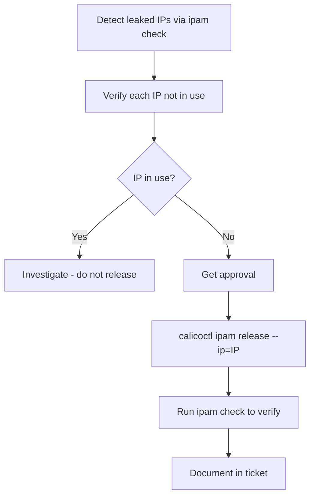

# How to Validate Calico IPAM Release Workflows

Author: [nawazdhandala](https://github.com/nawazdhandala)

Tags: Calico, Kubernetes, Networking, IPAM

Description: Validate that Calico IPAM release operations completed successfully by confirming released IPs are no longer allocated and IPAM consistency checks pass after each release.

---

## Introduction

Validating IPAM release operations requires confirming three outcomes: the specific IP is no longer in the IPAM database, the overall IPAM consistency check still passes, and the IP becomes available for new pod allocation. Skipping post-release validation is the most common source of ongoing IPAM inconsistencies.

## Key Operations

```bash
# Run IPAM check to identify issues
calicoctl ipam check

# Verify specific IP before release
IP="192.168.1.42"
kubectl get pod --all-namespaces -o wide | grep "${IP}"
kubectl get endpoints --all-namespaces | grep "${IP}"

# Release after verification (no pod found)
calicoctl ipam release --ip="${IP}"

# Post-release verification
calicoctl ipam check
calicoctl ipam show | grep "${IP}"  # Should show no output
```

## Workflow Summary



## Best Practices

```bash
# Always run check before and after releases
calicoctl ipam check  # Before
# ... run releases ...
calicoctl ipam check  # After - should still show "consistent"

# Never bulk-release without individual verification
# for ip in $(leaked-ips); do release ${ip}; done  # DANGEROUS without verify

# Correct approach: verify each one
for ip in $(cat release-candidates.txt); do
  IN_USE=$(kubectl get pod --all-namespaces -o wide | grep -c "${ip}" || echo 0)
  if [ "${IN_USE}" -eq 0 ]; then
    calicoctl ipam release --ip="${ip}"
    echo "Released ${ip}"
  else
    echo "SKIP ${ip} - still in use"
  fi
done
```

## Conclusion

Calico IPAM release workflows require discipline at every step: detect leaks with `calicoctl ipam check`, verify each IP is not in use before releasing, get human approval, and run post-release consistency checks. The verification step is non-negotiable — automating it away to save time is the most common source of IPAM corruption. Build the per-IP verification into every release script and treat any script that doesn't verify as unsafe.
