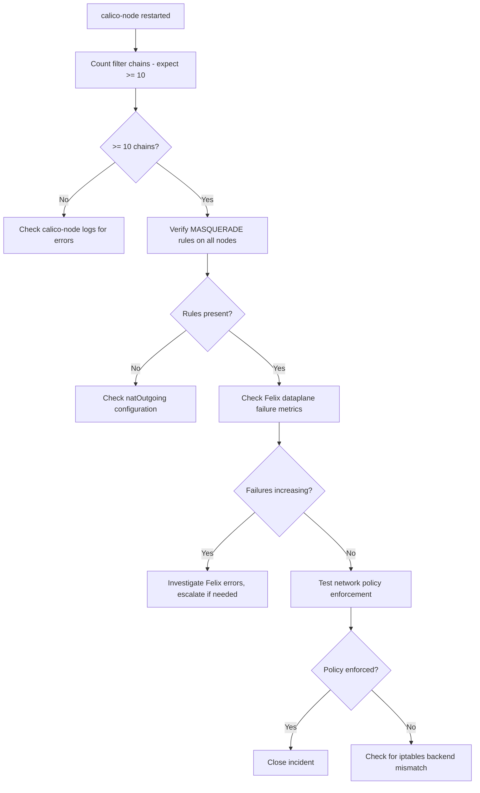

# How to Validate Resolution of Calico iptables Rules Not Applied

Author: [nawazdhandala](https://github.com/nawazdhandala)

Tags: Calico, iptables, Networking, Troubleshooting, Kubernetes, Felix

Description: Validate that Calico iptables rules are fully restored by checking chain presence, MASQUERADE rules, and Felix metrics for iptables programming success on all affected nodes.

---

## Introduction

Validating Calico iptables rule restoration requires checking both the presence of expected chains and the correctness of specific rules like MASQUERADE for NAT. A successful calico-node restart will reprogram all chains, but verification ensures Felix completed the full programming cycle without encountering new errors.

Chain count alone is not sufficient validation. Confirming that the `cali-nat-outgoing` chain is present and populated, and that network policy rules are enforced by testing with a test pod, provides complete validation that the fix was effective.

## Symptoms

- calico-node restarted but chains still missing
- Chains present but MASQUERADE rules absent

## Root Causes

- Felix encountered errors during rule reprogramming
- Multiple programming attempts in progress simultaneously

## Solution

**Validation Step 1: Count Calico iptables chains**

```bash
for NODE in $(kubectl get nodes -o jsonpath='{.items[*].metadata.name}'); do
  COUNT=$(ssh $NODE "sudo iptables -L 2>/dev/null | grep -c '^Chain cali'" 2>/dev/null || echo "SSH_FAILED")
  NAT_COUNT=$(ssh $NODE "sudo iptables -t nat -L 2>/dev/null | grep -c '^Chain cali'" 2>/dev/null || echo "0")
  echo "Node $NODE: filter chains=$COUNT, nat chains=$NAT_COUNT"
done
# Expected: filter chains >= 10, nat chains >= 2
```

**Validation Step 2: Verify MASQUERADE rule present**

```bash
for NODE in $(kubectl get nodes -o jsonpath='{.items[*].metadata.name}'); do
  MASQ=$(ssh $NODE "sudo iptables -t nat -L POSTROUTING -n 2>/dev/null | grep -c MASQUERADE" 2>/dev/null || echo "0")
  [ "$MASQ" -gt "0" ] && echo "PASS: $NODE has $MASQ MASQUERADE rule(s)" || echo "FAIL: $NODE missing MASQUERADE"
done
```

**Validation Step 3: Check Felix metrics for iptables errors**

```bash
# Get Felix metrics from calico-node
NODE_POD=$(kubectl get pods -n kube-system -l k8s-app=calico-node \
  --field-selector spec.nodeName=<node-name> -o jsonpath='{.items[0].metadata.name}')

kubectl exec $NODE_POD -n kube-system -- \
  wget -qO- http://localhost:9091/metrics 2>/dev/null | grep -E "felix_iptables|felix_int_dataplane_failures"
# Expected: felix_int_dataplane_failures_total = 0 or stable (not increasing)
```

**Validation Step 4: Test network policy enforcement**

```bash
# Create two pods and verify policy is enforced
kubectl run policy-test-client --image=busybox --restart=Never -- sleep 120
kubectl run policy-test-server --image=nginx --restart=Never --port=80

# Apply a deny policy and verify it blocks traffic
cat <<EOF | kubectl apply -f -
apiVersion: networking.k8s.io/v1
kind: NetworkPolicy
metadata:
  name: deny-test
spec:
  podSelector:
    matchLabels:
      run: policy-test-server
  policyTypes:
  - Ingress
EOF

SERVER_IP=$(kubectl get pod policy-test-server -o jsonpath='{.status.podIP}')
kubectl exec policy-test-client -- wget -qO- --timeout=5 http://$SERVER_IP && \
  echo "FAIL: Policy not enforced" || echo "PASS: Policy enforced (connection blocked)"

# Cleanup
kubectl delete pod policy-test-client policy-test-server
kubectl delete networkpolicy deny-test
```

**Validation Step 5: Verify Felix health endpoint**

```bash
NODE_POD=$(kubectl get pods -n kube-system -l k8s-app=calico-node \
  --field-selector spec.nodeName=<node-name> -o jsonpath='{.items[0].metadata.name}')

kubectl exec $NODE_POD -n kube-system -- calico-node -felix-health-check 2>/dev/null && \
  echo "PASS: Felix health check OK" || echo "FAIL: Felix health check failed"
```



## Prevention

- Add iptables chain count to post-maintenance verification checklist
- Monitor `felix_int_dataplane_failures_total` metric for increases
- Test network policy enforcement after any Calico upgrade or node change

## Conclusion

Validating iptables rule restoration requires chain count verification, MASQUERADE rule presence on all nodes, Felix dataplane failure metric review, and a live network policy enforcement test. All four checks together confirm Felix is successfully programming rules and enforcing policies on the node.
