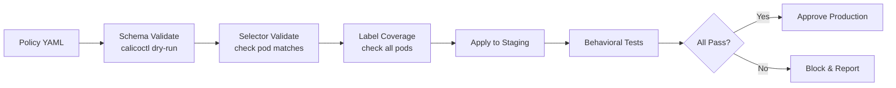

# How to Validate Calico Label-Based Network Policies Before Production

Author: [nawazdhandala](https://github.com/nawazdhandala)

Tags: Calico, Kubernetes, Network Policy, Labels, Validation

Description: Build a validation framework for Calico label-based network policies that verifies selector accuracy and label coverage before production deployment.

---

## Introduction

Validating label-based Calico network policies requires more than checking YAML syntax. You need to verify that your selectors match the intended pods, that no pods are missing required labels, and that the combined effect of all your policies produces the intended traffic behavior. A policy that is syntactically valid but semantically wrong can be just as dangerous as one with a typo.

Validation should happen at three points: before applying policies (static analysis), after applying policies in staging (behavioral testing), and continuously in production (ongoing label coverage monitoring). This guide focuses on the first two - the checks you run before policies reach production.

## Prerequisites

- Kubernetes cluster with Calico v3.26+ (staging environment)
- `calicoctl` and `kubectl` installed
- Python 3 for validation scripts
- CI/CD pipeline for automation

## Step 1: Static Selector Validation

```python
#!/usr/bin/env python3
# validate-selectors.py
import yaml
import subprocess
import sys

def check_selector_matches(selector, namespace="default"):
    """Check if a Calico selector matches any pods."""
    # Convert Calico selector to kubectl label selector
    # This is simplified - real implementation needs full parser
    label_sel = selector.replace(" == '", "=").replace("'", "").replace(" && ", ",")
    result = subprocess.run(
        ["kubectl", "get", "pods", "-n", namespace, "-l", label_sel, "--no-headers"],
        capture_output=True, text=True
    )
    count = len([l for l in result.stdout.split('\n') if l.strip()])
    return count

with open("policies/production-policies.yaml") as f:
    policies = list(yaml.safe_load_all(f))

errors = []
for policy in policies:
    if policy is None:
        continue
    name = policy['metadata']['name']
    ns = policy['metadata'].get('namespace', 'default')
    selector = policy['spec'].get('selector', '')

    if selector and selector != 'all()':
        matches = check_selector_matches(selector, ns)
        if matches == 0:
            errors.append(f"WARNING: Policy '{name}' selector '{selector}' matches 0 pods in {ns}")
        else:
            print(f"OK: Policy '{name}' selector matches {matches} pods")

if errors:
    print("\nValidation warnings:")
    for e in errors:
        print(f"  {e}")
```

## Step 2: Label Coverage Validation

```bash
#!/bin/bash
# validate-label-coverage.sh
REQUIRED_LABELS=("tier" "environment" "app")
NAMESPACES=("production" "staging")

EXIT_CODE=0
for ns in "${NAMESPACES[@]}"; do
  echo "Checking namespace: $ns"
  PODS=$(kubectl get pods -n "$ns" --no-headers -o custom-columns=NAME:.metadata.name)

  for pod in $PODS; do
    for label in "${REQUIRED_LABELS[@]}"; do
      VALUE=$(kubectl get pod "$pod" -n "$ns" -o jsonpath="{.metadata.labels.$label}")
      if [ -z "$VALUE" ]; then
        echo "FAIL: $ns/$pod missing label: $label"
        EXIT_CODE=1
      fi
    done
  done
done

exit $EXIT_CODE
```

## Step 3: Policy Conflict Detection

```bash
# Check for overlapping selectors that could cause conflicts
calicoctl get networkpolicies -n production -o yaml | python3 << 'EOF'
import yaml, sys

data = yaml.safe_load(sys.stdin)
selectors = {}

for policy in data.get('items', []):
    name = policy['metadata']['name']
    sel = policy['spec'].get('selector', '')
    if sel in selectors:
        print(f"CONFLICT: '{name}' and '{selectors[sel]}' have identical selectors: '{sel}'")
    selectors[sel] = name

print(f"Checked {len(selectors)} unique selectors")
EOF
```

## Step 4: Behavioral Test Suite

```bash
#!/bin/bash
# test-label-policies.sh - Run after applying to staging
PASS=0
FAIL=0

test_traffic() {
  local desc="$1" src_pod="$2" src_ns="$3" dest_ip="$4" port="$5" expected="$6"
  kubectl exec -n "$src_ns" "$src_pod" -- nc -zv "$dest_ip" "$port" --wait 3 2>/dev/null
  local result=$?
  if [ "$result" -eq "0" ] && [ "$expected" == "allow" ]; then
    echo "PASS: $desc"
    ((PASS++))
  elif [ "$result" -ne "0" ] && [ "$expected" == "deny" ]; then
    echo "PASS: $desc (correctly denied)"
    ((PASS++))
  else
    echo "FAIL: $desc (expected: $expected, got: $([ $result -eq 0 ] && echo 'allow' || echo 'deny'))"
    ((FAIL++))
  fi
}

echo "Results: $PASS passed, $FAIL failed"
[ "$FAIL" -eq 0 ]
```

## Validation Pipeline



## Conclusion

Label-based policy validation requires a multi-stage approach: static analysis of selectors, coverage checks for required labels, conflict detection between policies, and behavioral testing in staging. Automating these checks in your CI/CD pipeline ensures that every policy change is validated before it can affect production. The investment in validation infrastructure pays back quickly by catching label mismatches that would otherwise cause production incidents.
