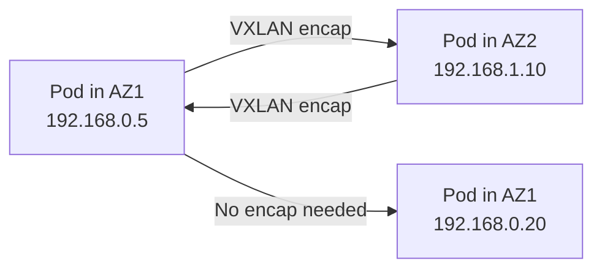

# Validate Calico Networking on AWS

Author: [nawazdhandala](https://github.com/nawazdhandala)

Tags: Calico, Kubernetes, Networking, AWS, Cloud, Validation

Description: How to validate Calico networking on AWS by testing cross-AZ pod connectivity, verifying VPC route tables, and confirming encapsulation mode behavior.

---

## Introduction

Validating Calico networking on AWS requires confirming that pod-to-pod communication works correctly both within and across Availability Zones, that the VPC route tables or encapsulation settings are correctly configured, and that AWS-specific constraints like source/destination checks are properly handled.

AWS-specific networking issues often only appear when pods communicate across AZ boundaries, making cross-AZ validation an essential step that is sometimes skipped. This guide covers comprehensive validation for Calico on AWS self-managed clusters.

## Prerequisites

- Calico installed on AWS self-managed Kubernetes
- `kubectl` access with ability to schedule pods on specific nodes
- AWS CLI access to inspect VPC route tables
- `calicoctl` configured

## Step 1: Verify Calico Component Health

```bash
kubectl get pods -n calico-system
kubectl get pods -n tigera-operator

# All pods should be Running
```

Check that IP pools are configured:

```bash
calicoctl get ippools -o wide
```

## Step 2: Verify Node Assignments

Confirm that Calico has assigned IPAM blocks to nodes:

```bash
calicoctl ipam show --show-blocks

# Expected: one /24 block per node from the configured IP pool
```

## Step 3: Test Same-AZ Pod Connectivity

Deploy test pods on nodes in the same AZ:

```bash
# Deploy to specific node
kubectl run test-a --image=busybox --overrides='{"spec":{"nodeName":"worker-az1-1"}}' \
  -- sleep 3600 &

kubectl run test-b --image=busybox --overrides='{"spec":{"nodeName":"worker-az1-2"}}' \
  -- sleep 3600 &

# Get pod IPs
POD_A_IP=$(kubectl get pod test-a -o jsonpath='{.status.podIP}')
POD_B_IP=$(kubectl get pod test-b -o jsonpath='{.status.podIP}')

# Test connectivity
kubectl exec test-a -- ping -c 3 $POD_B_IP
```

## Step 4: Test Cross-AZ Pod Connectivity



```bash
kubectl run test-c --image=busybox --overrides='{"spec":{"nodeName":"worker-az2-1"}}' \
  -- sleep 3600

POD_C_IP=$(kubectl get pod test-c -o jsonpath='{.status.podIP}')

# Cross-AZ connectivity test
kubectl exec test-a -- ping -c 3 $POD_C_IP
# Should succeed
```

## Step 5: Verify AWS Source/Destination Check

```bash
# Confirm source/destination check is disabled on worker nodes
for instance_id in $(aws ec2 describe-instances \
  --filters "Name=tag:kubernetes.io/role,Values=node" \
  --query 'Reservations[*].Instances[*].InstanceId' \
  --output text); do

  SRC_DST=$(aws ec2 describe-instances \
    --instance-ids $instance_id \
    --query 'Reservations[0].Instances[0].SourceDestCheck' \
    --output text)
  echo "$instance_id: SourceDestCheck=$SRC_DST"
  # Should be: False
done
```

## Step 6: Validate Security Groups

```bash
# Check VXLAN (UDP 4789) is allowed in the security group
aws ec2 describe-security-groups \
  --group-ids sg-0123456789 \
  --query 'SecurityGroups[0].IpPermissions[?FromPort==`4789`]'
```

## Step 7: Test DNS Resolution

```bash
kubectl exec test-a -- nslookup kubernetes.default.svc.cluster.local
# Should return the cluster IP
```

## Conclusion

Validating Calico on AWS requires testing connectivity both within and across AZs, verifying IPAM block assignments, confirming source/destination checks are disabled, and checking that security groups allow the encapsulation protocols. Cross-AZ testing is especially important because this traffic follows a different network path (VXLAN encapsulation) than same-AZ traffic.
