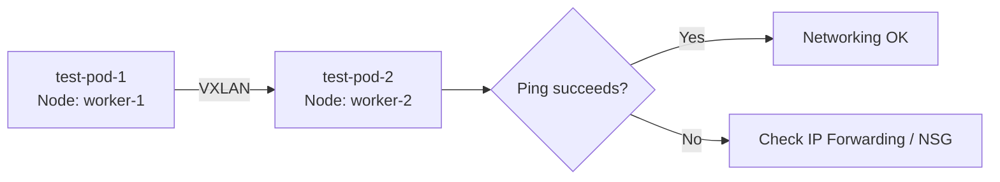

# Validate Calico Networking on Azure

Author: [nawazdhandala](https://github.com/nawazdhandala)

Tags: Calico, Kubernetes, Networking, Azure, Cloud, Validation

Description: How to validate Calico networking on Azure self-managed Kubernetes clusters, including IP forwarding verification, pod connectivity tests, and NSG rule validation.

---

## Introduction

Validating Calico networking on Azure has Azure-specific steps that go beyond standard Calico validation. Azure VNet constraints require explicit IP Forwarding settings on VM NICs when using routed pod traffic or Azure user-defined routes, and NSG rules must not block VXLAN traffic between nodes when using Calico VXLAN. Without validating these Azure-level settings, pod communication failures may be incorrectly attributed to Calico misconfigurations when the root cause is Azure platform settings.

A complete validation covers: Azure VM NIC settings, NSG rules, Calico component health, IPAM allocation, and end-to-end pod connectivity across different subnets.

## Prerequisites

- Calico installed on Azure self-managed Kubernetes
- Azure CLI authenticated with VM and network read access
- `kubectl` and `calicoctl` with cluster admin access

## Step 1: Verify Azure IP Forwarding

```bash
# Check IP Forwarding status on all worker VM NICs.
# This should be true for Calico deployments that use Azure UDR or routed pod traffic.

for vm in $(kubectl get nodes -o name | cut -d/ -f2); do
  NIC_ID=$(az vm show -g k8s-rg -n $vm \
    --query "networkProfile.networkInterfaces[0].id" -o tsv 2>/dev/null)

  if [ -n "$NIC_ID" ]; then
    IP_FWD=$(az network nic show --ids $NIC_ID \
      --query "enableIPForwarding" -o tsv)
    echo "$vm: IP Forwarding = $IP_FWD"
  fi
done
```

## Step 2: Verify NSG Rules Allow VXLAN

```bash
# Check for VXLAN rule in the worker NSG
az network nsg rule list \
  --resource-group k8s-rg \
  --nsg-name k8s-workers-nsg \
  --include-default \
  --query "[?access=='Allow' && direction=='Inbound' && (protocol=='Udp' || protocol=='*') && (destinationPortRange=='4789' || destinationPortRange=='*' || destinationPortRange=='0-65535' || contains(destinationPortRanges || \`[]\`, '4789') || contains(destinationPortRanges || \`[]\`, '*') || contains(destinationPortRanges || \`[]\`, '0-65535'))]" \
  --output table
```

Expected output should show an inbound Allow rule for UDP 4789, or a broader allow rule such as Azure's default VirtualNetwork-to-VirtualNetwork rule. If your cluster uses custom deny rules, make sure a higher-priority allow rule permits VXLAN between node IPs.

## Step 3: Verify Calico Component Health

```bash
kubectl get pods -n calico-system
kubectl get pods -n tigera-operator

# Check for any CrashLoopBackOff
kubectl describe pods -n calico-system | grep -A5 "State:"
```

## Step 4: Verify IPAM Block Assignments

```bash
calicoctl ipam show --show-blocks
# Each active node should have one or more blocks assigned.
# By default, Calico uses /26 IPv4 blocks unless the IP pool block size was changed.
```

## Step 5: Test Pod-to-Pod Connectivity

```bash
# Deploy test pods on different nodes
kubectl run test-pod-1 --image=busybox \
  --overrides='{"apiVersion":"v1","spec":{"nodeName":"worker-1"}}' -- sleep 3600
kubectl run test-pod-2 --image=busybox \
  --overrides='{"apiVersion":"v1","spec":{"nodeName":"worker-2"}}' -- sleep 3600

kubectl wait --for=condition=Ready pod/test-pod-1 --timeout=60s
kubectl wait --for=condition=Ready pod/test-pod-2 --timeout=60s

POD_2_IP=$(kubectl get pod test-pod-2 -o jsonpath='{.status.podIP}')

# Test connectivity
kubectl exec test-pod-1 -- ping -c 5 $POD_2_IP
```


```mermaid
graph LR
    A[test-pod-1<br/>Node: worker-1] -->|VXLAN| B[test-pod-2<br/>Node: worker-2]
    B --> C{Ping succeeds?}
    C -->|Yes| D[Networking OK]
    C -->|No| E[Check IP Forwarding / NSG]
```

## Step 6: Validate Service Connectivity

```bash
# Deploy a service and test access from a pod
kubectl create deployment nginx --image=nginx
kubectl expose deployment nginx --port=80
kubectl rollout status deployment/nginx --timeout=60s

kubectl exec test-pod-1 -- wget -qO- nginx.default.svc.cluster.local
# Should return nginx HTML
```

## Step 7: Validate External Traffic (NAT)

```bash
# Test outbound internet access from a pod
kubectl exec test-pod-1 -- wget -qO- http://ifconfig.me
# Should return the external IP of the NAT gateway / load balancer
```

## Cleanup

```bash
kubectl delete pod test-pod-1 test-pod-2
kubectl delete deployment nginx
kubectl delete service nginx
```

## Conclusion

Validating Calico on Azure is a multi-layer process: verify Azure-level settings (IP Forwarding, NSG rules), confirm Calico components are healthy, check IPAM block assignments, and run end-to-end connectivity tests across nodes. Azure-specific validation is critical because IP Forwarding is disabled by default for routed designs and custom NSG deny rules can block VXLAN traffic, both of which can silently break Calico pod networking.
