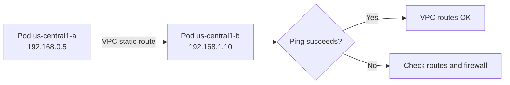

# Validate Calico Networking on Google Compute Engine

Author: [nawazdhandala](https://github.com/nawazdhandala)

Tags: Calico, Kubernetes, Networking, GCE, Google Cloud, Validation

Description: How to validate Calico networking on GCE self-managed Kubernetes, including VPC route verification, firewall rule checks, and cross-zone pod connectivity tests.

---

## Introduction

Validating Calico on GCE involves confirming that the GCP-specific infrastructure configuration is correct alongside standard Calico health checks. GCE's globally-routed VPC requires custom static routes for pod CIDRs when using native routing mode, and GCP firewall rules must explicitly allow the traffic patterns that Calico uses for both the data plane and control plane.

A complete validation checks GCP firewall rules, VPC static routes, GCE instance can-ip-forward settings, Calico component health, and end-to-end pod connectivity across zones.

## Prerequisites

- Calico installed on GCE self-managed Kubernetes
- `gcloud` CLI authenticated with Compute Engine read permissions
- `kubectl` and `calicoctl` with cluster admin access

## Step 1: Verify GCE Instance can-ip-forward

```bash
for node in $(kubectl get nodes -o name | cut -d/ -f2); do
  ZONE=$(kubectl get node $node -o jsonpath='{.metadata.labels.topology\.kubernetes\.io/zone}')
  CAN_FWD=$(gcloud compute instances describe $node \
    --zone $ZONE \
    --format="value(canIpForward)" 2>/dev/null)
  echo "$node ($ZONE): canIpForward=$CAN_FWD"
  # Should be: true
done
```

## Step 2: Verify VPC Firewall Rules

```bash
# List all Calico-related firewall rules
gcloud compute firewall-rules list \
  --filter="name~calico OR name~kubelet OR name~vxlan" \
  --format="table(name,direction,allowed[].map().firewall_rule():label=ALLOW,targetTags.list())"
```

Expected rules:
- `allow-calico-vxlan` (if using VXLAN): UDP 4789
- `allow-kubelet`: TCP 10250
- `allow-calico-bgp` (if using BGP): TCP 179

## Step 3: Verify VPC Static Routes for Pod CIDRs

```bash
# List routes matching pod CIDR space
gcloud compute routes list \
  --filter="destRange~192.168" \
  --format="table(name,destRange,nextHopInstance)"
```

Verify each node has a corresponding route:

```bash
# Cross-check with Calico IPAM blocks
calicoctl ipam show --show-blocks
# Every block should have a corresponding VPC route
```

## Step 4: Check Calico Component Health

```bash
kubectl get pods -n calico-system
kubectl get pods -n tigera-operator

# Check Felix logs
kubectl logs -n calico-system ds/calico-node --tail=50 | grep -i "error\|warning"
```

## Step 5: Test Cross-Zone Pod Connectivity



```bash
# Deploy pods on different zones
kubectl run test-z1 --image=busybox \
  --overrides='{"spec":{"nodeName":"worker-us-central1-a"}}' -- sleep 3600 &
kubectl run test-z2 --image=busybox \
  --overrides='{"spec":{"nodeName":"worker-us-central1-b"}}' -- sleep 3600 &

sleep 15

Z2_IP=$(kubectl get pod test-z2 -o jsonpath='{.status.podIP}')
kubectl exec test-z1 -- ping -c 3 $Z2_IP
```

## Step 6: Validate Service DNS

```bash
kubectl exec test-z1 -- nslookup kubernetes.default.svc.cluster.local
```

## Step 7: Test External Traffic

```bash
kubectl exec test-z1 -- wget -qO- http://metadata.google.internal/computeMetadata/v1/project/project-id \
  -H "Metadata-Flavor: Google"
# Should return your GCP project ID
```

## Cleanup

```bash
kubectl delete pod test-z1 test-z2
```

## Conclusion

Validating Calico on GCE requires checking GCP-level settings (can-ip-forward, firewall rules, VPC routes) alongside standard Calico health checks. The VPC static routes are the most critical GCE-specific element - if a node's pod CIDR doesn't have a corresponding VPC route in native routing mode, all traffic to pods on that node from other nodes will fail silently.
