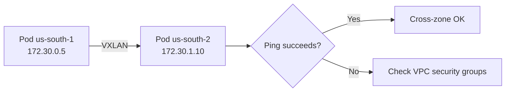

# Validate Calico Networking on IBM Cloud

Author: [nawazdhandala](https://github.com/nawazdhandala)

Tags: Calico, Kubernetes, Networking, IBM Cloud, Validation

Description: How to validate Calico networking on IBM Cloud Kubernetes Service and self-managed Kubernetes on IBM Cloud VPC, including security group checks and cross-zone connectivity tests.

---

## Introduction

Validating Calico on IBM Cloud requires checking IBM Cloud-specific infrastructure settings alongside standard Calico health checks. For IKS clusters, IBM manages much of the Calico configuration automatically, but custom policies and IP pool changes need validation to ensure they don't conflict with IBM's managed configuration. For self-managed clusters on IBM Cloud VPC, VPC security groups and routing must be explicitly verified.

This guide covers validation procedures for both IKS and self-managed Kubernetes on IBM Cloud.

## Prerequisites

- IBM Cloud CLI with Kubernetes plugin configured
- `kubectl` and `calicoctl` with cluster admin access
- Access to IBM Cloud VPC console or CLI

## Step 1: Verify Calico Health on IKS

```bash
# Check all Calico pods are running
kubectl get pods -n calico-system
kubectl get pods -n ibm-system | grep calico

# Check Felix status via calicoctl
calicoctl node status

# Expected output
# Calico process is running.
# IPv4 BGP status: No peers established
```

## Step 2: Check IP Pool Configuration

```bash
calicoctl get ippools -o wide
# Verify cidr, encapsulation mode, and natOutgoing match intended config

calicoctl ipam show --show-blocks
# Each node should have at least one block assigned
```

## Step 3: Validate IBM Cloud VPC Security Groups (Self-Managed)

```bash
# List security group rules
ibmcloud is security-group <sg-id>

# Verify VXLAN rule exists
ibmcloud is security-group-rules <sg-id> | grep 4789

# Verify kubelet rule
ibmcloud is security-group-rules <sg-id> | grep 10250
```

## Step 4: Test Cross-Zone Pod Connectivity

```bash
# Get worker nodes in different zones
kubectl get nodes -L ibm-cloud.kubernetes.io/zone
```



```bash
# Deploy test pods on different zones
kubectl run test-zone-1 --image=busybox \
  --overrides='{"spec":{"nodeSelector":{"ibm-cloud.kubernetes.io/zone":"us-south-1"}}}' \
  -- sleep 3600 &

kubectl run test-zone-2 --image=busybox \
  --overrides='{"spec":{"nodeSelector":{"ibm-cloud.kubernetes.io/zone":"us-south-2"}}}' \
  -- sleep 3600 &

sleep 15

Z2_IP=$(kubectl get pod test-zone-2 -o jsonpath='{.status.podIP}')
kubectl exec test-zone-1 -- ping -c 3 $Z2_IP
```

## Step 5: Validate IKS Managed Calico Policies

IKS installs several managed Calico policies. Verify they haven't been accidentally removed:

```bash
calicoctl get globalnetworkpolicies | grep ibm
# Should show several IBM-managed policies like:
# allow-ibm-ports
# allow-all-outbound
```

## Step 6: Test Service Discovery

```bash
kubectl run dns-test --image=busybox --rm -it -- \
  nslookup kubernetes.default.svc.cluster.local
# Should return the cluster IP
```

## Step 7: Validate Network Policy Enforcement

```bash
# Create a test policy
kubectl create namespace test-ns
kubectl run server --image=nginx -n test-ns
kubectl expose pod server -n test-ns --port=80

# Apply deny policy
kubectl apply -n test-ns -f - <<EOF
apiVersion: networking.k8s.io/v1
kind: NetworkPolicy
metadata:
  name: deny-ingress
spec:
  podSelector:
    matchLabels:
      run: server
  policyTypes: [Ingress]
EOF

# Test - should be denied
kubectl run client --image=busybox -n test-ns --rm -it \
  -- wget -T 3 server.test-ns.svc.cluster.local
```

## Cleanup

```bash
kubectl delete pod test-zone-1 test-zone-2
kubectl delete namespace test-ns
```

## Conclusion

Validating Calico on IBM Cloud requires verifying IBM Cloud VPC security group rules, testing cross-zone pod connectivity, and confirming that IBM's managed Calico policies are intact for IKS clusters. The validation process is especially important after Kubernetes version upgrades on IKS, where managed Calico configurations may be updated and custom policies need to be re-verified for compatibility.
