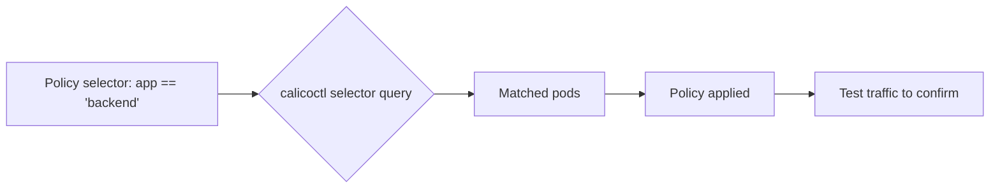

# Validate Calico NetworkPolicy Resource

Author: [nawazdhandala](https://github.com/nawazdhandala)

Tags: Calico, Kubernetes, Networking, NetworkPolicy, Validation

Description: How to validate Calico NetworkPolicy resources to confirm policies are correctly applied, selectors match the intended pods, and traffic behavior matches the policy intent.

---

## Introduction

Validating Calico NetworkPolicy resources requires confirming that the policy exists with the correct specification, that the selector matches the intended pods, that Felix has programmed the policy into the data plane, and that actual traffic behavior matches the intended allow/deny actions. A policy that appears correct syntactically may still fail to enforce correctly if selectors don't match or if policy ordering creates unexpected interactions.

## Prerequisites

- Calico with NetworkPolicy resources deployed
- `calicoctl` and `kubectl` with cluster admin access
- Test pods available for traffic testing

## Step 1: Verify Policy Exists and Is Valid

```bash
# List all policies in a namespace
calicoctl get networkpolicy -n production

# Inspect specific policy
calicoctl get networkpolicy allow-frontend-to-backend -n production -o yaml

# Validate YAML is syntactically correct
calicoctl validate -f my-policy.yaml
```

## Step 2: Verify Selector Matches Target Pods

```bash
# Check which pods match the policy selector "app == 'backend'"
kubectl get pods -n production -l app=backend

# If the selector uses 'all()'
kubectl get pods -n production
```



## Step 3: Check Felix Programmed the Policy

```bash
# Felix logs show policy programming
kubectl logs -n calico-system ds/calico-node --tail=100 | \
  grep -i "networkpolicy\|allow-frontend"

# Check metrics
kubectl exec -n calico-system ds/calico-node -- \
  curl -s localhost:9091/metrics | grep felix_active_local_policies
```

## Step 4: Test Allowed Traffic

```bash
# Deploy test pods matching source and destination selectors
kubectl run backend --image=nginx -n production -l app=backend
kubectl expose pod backend -n production --port=8080 --target-port=80

kubectl run frontend --image=busybox -n production -l app=frontend -- sleep 3600
kubectl run other --image=busybox -n production -l app=other -- sleep 3600

# Test: frontend -> backend (should succeed)
kubectl exec -n production frontend -- wget -qO- http://backend:8080
# Should return nginx page

# Test: other -> backend (should fail)
kubectl exec -n production other -- wget -T 3 -qO- http://backend:8080
# Should timeout
```

## Step 5: Verify Policy Order and Tier Interaction

```bash
# Check all policies in namespace with their orders
calicoctl get networkpolicies -n production -o wide | sort -k3 -n

# Identify any policies that might override your new policy
# A lower order number = higher priority
```

## Step 6: Test Egress Policy

```bash
# Test egress to database (should succeed)
kubectl exec -n production frontend -- nc -zv database 5432

# Test egress to external (should be denied if policy denies external egress)
kubectl exec -n production frontend -- wget -T 3 http://example.com
```

## Cleanup Test Resources

```bash
kubectl delete pod frontend backend other -n production
kubectl delete service backend -n production
```

## Conclusion

Validating Calico NetworkPolicy resources requires a four-step process: verify the policy specification is correct, confirm selectors match the intended pods, check Felix has programmed the policy, and test actual traffic behavior for both allowed and denied scenarios. Always test both positive and negative cases - a policy that allows intended traffic but doesn't deny unintended traffic is misconfigured.
