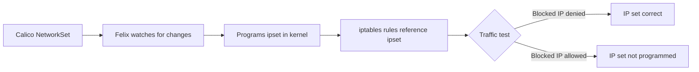

# Validate Calico NetworkSet Resource

Author: [nawazdhandala](https://github.com/nawazdhandala)

Tags: Calico, Kubernetes, Networking, NetworkSet, Validation

Description: How to validate Calico NetworkSet resources to confirm IP sets are correctly defined, labels are applied for policy matching, and IP sets are programmed into the kernel.

---

## Introduction

Validating Calico NetworkSet resources involves confirming that the correct IP addresses and CIDRs are included, that the labels enable correct policy matching, and that Felix has programmed the IP sets into the kernel. A NetworkSet with wrong IPs silently allows or blocks the wrong traffic; a NetworkSet with incorrect labels won't match any policy selectors.

## Prerequisites

- Calico NetworkSet resources deployed
- `calicoctl` and `kubectl` with cluster admin access

## Step 1: List and Inspect NetworkSets

```bash
# List all namespace-scoped NetworkSets
calicoctl get networksets -A

# List GlobalNetworkSets
calicoctl get globalnetworksets

# Inspect a specific NetworkSet
calicoctl get networkset trusted-payment-processors -n payments -o yaml
```

## Step 2: Verify IP Contents

```bash
# Check specific IPs are in the set
calicoctl get networkset trusted-payment-processors -n payments -o yaml | grep "nets" -A20

# Verify a specific IP is included
IP_TO_CHECK="52.44.1.100"
calicoctl get networkset trusted-payment-processors -n payments -o json | \
  python3 -c "
import json, sys, ipaddress
data = json.load(sys.stdin)
ip = ipaddress.ip_address('$IP_TO_CHECK')
for net in data['spec']['nets']:
    if ip in ipaddress.ip_network(net, strict=False):
        print(f'IP $IP_TO_CHECK is in network {net}')
        break
else:
    print('IP $IP_TO_CHECK NOT found in NetworkSet')
"
```

## Step 3: Verify Labels for Policy Matching

```bash
# Check labels on the NetworkSet
calicoctl get networkset trusted-payment-processors -n payments -o yaml | grep -A5 "labels:"

# Check if any policies reference these labels
calicoctl get networkpolicies -n payments -o yaml | grep "role == 'trusted-external'"
```

## Step 4: Verify Felix Programmed the IP Set



```bash
# On a node, check if the IP set exists in the kernel
kubectl debug node/worker-1 -it --image=ubuntu -- \
  ipset list | grep "cali-" | grep -i "networkset"

# Or check ipset contents
ipset list cali-s:management-hosts 2>/dev/null
```

## Step 5: Traffic Test

```bash
# Deploy a test pod that should be allowed/blocked based on NetworkSet
kubectl run network-test --image=busybox -n payments -- sleep 3600

# Test connectivity to an IP in the allowed set
kubectl exec -n payments network-test -- nc -zv 52.44.1.100 443
# Should succeed (if policy allows this NetworkSet)

# Test connectivity to an IP NOT in the allowed set
kubectl exec -n payments network-test -- nc -zv 1.2.3.4 443
# Should fail (if policy only allows the NetworkSet)
```

## Step 6: Verify GlobalNetworkSet Cluster-Wide Application

```bash
# GlobalNetworkSets apply cluster-wide - verify
calicoctl get globalnetworkset management-hosts -o yaml

# Check it's referenced in a GlobalNetworkPolicy
calicoctl get globalnetworkpolicies -o yaml | grep "role == 'management'"
```

## Conclusion

Validating Calico NetworkSet resources requires checking IP contents, verifying label correctness for selector matching, and confirming Felix has programmed the IP set into the kernel. Traffic testing against IPs both inside and outside the NetworkSet confirms end-to-end correctness. Always verify that updates to NetworkSet IP lists are reflected in kernel IP sets, especially after adding new external service IP ranges.
