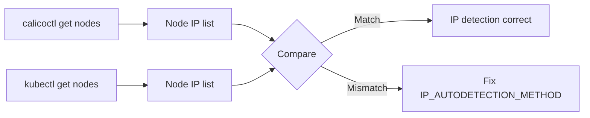

# Validate Calico Node Configuration

Author: [nawazdhandala](https://github.com/nawazdhandala)

Tags: Calico, Kubernetes, Networking, Node, Felix, Validation

Description: How to validate Calico node configuration including Felix settings, node IP detection, dataplane mode verification, and BGP peer status checks.

---

## Introduction

Validating Calico node configuration ensures that Felix is running with the intended settings on each cluster node, that nodes have registered the correct IP addresses, that the configured dataplane mode is active, and that BGP sessions (if used) are established. Configuration validation is especially important after upgrades, new node additions, and configuration changes.

This guide covers systematic validation of all key Calico node configuration components.

## Prerequisites

- Calico installed with `kubectl` and `calicoctl` access
- Node-level access for some checks
- `calicoctl` configured with cluster admin credentials

## Step 1: Validate Felix Configuration

```bash
# View current FelixConfiguration
kubectl get felixconfiguration default -o yaml

# Verify key settings
kubectl get felixconfiguration default -o jsonpath='{.spec.prometheusMetricsEnabled}'
# Should return: true (if metrics enabled)

kubectl get felixconfiguration default -o jsonpath='{.spec.logSeverityScreen}'
# Should return: Info

# Check for per-node overrides
kubectl get felixconfigurations | grep "node\."
```

## Step 2: Validate Node IP Registration

```bash
# All nodes should have correctly detected IPs
calicoctl get nodes -o wide

# Cross-reference with kubectl
kubectl get nodes -o wide

# IPs should match
```



## Step 3: Validate Dataplane Mode

```bash
# Check if eBPF is enabled
kubectl get felixconfiguration default -o jsonpath='{.spec.bpfEnabled}'

# Verify eBPF programs are loaded (if eBPF mode)
kubectl exec -n calico-system ds/calico-node -- \
  calico-node -show-bpf-programs 2>/dev/null || echo "iptables mode (non-eBPF)"

# For iptables mode, verify Calico chains exist
kubectl debug node/worker-1 -it --image=ubuntu -- \
  iptables -L cali-FORWARD -n --line-numbers 2>/dev/null | head -20
```

## Step 4: Validate Felix Is Running on All Nodes

```bash
kubectl get pods -n calico-system -l k8s-app=calico-node -o wide
# All pods should be Running, 1/1 or 2/2 Ready

# Check for any pods that have been restarting
kubectl get pods -n calico-system | grep calico-node | \
  awk '{if ($4 > 5) print "High restarts: "$1, $4}'
```

## Step 5: Validate Felix Policy Programming

```bash
# Check Felix has programmed policies on each node
kubectl exec -n calico-system ds/calico-node -- calico-node -felix-live

# Check active endpoints count
kubectl exec -n calico-system ds/calico-node -- \
  curl -s localhost:9091/metrics | grep felix_active_local_endpoints
# Should match number of pods on this node
```

## Step 6: Validate BGP Configuration (If Using BGP)

```bash
# Check BGP configuration
calicoctl get bgpconfiguration default -o yaml

# Check BGP peer status
calicoctl node status
# Expected:
# Calico process is running.
# IPv4 BGP status
# +--------------+-------------------+-------+----------+-------------+
# | PEER ADDRESS |     PEER TYPE     | STATE |  SINCE   |    INFO     |
# +--------------+-------------------+-------+----------+-------------+
# | 10.0.1.10   | node-to-node mesh | up    | 10:30:00 | Established |
```

## Step 7: Validate MTU Settings

```bash
# Check configured MTU
kubectl get felixconfiguration default -o jsonpath='{.spec.mtu}'
# 0 means auto-detect

# Check actual MTU on Calico interfaces
kubectl exec -n calico-system ds/calico-node -- ip link show | grep -E "cali|vxlan" | \
  grep -o "mtu [0-9]*"
```

## Conclusion

Validating Calico node configuration is a systematic check of Felix settings, node IP registration accuracy, dataplane mode status, BGP session health, and interface MTU alignment. Run this validation after any configuration change and after cluster upgrades. Discrepancies between intended configuration and actual state should be investigated promptly - an incorrect node IP or wrong dataplane mode can cause subtle networking issues that are difficult to diagnose later.
