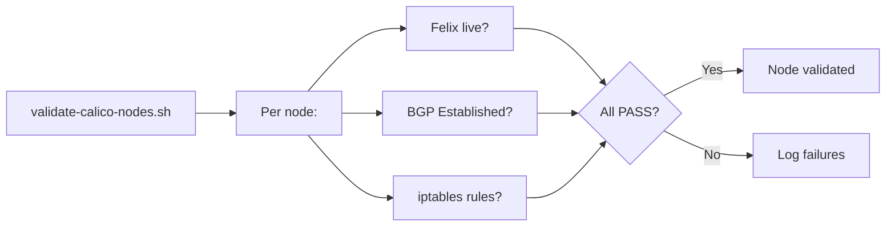

# How to Validate Calico Node Diagnostics

Author: [nawazdhandala](https://github.com/nawazdhandala)

Tags: Calico, Kubernetes, Networking, Diagnostics, Validation

Description: Validate Calico networking health on individual cluster nodes by confirming Felix liveness, iptables rule completeness, BGP route propagation, and pod IP reachability from each node.

---

## Introduction

Validating Calico node health requires confirming four signals per node: Felix is live and ready, iptables rules are programmed, BGP peers are Established, and pod IPs are reachable from the node. Running this validation on every node ensures no node is silently degraded before issues affect application traffic.

## Per-Node Validation Script

```bash
#!/bin/bash
# validate-calico-nodes.sh
PASS=0
FAIL=0

for pod in $(kubectl get pods -n calico-system -l k8s-app=calico-node \
  -o jsonpath='{.items[*].metadata.name}'); do

  NODE=$(kubectl get pod -n calico-system "${pod}" \
    -o jsonpath='{.spec.nodeName}')

  echo "Validating node: ${NODE}"

  # 1. Felix liveness
  LIVE=$(kubectl exec -n calico-system "${pod}" -c calico-node -- \
    calico-node -felix-live 2>&1 | grep -c "live" || echo 0)
  if [ "${LIVE}" -gt 0 ]; then
    echo "  PASS: Felix live"
    PASS=$((PASS + 1))
  else
    echo "  FAIL: Felix not live on ${NODE}"
    FAIL=$((FAIL + 1))
  fi

  # 2. BGP peers
  ESTABLISHED=$(kubectl exec -n calico-system "${pod}" -c calico-node -- \
    calicoctl node status 2>/dev/null | grep -c "Established" || echo 0)
  if [ "${ESTABLISHED}" -gt 0 ]; then
    echo "  PASS: ${ESTABLISHED} BGP peer(s) Established"
    PASS=$((PASS + 1))
  else
    echo "  WARN: No BGP peers Established on ${NODE}"
    # Not always a failure - depends on BGP topology
  fi

done

echo ""
echo "Validation: ${PASS} passed, ${FAIL} failed"
exit ${FAIL}
```

## Validate iptables Rules Are Complete

```bash
# Check Calico iptables chain exists and has rules
CALICO_RULES=$(kubectl debug node/"${NODE}" --image=alpine -- \
  nsenter -t 1 -n -- iptables -L cali-FORWARD --line-numbers 2>/dev/null | wc -l)

if [ "${CALICO_RULES}" -gt 2 ]; then
  echo "PASS: Calico iptables rules present (${CALICO_RULES} rules in cali-FORWARD)"
else
  echo "FAIL: No Calico iptables rules in cali-FORWARD"
fi
```

## Validate Pod IP Reachability

```bash
# Test that a pod IP is reachable from the node's calico-node pod
POD_IP=$(kubectl get pod <test-pod> -n <namespace> \
  -o jsonpath='{.status.podIP}')
TEST_NODE_POD="<calico-node-pod-on-different-node>"

kubectl exec -n calico-system "${TEST_NODE_POD}" -c calico-node -- \
  ping -c 3 "${POD_IP}"
# Success: routing between nodes is working
# Failure: BGP routes not propagated, check BGP state
```

## Validation Architecture



## Conclusion

Per-node Calico validation ensures that no node is silently degraded. The four validation points - Felix liveness, BGP peer state, iptables rules, and pod reachability - cover the primary failure modes for individual nodes. Run this validation after node replacements, calico-node pod restarts, and before declaring an incident resolved. A green run on all nodes confirms the full data plane is healthy.
