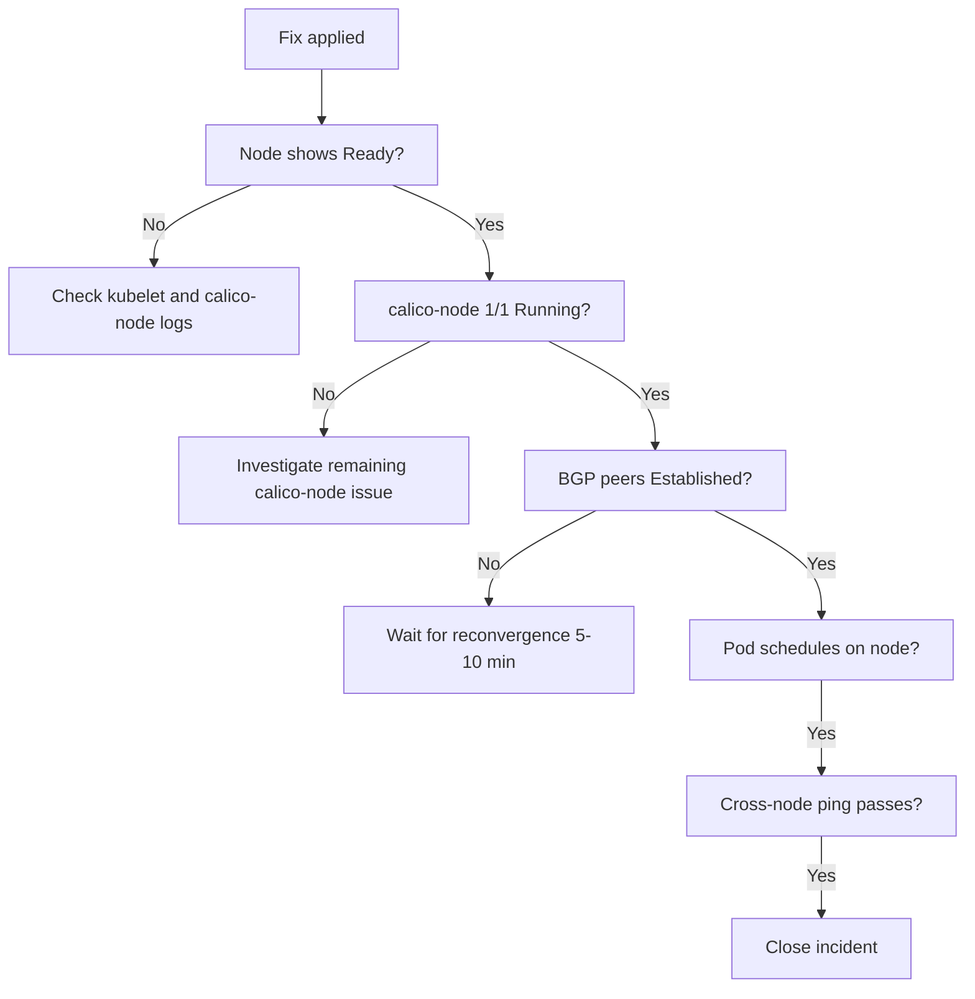

# How to Validate Resolution of Calico Node Not Ready Status

Author: [nawazdhandala](https://github.com/nawazdhandala)

Tags: Calico, Kubernetes, Networking, Troubleshooting

Description: Validation steps to confirm a Kubernetes node is fully Ready after resolving Calico issues including pod scheduling tests and BGP state verification.

---

## Introduction

Validating node Ready status restoration after a Calico fix requires confirming the node condition, calico-node pod health, pod scheduling on the recovered node, and BGP peer state. A node that shows Ready may still have incomplete networking if BGP route reconvergence is still in progress.

## Symptoms

- Node shows Ready but pods cannot schedule due to network issues
- calico-node is 1/1 but BGP peers not yet Established
- Node recovers then goes NotReady again

## Root Causes

- Underlying issue not fully resolved
- BGP reconvergence still in progress after fix

## Diagnosis Steps

```bash
kubectl get nodes
kubectl get pods -n kube-system -l k8s-app=calico-node -o wide
```

## Solution

**Validation Step 1: Node shows Ready**

```bash
kubectl get node <node-name>
# Expected: STATUS=Ready
```

**Validation Step 2: calico-node pod is 1/1 Running**

```bash
kubectl get pods -n kube-system -l k8s-app=calico-node \
  --field-selector spec.nodeName=<node-name>
# Expected: 1/1 Running
```

**Validation Step 3: BGP peers Established**

```bash
calicoctl node status
# Expected: all peers show Established
```

**Validation Step 4: Test pod scheduling on recovered node**

```bash
kubectl run node-test --image=busybox --restart=Never \
  --overrides="{\"spec\":{\"nodeName\":\"<node-name>\"}}" -- sleep 30
kubectl wait pod/node-test --for=condition=Ready --timeout=60s
kubectl get pod node-test -o wide
kubectl delete pod node-test
```

**Validation Step 5: Cross-node connectivity from recovered node**

```bash
kubectl run from-node --image=busybox --restart=Never \
  --overrides="{\"spec\":{\"nodeName\":\"<recovered-node>\"}}" -- sleep 120
kubectl run to-node --image=busybox --restart=Never \
  --overrides="{\"spec\":{\"nodeName\":\"<other-node>\"}}" -- sleep 120

kubectl wait pod/from-node pod/to-node --for=condition=Ready --timeout=60s
TO_IP=$(kubectl get pod to-node -o jsonpath='{.status.podIP}')
kubectl exec from-node -- ping -c 3 $TO_IP

kubectl delete pod from-node to-node
```



## Prevention

- Include BGP peer state check in node recovery validation
- Set 10-minute observation window before closing node recovery incidents
- Add recovered node to post-incident monitoring for 24 hours

## Conclusion

Validating node Ready recovery requires confirming node status, calico-node pod health, BGP peer state, pod scheduling capability, and cross-node connectivity. BGP reconvergence may take a few minutes after calico-node recovers — allow time for this before confirming the node is fully operational.
