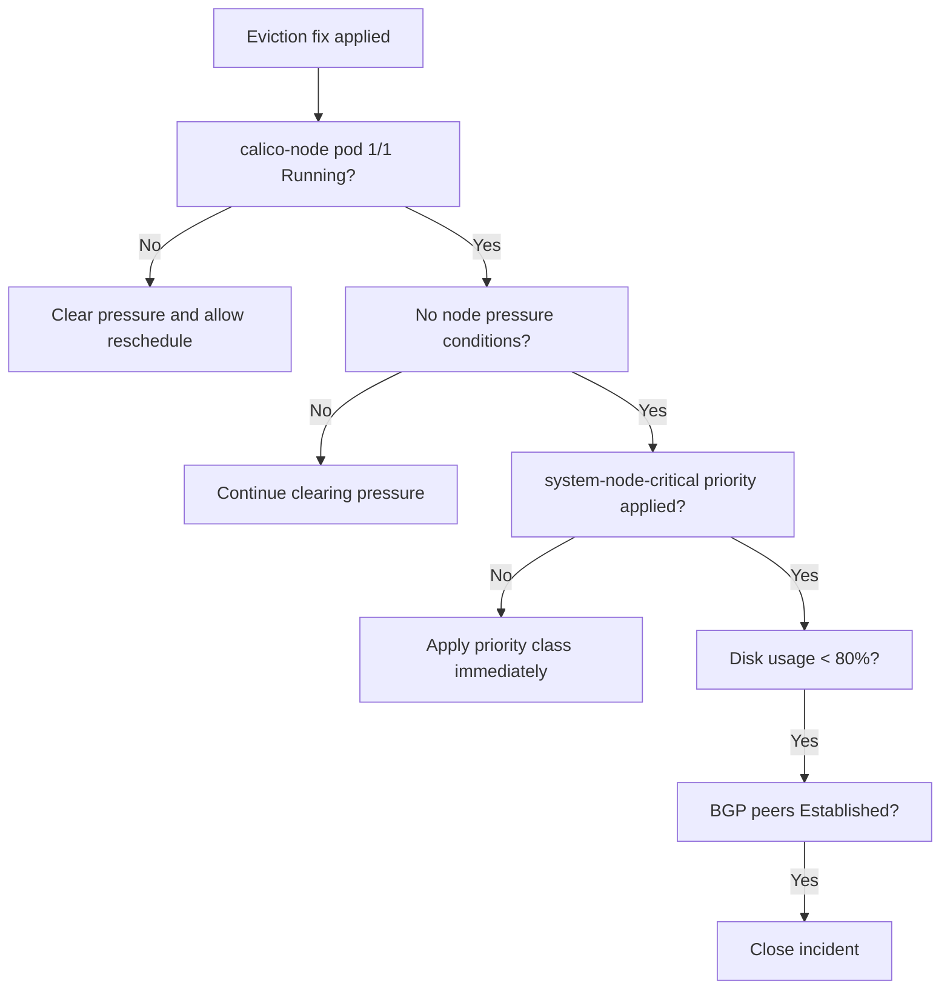

# How to Validate Resolution of Calico Node Pod Eviction

Author: [nawazdhandala](https://github.com/nawazdhandala)

Tags: Calico, Kubernetes, Networking, Troubleshooting

Description: Validate that calico-node has recovered after eviction with pod health checks, priority class confirmation, and node pressure verification.

---

## Introduction

Validating calico-node eviction recovery requires confirming the pod is running, the node pressure has cleared, the system-node-critical priority class is applied, and networking is functioning correctly. The priority class verification is the most critical post-incident validation — without it, the pod will be evicted again on the next pressure event.

## Symptoms

- Pod recovered but priority class not applied
- Node pressure still present causing re-eviction

## Root Causes

- Priority class fix not applied during incident response
- Disk pressure not fully cleared

## Diagnosis Steps

```bash
kubectl get pods -n kube-system -l k8s-app=calico-node -o wide
kubectl describe node <node> | grep -i pressure
```

## Solution

**Validation Step 1: calico-node pod is 1/1 Running**

```bash
kubectl get pods -n kube-system -l k8s-app=calico-node --field-selector spec.nodeName=<node>
# Expected: 1/1 Running, not Evicted
```

**Validation Step 2: No node pressure conditions**

```bash
kubectl get node <node> -o json | \
  jq '.status.conditions[] | select(.type | test("Pressure")) | {type, status}'
# Expected: all pressure conditions show status "False"
```

**Validation Step 3: system-node-critical priority class applied**

```bash
kubectl get daemonset calico-node -n kube-system \
  -o jsonpath='{.spec.template.spec.priorityClassName}'
# Expected: system-node-critical
```

**Validation Step 4: Node disk usage at safe level**

```bash
ssh <node> "df -h / | tail -1"
# Expected: Use% < 80%
```

**Validation Step 5: BGP routes restored**

```bash
calicoctl node status
# Expected: all BGP peers Established
```

**Validation Step 6: Networking functional on recovered node**

```bash
kubectl run evict-test --image=busybox --restart=Never \
  --overrides="{\"spec\":{\"nodeName\":\"<recovered-node>\"}}" -- sleep 30
kubectl wait pod/evict-test --for=condition=Ready --timeout=60s
kubectl get pod evict-test -o wide
kubectl delete pod evict-test
```



## Prevention

- Make priority class verification part of incident closure checklist
- Set disk usage alert at 80% to prevent recurrence
- Check priority class in weekly cluster health audits

## Conclusion

Validating calico-node eviction recovery requires confirming the pod is running, node pressure has cleared, disk usage is safe, the system-node-critical priority class is applied, and BGP routes are restored. The priority class check is the most critical validation step for preventing recurrence.
