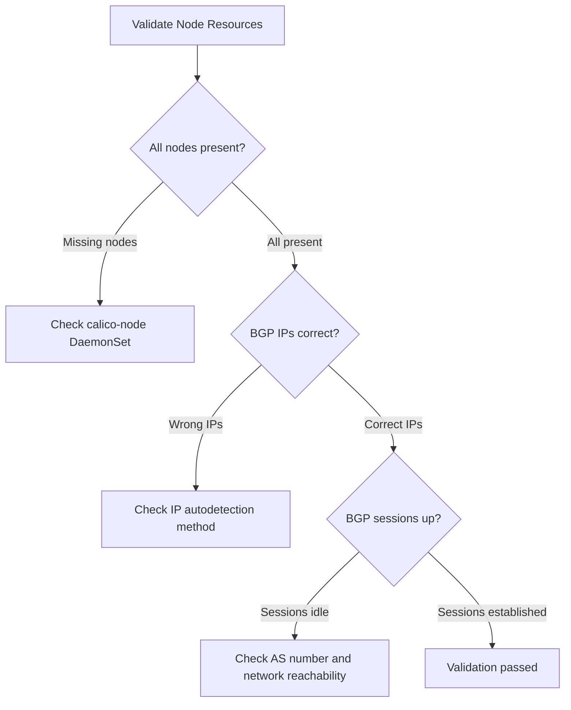

# Validate Calico Node Resource

Author: [nawazdhandala](https://github.com/nawazdhandala)

Tags: Calico, Kubernetes, Networking, Node, Validation

Description: How to validate Calico Node resources to confirm per-node BGP configuration is correct, IP addresses are properly assigned, and BGP sessions are established as expected.

---

## Introduction

Validating Calico Node resources confirms that each node has the correct BGP identity and that the configuration matches the intended network topology. Common validation failures include nodes with incorrect IP addresses (due to wrong auto-detection interface), missing AS number overrides, or BGP sessions that remain in idle state due to configuration mismatches between the Node resource and the actual network.

Validation should be performed after any node configuration change, after adding new nodes to the cluster, and as part of routine network audits.

## Prerequisites

- Calico installed with BGP enabled
- `calicoctl` with cluster admin access
- Access to `kubectl` for checking DaemonSet status

## Step 1: Verify Node Resources Exist for All Nodes

```bash
# Compare Kubernetes nodes with Calico Node resources
echo "=== Kubernetes Nodes ==="
kubectl get nodes -o name | sort

echo "=== Calico Node Resources ==="
calicoctl get nodes -o wide | sort
```

Every Kubernetes node should have a corresponding Calico Node resource. Missing entries indicate the calico-node pod may not have started successfully on that node.

## Step 2: Verify BGP IP Address Assignments

```bash
# Check each node's IPv4 address used for BGP
calicoctl get nodes -o json | python3 -c "
import json, sys
data = json.load(sys.stdin)
for node in data['items']:
    name = node['metadata']['name']
    bgp = node['spec'].get('bgp', {})
    ipv4 = bgp.get('ipv4Address', 'NOT SET')
    asn = bgp.get('asNumber', 'global default')
    print(f'{name}: IPv4={ipv4}, AS={asn}')
"
```

## Step 3: Verify BGP Session Status

```bash
# Check BGP peer status for each node
# Run on each node or check via calicoctl
calicoctl node status

# Check from a specific calico-node pod
NODE_POD=$(kubectl get pod -n calico-system -l k8s-app=calico-node -o name | head -1)
kubectl exec -n calico-system $NODE_POD -- birdcl show protocols
```



## Step 4: Validate Tunnel IP Assignments

```bash
# Verify VXLAN tunnel addresses are assigned and unique
calicoctl get nodes -o json | python3 -c "
import json, sys
data = json.load(sys.stdin)
tunnel_ips = {}
for node in data['items']:
    name = node['metadata']['name']
    tunnel_ip = node['spec'].get('ipv4VXLANTunnelAddr', None)
    if tunnel_ip:
        if tunnel_ip in tunnel_ips:
            print(f'CONFLICT: {name} and {tunnel_ips[tunnel_ip]} share tunnel IP {tunnel_ip}')
        else:
            tunnel_ips[tunnel_ip] = name
            print(f'{name}: tunnel IP = {tunnel_ip}')
"
```

## Step 5: Test Pod-to-Pod Connectivity Across Nodes

```bash
# Deploy test pods on different nodes
kubectl run test-a --image=busybox -l test=connectivity -- sleep 3600
kubectl run test-b --image=busybox -l test=connectivity -- sleep 3600

# Get pod IPs
POD_A_IP=$(kubectl get pod test-a -o jsonpath='{.status.podIP}')
POD_B_IP=$(kubectl get pod test-b -o jsonpath='{.status.podIP}')

# Test cross-node connectivity
kubectl exec test-a -- ping -c 3 $POD_B_IP

# Cleanup
kubectl delete pod test-a test-b
```

## Conclusion

Calico Node resource validation covers three layers: resource existence (every k8s node has a Calico Node), BGP configuration accuracy (correct IPs and AS numbers), and functional BGP session establishment. Tunnel IP conflicts are rare but critical to detect - two nodes sharing a tunnel IP causes traffic black-holing that is difficult to diagnose without explicitly checking the Node resource configuration.
