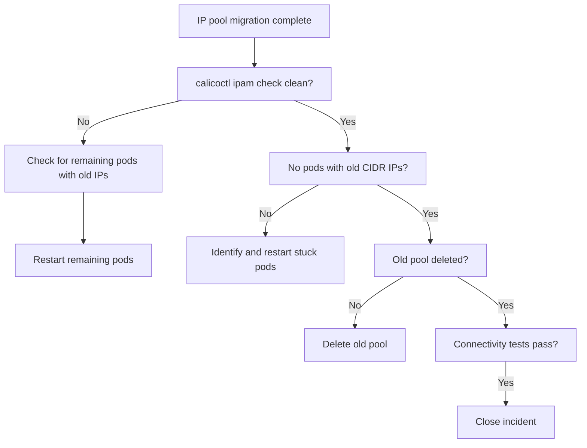

# How to Validate Resolution of Calico Pod CIDR Conflicts

Author: [nawazdhandala](https://github.com/nawazdhandala)

Tags: Calico, Kubernetes, Networking, Troubleshooting

Description: Validate that Calico pod CIDR conflicts are fully resolved by confirming no IP overlaps remain, pods have new addresses, and connectivity is restored.

---

## Introduction

Validating CIDR conflict resolution requires confirming that the conflicting IP pool has been removed, that all pods have received IPs from the new non-overlapping CIDR, and that `calicoctl ipam check` returns clean. Connectivity testing should confirm that traffic to previously affected IP ranges now works correctly.

## Symptoms

- Fix applied but some pods still have old IPs from conflicting CIDR
- IPAM check still shows conflicts because old pool was not deleted
- Routing anomalies persist after pool migration

## Root Causes

- Some pods not restarted during rolling update
- Old pool not fully drained before deletion attempt

## Diagnosis Steps

```bash
calicoctl ipam check
calicoctl get ippool -o yaml | grep cidr:
```

## Solution

**Validation Step 1: IPAM check returns clean**

```bash
calicoctl ipam check 2>&1
# Expected: "IPAM allocations are consistent" or similar clean output
```

**Validation Step 2: No pods with old CIDR IPs**

```bash
OLD_CIDR_PREFIX="10.0."  # Replace with old conflicting prefix
kubectl get pods --all-namespaces -o wide | grep "$OLD_CIDR_PREFIX" | grep -v "kube-system"
# Expected: empty - no pods should have IPs starting with old prefix
```

**Validation Step 3: Old IP pool deleted**

```bash
calicoctl get ippool
# Expected: only the new non-conflicting pool is present
```

**Validation Step 4: Connectivity test to previously affected range**

```bash
# Test connectivity between pods using new IPs
kubectl run val-a --image=busybox --restart=Never -- sleep 120
kubectl run val-b --image=busybox --restart=Never -- sleep 120
kubectl wait pod/val-a pod/val-b --for=condition=Ready --timeout=60s

B_IP=$(kubectl get pod val-b -o jsonpath='{.status.podIP}')
echo "Pod B IP: $B_IP (should be in new CIDR)"
kubectl exec val-a -- ping -c 3 $B_IP

kubectl delete pod val-a val-b
```

**Validation Step 5: Node-to-pod traffic test**

```bash
# Test from a node to a pod (previous source of routing conflict)
NODE_IP=$(kubectl get nodes -o jsonpath='{.items[0].status.addresses[?(@.type=="InternalIP")].address}')
POD_IP=$(kubectl get pods --all-namespaces -o jsonpath='{.items[0].status.podIP}' | head -1)
# SSH to node and ping pod
ssh <node-name> "ping -c 3 $POD_IP"
```



## Prevention

- Run IPAM check as the final step of any IP pool change procedure
- Check that all pods have IPs in the expected CIDR range post-migration
- Verify node-to-pod connectivity after CIDR migration

## Conclusion

Validating CIDR conflict resolution requires a clean `calicoctl ipam check`, confirmation that no pods retain old CIDR IPs, deletion of the old pool, and connectivity tests. The node-to-pod traffic test is critical since the conflict was in that specific traffic path.
