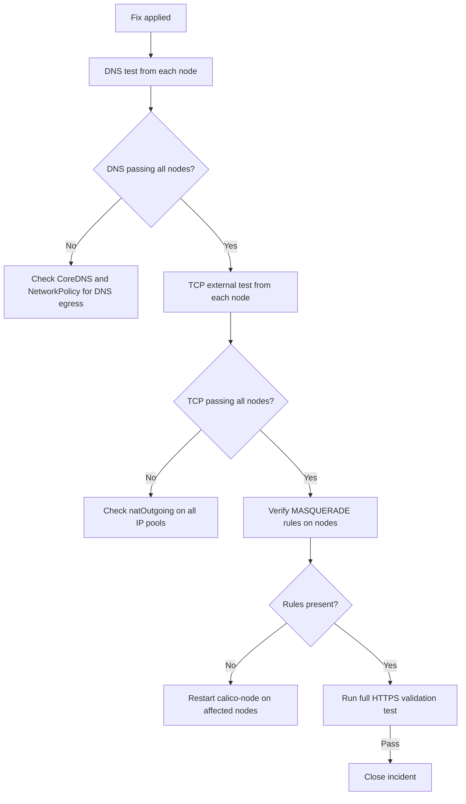

# How to Validate Resolution of Calico Pods That Cannot Reach External Services

Author: [nawazdhandala](https://github.com/nawazdhandala)

Tags: Calico, Kubernetes, Networking, Troubleshooting

Description: Validate that external service connectivity is restored for Calico pods by testing DNS, TCP, and HTTPS from pods on each node, and confirming natOutgoing and iptables NAT rules are in place.

---

## Introduction

Validating that external service connectivity is restored for Calico pods requires testing multiple connectivity layers — DNS, ICMP, TCP, and HTTPS — from pods on each node in the cluster. Testing from a single pod is insufficient because natOutgoing or iptables state may differ node-by-node.

Complete validation also includes confirming the natOutgoing configuration is correct on all IP pools and verifying that Felix has programmed MASQUERADE rules on each node. These configuration checks confirm the fix is durable and will not revert on calico-node restart.

## Symptoms

- Fix applied but connectivity still fails on specific nodes
- DNS works but TCP to external services fails

## Root Causes

- calico-node not yet reconciled on all nodes
- Multiple IP pools — only one was fixed

## Solution

**Validation Step 1: Test DNS resolution from a pod on each node**

```bash
for NODE in $(kubectl get nodes -o jsonpath='{.items[*].metadata.name}'); do
  kubectl run dns-test-$(echo $NODE | sed 's/[^a-z0-9]/-/g') \
    --image=busybox --restart=Never \
    --overrides="{\"spec\":{\"nodeName\":\"$NODE\"}}" \
    -- nslookup google.com
done

sleep 15
kubectl get pods | grep dns-test
kubectl logs -l run=dns-test 2>/dev/null || \
  for POD in $(kubectl get pods | grep dns-test | awk '{print $1}'); do
    echo "--- $POD ---"; kubectl logs $POD
  done
kubectl delete pods -l run=dns-test 2>/dev/null || true
```

**Validation Step 2: Test TCP external connectivity from each node**

```bash
for NODE in $(kubectl get nodes -o jsonpath='{.items[*].metadata.name}' | tr ' ' '\n' | head -5); do
  SAFE_NODE=$(echo $NODE | sed 's/[^a-z0-9]/-/g')
  kubectl run tcp-test-$SAFE_NODE \
    --image=busybox --restart=Never \
    --overrides="{\"spec\":{\"nodeName\":\"$NODE\"}}" \
    -- wget -qO- --timeout=10 http://1.1.1.1
done

sleep 15
for POD in $(kubectl get pods | grep tcp-test | awk '{print $1}'); do
  echo -n "$POD: "
  kubectl logs $POD 2>&1 | head -1
done
kubectl get pods | grep tcp-test | awk '{print $1}' | xargs kubectl delete pod
```

**Validation Step 3: Verify natOutgoing on all IP pools**

```bash
FAIL=0
for POOL in $(calicoctl get ippool -o jsonpath='{.items[*].metadata.name}'); do
  NAT=$(calicoctl get ippool $POOL -o jsonpath='{.spec.natOutgoing}')
  if [ "$NAT" != "true" ]; then
    echo "FAIL: IP pool $POOL has natOutgoing: $NAT"
    FAIL=1
  else
    echo "PASS: IP pool $POOL natOutgoing: true"
  fi
done
[ $FAIL -eq 0 ] && echo "All IP pools validated"
```

**Validation Step 4: Verify MASQUERADE rules on nodes**

```bash
for NODE in $(kubectl get nodes -o jsonpath='{.items[*].metadata.name}'); do
  COUNT=$(ssh $NODE "sudo iptables -t nat -L POSTROUTING -n 2>/dev/null | grep -c MASQUERADE" 2>/dev/null || echo "0")
  if [ "$COUNT" -gt "0" ]; then
    echo "PASS: Node $NODE has $COUNT MASQUERADE rules"
  else
    echo "FAIL: Node $NODE missing MASQUERADE rules"
  fi
done
```

**Validation Step 5: Full connectivity test including HTTPS**

```bash
kubectl run full-validate --image=nicolaka/netshoot --restart=Never -- \
  sh -c "nslookup google.com && curl -s --connect-timeout 10 https://ifconfig.me && echo HTTPS_OK"

kubectl wait pod full-validate --for=condition=Ready --timeout=60s
kubectl logs full-validate
kubectl delete pod full-validate
```



## Prevention

- Add all validation steps to the incident closure checklist
- Run per-node connectivity tests as a standard post-incident procedure
- Document expected natOutgoing values in the cluster configuration baseline

## Conclusion

Validating external service connectivity restoration requires per-node DNS and TCP tests, natOutgoing verification on all IP pools, and MASQUERADE rule checks on each node. A fix that passes single-pod testing may still have gaps on other nodes that require calico-node reconciliation time.
