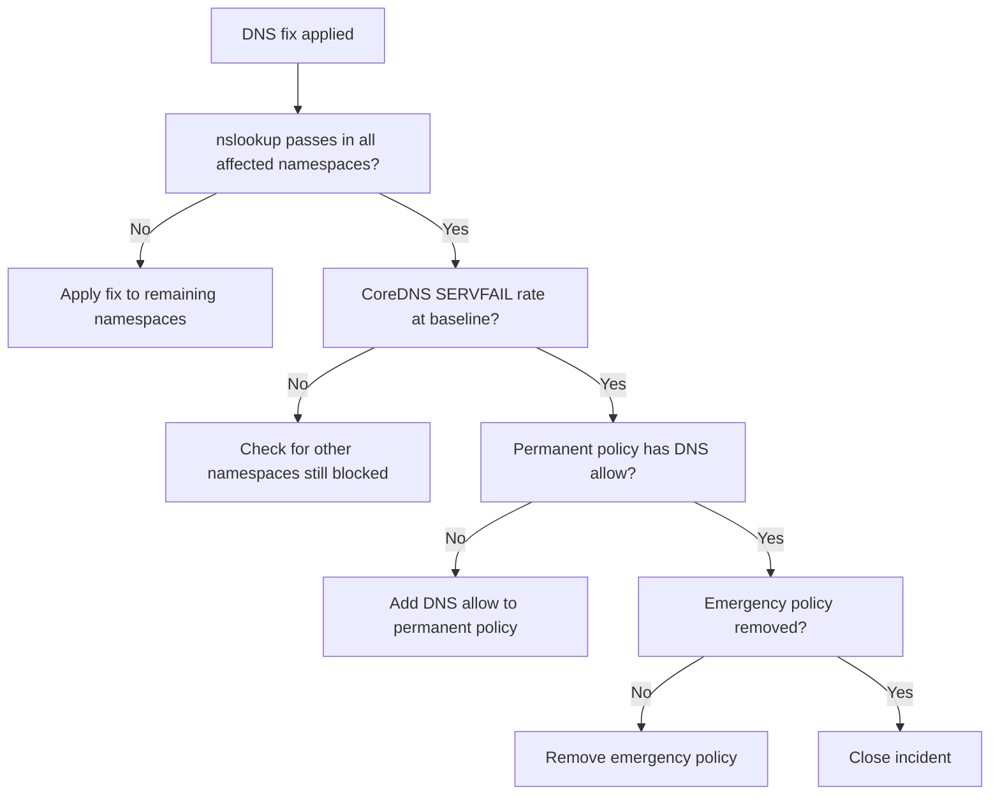

# How to Validate Resolution of Calico Policy Blocking DNS

Author: [nawazdhandala](https://github.com/nawazdhandala)

Tags: Calico, Kubernetes, Networking, Troubleshooting

Description: Validate that DNS is fully restored after fixing Calico NetworkPolicy blocks including resolution tests, CoreDNS error rate monitoring, and permanent fix confirmation.

---

## Introduction

Validating DNS restoration after a Calico policy fix requires confirming that DNS works from all affected pods, that the CoreDNS SERVFAIL rate has returned to baseline, and that the permanent fix is in place with the emergency policy removed. DNS failures can cascade, so a brief monitoring window is important to catch any remaining issues.

## Symptoms

- DNS restored for some pods but not others
- Emergency policy in place but permanent fix not done
- CoreDNS SERVFAIL rate still elevated after fix

## Root Causes

- Multiple namespaces affected but only one fixed
- Permanent fix not applied before emergency policy removed

## Diagnosis Steps

```bash
kubectl get networkpolicy -n <namespace> | grep emergency
```

## Solution

**Validation Step 1: DNS works from affected pods**

```bash
for NS in <affected-namespace-1> <affected-namespace-2>; do
  kubectl run dns-val --image=busybox -n $NS --restart=Never --rm -i \
    --timeout=15s -- nslookup kubernetes.default 2>&1 \
    && echo "PASS: DNS in $NS" || echo "FAIL: DNS in $NS"
done
```

**Validation Step 2: CoreDNS SERVFAIL rate at baseline**

```bash
kubectl exec -n kube-system \
  $(kubectl get pods -n kube-system -l k8s-app=kube-dns -o name | head -1) \
  -- wget -qO- http://localhost:9153/metrics \
  | grep 'coredns_dns_responses_total{.*SERVFAIL.*}'
# Rate should be near zero
```

**Validation Step 3: Permanent fix confirmed and emergency policy removed**

```bash
kubectl get networkpolicy -n <namespace> | grep emergency
# Expected: no emergency policy
kubectl get networkpolicy -n <namespace> -o yaml | grep "port: 53"
# Expected: DNS allow present in permanent policy
```

**Validation Step 4: Application services healthy**

```bash
# Check that applications are resolving service names correctly
kubectl get pods -n <namespace> | grep -v Running
# Expected: all pods Running and Ready
```



## Prevention

- Test DNS across all namespaces after any policy incident
- Monitor CoreDNS SERVFAIL rate as a standard SLI
- Validate emergency policies are removed within 24 hours of incident closure

## Conclusion

Validating DNS restoration requires successful nslookup tests from all affected namespaces, CoreDNS SERVFAIL rate returning to baseline, permanent fix in place, and emergency policy removed. All four conditions must pass before the incident is closed.
