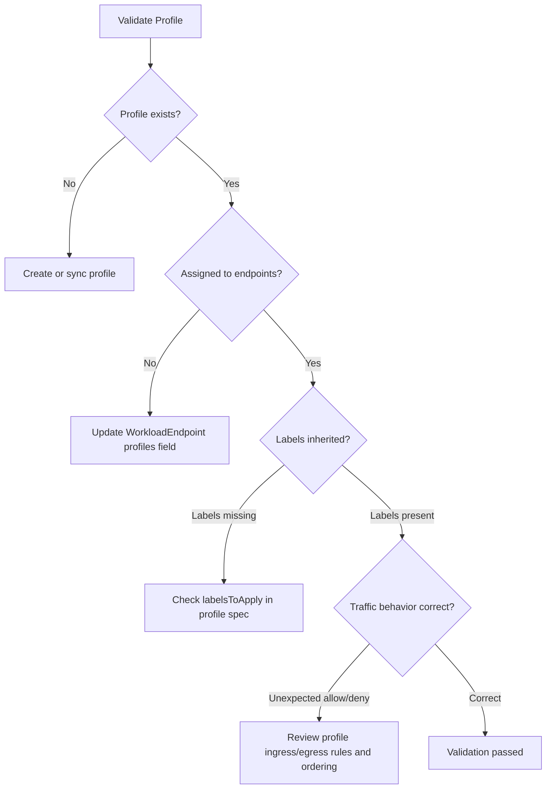

# Validate Calico Profile Resource

Author: [nawazdhandala](https://github.com/nawazdhandala)

Tags: Calico, Kubernetes, Networking, Profile, Validation

Description: How to validate Calico Profile resources to confirm label inheritance is working correctly, profile rules are being applied to the intended endpoints, and the policy evaluation order behaves as expected.

---

## Introduction

Validating Calico Profile resources requires confirming three things: the profile specification matches the intended configuration, the profile is assigned to the correct workload endpoints, and the labels applied by the profile are visible on those endpoints (making them matchable by policy selectors). In Kubernetes, profile validation is primarily about verifying that namespace-profile synchronization is correct and that the auto-generated profiles have not been modified unexpectedly.

## Prerequisites

- Calico installed with workload endpoints
- `calicoctl` with cluster admin access
- Test workloads to verify label inheritance

## Step 1: Verify Profile Exists and Is Correct

```bash
# List all profiles
calicoctl get profiles

# Check a specific profile's specification
calicoctl get profile kns.production -o yaml

# Verify the labelsToApply field
calicoctl get profile kns.production -o json | python3 -c "
import json, sys
p = json.load(sys.stdin)
print('Labels to apply:')
for k, v in p.get('spec', {}).get('labelsToApply', {}).items():
    print(f'  {k}: {v}')
"
```

## Step 2: Verify Profile Assigned to Workload Endpoints

```bash
# List workload endpoints and their assigned profiles
calicoctl get workloadendpoints -A -o json | python3 -c "
import json, sys
data = json.load(sys.stdin)
for ep in data['items']:
    name = ep['metadata']['name']
    ns = ep['metadata']['namespace']
    profiles = ep['spec'].get('profiles', [])
    print(f'{ns}/{name}: profiles = {profiles}')
"
```

## Step 3: Verify Label Inheritance

```bash
# Labels from profiles should appear on the workload endpoint
# Check that a pod in 'production' namespace has namespace labels applied
calicoctl get workloadendpoint -n production -o json | python3 -c "
import json, sys
data = json.load(sys.stdin)
for ep in data['items']:
    name = ep['metadata']['name']
    labels = ep['metadata'].get('labels', {})
    # Kubernetes namespace profile should add pcns.projectcalico.org/name
    ns_label = labels.get('pcns.projectcalico.org/name', 'MISSING')
    print(f'{name}: namespace label = {ns_label}')
"
```



## Step 4: Test Traffic Behavior with Profile Rules

```bash
# Deploy test pods to verify profile-based policy allows expected traffic
kubectl run sender --image=busybox -n production -l role=test -- sleep 3600
kubectl run receiver --image=nginx -n production -l role=test

# Test intra-namespace traffic (should be allowed by default profile)
kubectl exec -n production sender -- wget -qO- http://receiver.production

# Cleanup
kubectl delete pod sender receiver -n production
```

## Step 5: Verify No Unexpected Profile Modifications

```bash
# Compare current profile state with expected configuration
calicoctl get profile kns.production -o yaml > current-profile.yaml
diff expected-profile.yaml current-profile.yaml
```

## Conclusion

Profile validation in Kubernetes clusters focuses on verifying that namespace profiles are synchronized correctly and that auto-generated profiles match the expected namespace label set. The most critical validation is confirming label inheritance — if `labelsToApply` is incorrect, policy selectors that depend on namespace labels will fail silently, allowing or blocking traffic in unexpected ways. Always test both allowed and denied traffic paths after any profile change.
