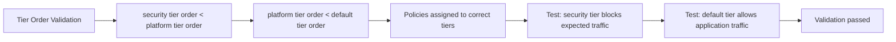

# Validate Calico Tier Resource

Author: [nawazdhandala](https://github.com/nawazdhandala)

Tags: Calico, Kubernetes, Networking, Tier, Validation

Description: How to validate Calico Tier resources to confirm the tier hierarchy is correctly ordered, policies are assigned to the correct tiers, and the evaluation order produces the intended traffic behavior.

---

## Introduction

Validating Calico Tier configuration requires confirming that tiers exist with the correct order values, that policies are assigned to the intended tiers, and that the resulting evaluation order enforces the expected security hierarchy. A misconfigured tier order - such as platform tier at order 100 and security tier at order 500 - would allow platform policies to take precedence over security baselines, undermining the entire layered model.

## Prerequisites

- Calico Enterprise or Calico Cloud with Tier support
- `calicoctl` with cluster admin access
- Documented expected tier hierarchy

## Step 1: Verify Tier Existence and Order

```bash
# List all tiers and their orders
calicoctl get tiers -o yaml

# Verify order values match expected hierarchy
calicoctl get tiers -o json | python3 -c "
import json, sys
data = json.load(sys.stdin)
tiers = sorted(data['items'], key=lambda t: t['spec'].get('order', 9999))
print('Tier evaluation order:')
for i, tier in enumerate(tiers, 1):
    name = tier['metadata']['name']
    order = tier['spec'].get('order', 'default')
    print(f'  {i}. {name} (order={order})')
"
```

## Step 2: Verify Policies Are in Correct Tiers

```bash
# Check which tier each policy belongs to
calicoctl get globalnetworkpolicies -o json | python3 -c "
import json, sys
data = json.load(sys.stdin)
for p in sorted(data['items'], key=lambda x: (x['spec'].get('tier', 'default'), x['spec'].get('order', 9999))):
    name = p['metadata']['name']
    tier = p['spec'].get('tier', 'default')
    order = p['spec'].get('order', 'unset')
    print(f'  tier={tier} order={order}: {name}')
"
```

## Step 3: Verify Security Tier Policies Cannot Be Bypassed

```bash
# Deploy test pods and verify security tier deny takes precedence
kubectl run blocked-sender --image=busybox -n test \
  -l threat-level=high -- sleep 3600
kubectl run target --image=nginx -n test

# Security tier policy should block traffic from threat-level=high endpoints
kubectl exec -n test blocked-sender -- wget -T 3 http://target.test
# Should timeout (blocked by security tier)

kubectl delete pod blocked-sender target -n test
```



## Step 4: Verify RBAC Controls Tier Access

```bash
# Test that application team cannot create policies in security tier
kubectl auth can-i create globalnetworkpolicies.projectcalico.org \
  --as=system:serviceaccount:app-team:developer \
  --subresource=security.*
# Should return 'no'

# Test that security team can
kubectl auth can-i create globalnetworkpolicies.projectcalico.org \
  --as=system:serviceaccount:security-team:policy-admin \
  --subresource=security.*
# Should return 'yes'
```

## Step 5: Check Felix Programmed All Tier Policies

```bash
# Check Felix metrics for active policies per tier
NODE_POD=$(kubectl get pod -n calico-system -l k8s-app=calico-node -o name | head -1)
kubectl exec -n calico-system $NODE_POD -- \
  curl -s localhost:9091/metrics | grep felix_active_local_policies
```

## Conclusion

Tier validation confirms the ordering contract is maintained: security tier enforces first, platform tier second, application policies last. The critical test is verifying that the security tier's deny rules cannot be bypassed by any lower-tier allow. Test this explicitly with pods labeled to match security tier deny rules and confirm the traffic is blocked even when a lower-tier policy would allow it.
