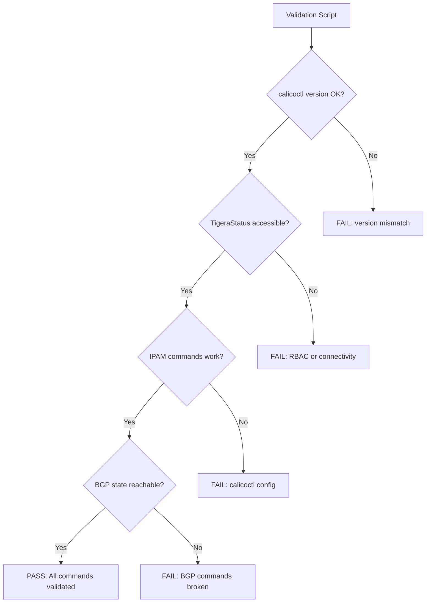

# How to Validate Calico Troubleshooting Commands

Author: [nawazdhandala](https://github.com/nawazdhandala)

Tags: Calico, Kubernetes, Networking, Troubleshooting, Validation

Description: Validate that your Calico troubleshooting command toolkit is functional and returns accurate results by testing calicoctl connectivity, command output correctness, and BGP state accuracy.

---

## Introduction

Calico troubleshooting commands need to be validated before an incident. A calicoctl configuration pointing to the wrong cluster, a service account with missing permissions, or a version mismatch between calicoctl and the cluster will return incorrect or empty results at the worst possible time. Validation ensures every command in your toolkit is working correctly.

## Validate calicoctl Configuration

```bash
# Verify calicoctl can connect to the correct cluster
calicoctl version

# Expected output includes:
# Client Version: vX.Y.Z
# Cluster Calico Version: vX.Y.Z (should match client version)

# If "Cluster Calico Version" is different or missing:
# calicoctl version mismatch - download matching version
CALICO_VERSION=$(kubectl get pods -n calico-system \
  -l k8s-app=calico-node -o jsonpath='{.items[0].spec.containers[0].image}' | \
  cut -d: -f2)
echo "Cluster Calico version: ${CALICO_VERSION}"
```

## Validate Core Command Outputs

```bash
#!/bin/bash
# validate-calico-commands.sh
PASS=0
FAIL=0

check() {
  local desc="$1"
  local cmd="$2"
  if eval "${cmd}" > /dev/null 2>&1; then
    echo "PASS: ${desc}"
    PASS=$((PASS + 1))
  else
    echo "FAIL: ${desc} - command returned error"
    FAIL=$((FAIL + 1))
  fi
}

check "tigerastatus accessible" "kubectl get tigerastatus"
check "calico-system pods accessible" "kubectl get pods -n calico-system"
check "calicoctl get felixconfiguration" "calicoctl get felixconfiguration"
check "calicoctl get bgppeer" "calicoctl get bgppeer"
check "calicoctl ipam show" "calicoctl ipam show"
check "calicoctl get globalnetworkpolicy" "calicoctl get globalnetworkpolicy"

echo ""
echo "Results: ${PASS} passed, ${FAIL} failed"
exit ${FAIL}
```

## Validate BGP Status Accuracy

```bash
# Cross-check BGP peer count between calicoctl and BGPPeer resources
CONFIGURED_PEERS=$(calicoctl get bgppeer --no-headers 2>/dev/null | wc -l)
echo "Configured BGPPeer resources: ${CONFIGURED_PEERS}"

# BGP state shown in calico-node pod
FIRST_NODE=$(kubectl get pods -n calico-system -l k8s-app=calico-node \
  -o jsonpath='{.items[0].metadata.name}')
kubectl exec -n calico-system "${FIRST_NODE}" -c calico-node -- \
  calicoctl node status 2>/dev/null | grep -i "peer"
```

## Validation Architecture



## Validate IPAM Command Accuracy

```bash
# Verify IPAM show matches actual pod count
IPAM_USED=$(calicoctl ipam show 2>/dev/null | grep "IPs in use" | awk '{print $NF}')
ACTUAL_PODS=$(kubectl get pods --all-namespaces --no-headers | grep Running | wc -l)
echo "IPAM shows ${IPAM_USED} IPs in use, ${ACTUAL_PODS} running pods"
# These should be close (some pods share IPs, host-networked pods don't use IPAM)
```

## Conclusion

Validating Calico troubleshooting commands quarterly prevents the frustration of discovering a broken tool during an incident. The validation script checks all core commands and identifies permission or connectivity problems before they matter. Run it after any calicoctl version change, kubeconfig rotation, or service account permission update. A green validation run gives you confidence that when an incident occurs, the tools will work.
