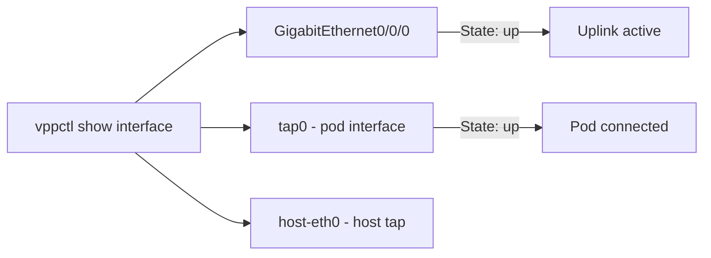

# Validate Calico VPP Host Networking

Author: [nawazdhandala](https://github.com/nawazdhandala)

Tags: Calico, Kubernetes, Networking, VPP, DPDK, Validation

Description: How to validate Calico VPP host networking configuration, including VPP interface status verification, hugepage utilization checks, and pod-to-pod throughput testing.

---

## Introduction

Validating Calico VPP host networking goes beyond standard Calico validation because the VPP dataplane processes packets outside the Linux kernel. Traditional tools like `iptables -L` or `tcpdump` may not show traffic that VPP is processing directly. Validation requires using VPP's own CLI (`vppctl`) to inspect interface state, policy programming, and packet counters.

A successful VPP validation confirms that VPP has initialized correctly with the right interfaces, hugepages are allocated and being used, pods can communicate through the VPP dataplane, and performance metrics show the expected improvement over the Linux kernel dataplane.

## Prerequisites

- Calico VPP deployed on Kubernetes nodes
- `vppctl` accessible via `kubectl exec` into the VPP pod
- Test pods that can generate traffic (iperf3, netperf)
- Prometheus metrics from the VPP agent

## Step 1: Verify VPP Pod Health

```bash
kubectl get pods -n calico-vpp-dataplane -o wide
# All pods should be Running

kubectl logs -n calico-vpp-dataplane ds/calico-vpp-node -c vpp-manager --tail=50
# Look for "VPP started successfully"
```

## Step 2: Inspect VPP Interfaces

```bash
# Access VPP CLI
kubectl exec -n calico-vpp-dataplane ds/calico-vpp-node -c vpp -- vppctl show interface

# Expected output shows:
# GigabitEthernet0/0/0  - the uplink interface
# loop0                 - loop back
# tap0, tap1, ...       - pod interfaces
```



## Step 3: Check Hugepage Allocation

```bash
# On the node, check hugepage usage
grep HugePages /proc/meminfo

# From VPP CLI
kubectl exec -n calico-vpp-dataplane ds/calico-vpp-node -c vpp -- \
  vppctl show memory

# Should show memory allocated from hugepages
```

## Step 4: Verify Pod IP Assignment

```bash
# Deploy a test pod
kubectl run vpp-test --image=nicolaka/netshoot -- sleep 3600

# Verify it gets an IP from Calico IPAM
kubectl get pod vpp-test -o jsonpath='{.status.podIP}'

# Check VPP knows about this pod's tap interface
kubectl exec -n calico-vpp-dataplane ds/calico-vpp-node -c vpp -- \
  vppctl show ip fib table 0
```

## Step 5: Test Pod-to-Pod Connectivity

```bash
kubectl run vpp-test-a --image=nicolaka/netshoot -- sleep 3600
kubectl run vpp-test-b --image=nicolaka/netshoot -- sleep 3600

POD_B_IP=$(kubectl get pod vpp-test-b -o jsonpath='{.status.podIP}')
kubectl exec vpp-test-a -- ping -c 5 $POD_B_IP
```

## Step 6: Performance Benchmark

```bash
# Install iperf3 test
kubectl run iperf-server --image=networkstatic/iperf3 -- -s
kubectl run iperf-client --image=networkstatic/iperf3 \
  --env="SERVER_IP=$(kubectl get pod iperf-server -o jsonpath='{.status.podIP}')" \
  -- -c $SERVER_IP -t 10 -P 4

# Compare results to non-VPP baseline
# Expected improvement: 2-5x throughput increase
```

## Step 7: Verify Policy Enforcement in VPP

```bash
# Check that Calico policies are programmed into VPP
kubectl exec -n calico-vpp-dataplane ds/calico-vpp-node -c agent -- \
  calico-vpp-agent --show-policies

# Or check VPP ACL tables
kubectl exec -n calico-vpp-dataplane ds/calico-vpp-node -c vpp -- \
  vppctl show acl-plugin acl
```

## Conclusion

Validating Calico VPP requires using VPP-native tools (`vppctl`) alongside standard Kubernetes tools. The key validation points are VPP interface state, hugepage allocation and utilization, pod IP assignment through the VPP tap interfaces, and performance benchmarking to confirm the expected throughput improvement. Always compare VPP performance against the baseline Linux kernel dataplane to quantify the actual benefit for your workload.
