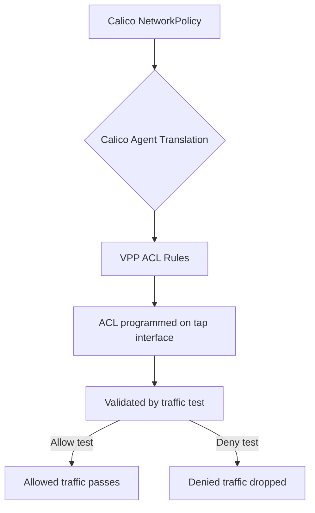

# Validate Calico VPP Technical Details

Author: [nawazdhandala](https://github.com/nawazdhandala)

Tags: Calico, Kubernetes, Networking, VPP, DPDK, Validation, Technical

Description: How to technically validate Calico VPP's internal state, including node graph operation, ACL programming, NAT table correctness, and FIB consistency verification.

---

## Introduction

Validating Calico VPP at a technical level means verifying the internal state of VPP's data structures — not just that pods can ping each other, but that the ACL tables correctly implement the Calico policies, the FIB has the right routes for all pod CIDRs, the NAT tables correctly implement Kubernetes services, and the tap interfaces are properly connected to pod network namespaces.

This depth of validation is important for production deployments where subtle misconfiguration could cause intermittent packet drops that are hard to detect with simple connectivity tests.

## Prerequisites

- Calico VPP deployed with vppctl access
- Test workloads deployed for end-to-end validation
- Understanding of VPP internal data structures

## Step 1: Validate VPP Node Graph Health

```bash
# Check node graph statistics
kubectl exec -n calico-vpp-dataplane ds/calico-vpp-node -c vpp -- \
  vppctl show node counters

# Look for any nodes with unexpected error counters
# Key nodes to check:
# - ip4-input: should have very low errors
# - dpdk-input: monitor for missed errors (= packet drops at NIC)
# - calico-policy-forward: check deny counters match your expectations
```

## Step 2: Validate ACL Tables Implement Calico Policies

```bash
# Get all ACLs from VPP
kubectl exec -n calico-vpp-dataplane ds/calico-vpp-node -c vpp -- \
  vppctl show acl-plugin acl index 0 detail
```



Verify specific policy:

```bash
# Apply a test policy that denies port 8080
kubectl apply -f - <<EOF
apiVersion: networking.k8s.io/v1
kind: NetworkPolicy
metadata:
  name: deny-8080-test
  namespace: default
spec:
  podSelector:
    matchLabels:
      app: test-server
  ingress:
    - ports:
        - port: 80
EOF

# Verify ACL was updated in VPP
kubectl exec -n calico-vpp-dataplane ds/calico-vpp-node -c vpp -- \
  vppctl show acl-plugin interface | grep -A10 "test-server"
```

## Step 3: Validate FIB Routes

```bash
# Check all pod CIDRs are in the FIB
kubectl exec -n calico-vpp-dataplane ds/calico-vpp-node -c vpp -- \
  vppctl show ip fib table 0 | grep "192.168"

# Each Calico IPAM block should have an entry
calicoctl ipam show --show-blocks | awk '{print $2}' | while read cidr; do
  echo "Checking FIB for $cidr"
  kubectl exec -n calico-vpp-dataplane ds/calico-vpp-node -c vpp -- \
    vppctl show ip fib $cidr | grep -c "unicast"
done
```

## Step 4: Validate NAT Tables for Services

```bash
# List all Kubernetes service NAT entries
kubectl exec -n calico-vpp-dataplane ds/calico-vpp-node -c vpp -- \
  vppctl show nat44 translations protocol tcp

# Compare with Kubernetes services
kubectl get services -A -o jsonpath='{range .items[*]}{.spec.clusterIP}:{.spec.ports[*].port}{"\n"}{end}'
```

## Step 5: Validate Tap Interface MTU

```bash
# Check tap interface MTU matches Calico's configured MTU
kubectl exec -n calico-vpp-dataplane ds/calico-vpp-node -c vpp -- \
  vppctl show interface | grep -A2 tap

# Should show MTU matching felix mtu configuration
# Default: 1450 for VXLAN, 1500 for native routing
```

## Step 6: Full End-to-End Policy Validation

```bash
# Test allowed traffic
kubectl run allowed-client --image=busybox -- wget -T 3 test-server:80

# Test denied traffic
kubectl run denied-client --image=busybox -- wget -T 3 test-server:8080
# Should timeout (denied)

# Verify VPP counter incremented for the deny
kubectl exec -n calico-vpp-dataplane ds/calico-vpp-node -c vpp -- \
  vppctl show node counters | grep "acl-plugin-out"
```

## Conclusion

Technical validation of Calico VPP verifies that VPP's internal data structures correctly implement the intended security and routing configuration. Checking ACL tables, FIB routes, NAT translations, and node graph counters provides confidence that VPP is correctly processing packets in accordance with Calico policies. This level of validation is especially important after VPP or Calico upgrades that may change internal data structure formats.
