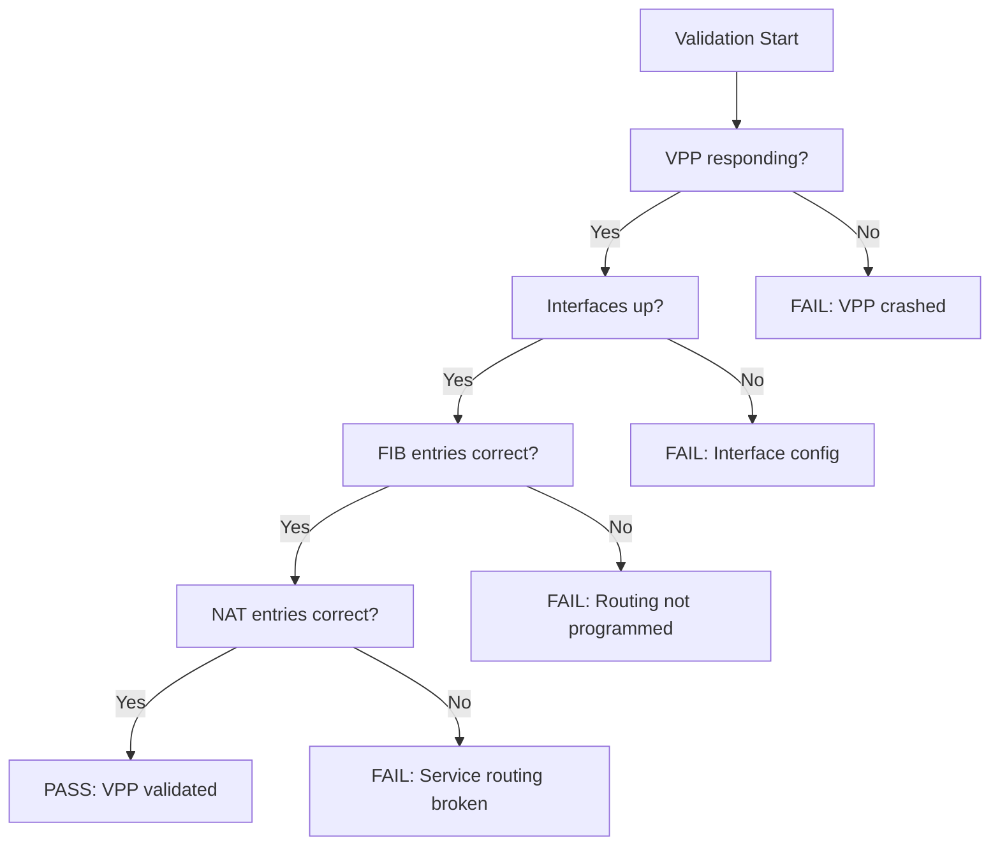

# How to Validate Calico VPP Troubleshooting Configurations

Author: [nawazdhandala](https://github.com/nawazdhandala)

Tags: Calico, VPP, Kubernetes, Networking, Troubleshooting, Validation

Description: Validate that Calico VPP is correctly configured and operating by verifying interface state, routing tables, NAT entries, and packet forwarding through the VPP dataplane.

---

## Introduction

Validating Calico VPP configurations ensures that the VPP dataplane is correctly set up before issues arise in production. VPP validation differs from standard Calico validation because you need to verify VPP-internal state - interface configuration, FIB entries, NAT tables - in addition to Kubernetes-level objects.

## Step 1: Validate VPP Process Health

```bash
VPP_POD=$(kubectl get pod -n calico-vpp-dataplane -l app=calico-vpp-node \
  -o jsonpath='{.items[0].metadata.name}')

# Confirm VPP is responding
kubectl exec -n calico-vpp-dataplane "${VPP_POD}" -c vpp -- \
  vppctl show version

# Expected: VPP version string, not an error
# If timeout or error: VPP process has crashed or is overloaded
```

## Step 2: Validate VPP Interface Configuration

```bash
# All pod tap interfaces should appear as 'up'
kubectl exec -n calico-vpp-dataplane "${VPP_POD}" -c vpp -- \
  vppctl show interface | awk '$2 == "up" {print $1}'

# Verify interface count matches expected pods on node
NODE=$(kubectl get pod -n calico-vpp-dataplane "${VPP_POD}" \
  -o jsonpath='{.spec.nodeName}')
PODS_ON_NODE=$(kubectl get pods --all-namespaces \
  --field-selector=spec.nodeName="${NODE}" --no-headers | wc -l)
echo "Pods on node: ${PODS_ON_NODE}"

VPP_TAPS=$(kubectl exec -n calico-vpp-dataplane "${VPP_POD}" -c vpp -- \
  vppctl show interface | grep -c "^tap")
echo "VPP tap interfaces: ${VPP_TAPS}"
# These numbers should be close (not every system pod needs a tap)
```

## Step 3: Validate VPP Routing (FIB)

```bash
# Verify a specific pod IP has a FIB entry
POD_IP=$(kubectl get pod <pod-name> -n <namespace> \
  -o jsonpath='{.status.podIP}')

kubectl exec -n calico-vpp-dataplane "${VPP_POD}" -c vpp -- \
  vppctl show ip fib "${POD_IP}"

# Expected output: route entry pointing to a tap interface
# If "no match found": calico-vpp-manager has not programmed the route
```

## Step 4: Validate NAT (Service Routing)

```bash
# Check that cluster service IPs are in the VPP NAT table
SERVICE_IP=$(kubectl get svc <service-name> -n <namespace> \
  -o jsonpath='{.spec.clusterIP}')

kubectl exec -n calico-vpp-dataplane "${VPP_POD}" -c vpp -- \
  vppctl show nat44 static mappings | grep "${SERVICE_IP}"

# Missing entries indicate calico-vpp-manager service sync failure
```

## Validation Architecture



## Step 5: Validate Error Counters Are Zero

```bash
# Check for non-zero error counters (indicates packet drops)
kubectl exec -n calico-vpp-dataplane "${VPP_POD}" -c vpp -- \
  vppctl show error | grep -v " 0 " | grep -v "^$" | head -20

# Zero output = no packet drops. Non-zero output identifies problem nodes.
```

## Conclusion

VPP validation requires checking four layers: VPP process health, interface state, FIB routing entries, and NAT service mappings. The error counter check is the fastest way to detect active packet drops. Run this validation sequence after any configuration change to the VPP dataplane, after calico-vpp-manager restarts, and as part of your pre-production checklist. Automated validation scripts should alert when any check fails.
