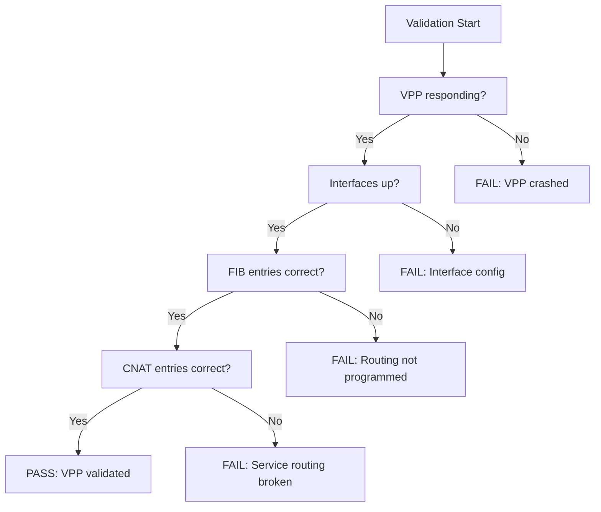

# How to Validate Calico VPP Troubleshooting Configurations

Author: [nawazdhandala](https://github.com/nawazdhandala)

Tags: Calico, VPP, Kubernetes, Networking, Troubleshooting, Validation

Description: Validate that Calico VPP is correctly configured and operating by verifying interface state, routing tables, NAT entries, and packet forwarding through the VPP dataplane.

---

## Introduction

Validating Calico VPP configurations ensures that the VPP dataplane is correctly set up before issues arise in production. VPP validation differs from standard Calico validation because you need to verify VPP-internal state - interface configuration, FIB entries, CNAT service translations - in addition to Kubernetes-level objects.

## Step 1: Validate VPP Process Health

```bash
VPP_POD=$(kubectl get pod -n calico-vpp-dataplane -l app=calico-vpp-node \
  -o jsonpath='{.items[0].metadata.name}')

# Confirm VPP is responding

kubectl exec -n calico-vpp-dataplane "${VPP_POD}" -c vpp -- \
  vppctl show version

# Expected: VPP version string, not an error
# If timeout or error: VPP process has crashed or is overloaded
```

## Step 2: Validate VPP Interface Configuration

```bash
# All pod tun interfaces should appear as 'up'
kubectl exec -n calico-vpp-dataplane "${VPP_POD}" -c vpp -- \
  vppctl show interface | awk '$2 == "up" {print $1}'

# Verify interface count matches expected pods on node
NODE=$(kubectl get pod -n calico-vpp-dataplane "${VPP_POD}" \
  -o jsonpath='{.spec.nodeName}')
PODS_ON_NODE=$(kubectl get pods --all-namespaces \
  --field-selector=spec.nodeName="${NODE}" --no-headers | wc -l)
echo "Pods on node: ${PODS_ON_NODE}"

VPP_TUNS=$(kubectl exec -n calico-vpp-dataplane "${VPP_POD}" -c vpp -- \
  vppctl show interface | grep -c "^tun")
echo "VPP tun interfaces: ${VPP_TUNS}"
# These numbers should be close (host-networked and some system pods do not need a tun)
```

## Step 3: Validate VPP Routing (FIB)

```bash
# Verify a specific pod IP has a FIB entry
POD_IP=$(kubectl get pod <pod-name> -n <namespace> \
  -o jsonpath='{.status.podIP}')

kubectl exec -n calico-vpp-dataplane "${VPP_POD}" -c vpp -- \
  vppctl show ip fib "${POD_IP}"

# Expected output: route entry pointing to a tun interface
# If "no match found": calico-vpp-agent has not programmed the route
```

## Step 4: Validate CNAT (Service Routing)

```bash
# Check that cluster service IPs are in the VPP CNAT translations
SERVICE_IP=$(kubectl get svc <service-name> -n <namespace> \
  -o jsonpath='{.spec.clusterIP}')

kubectl exec -n calico-vpp-dataplane "${VPP_POD}" -c vpp -- \
  vppctl show cnat translation "${SERVICE_IP}"

# Missing entries indicate calico-vpp-agent service sync failure
```

## Validation Architecture


```mermaid
flowchart TD
    A[Validation Start] --> B[VPP responding?]
    B -->|Yes| C[Interfaces up?]
    B -->|No| F[FAIL: VPP crashed]
    C -->|Yes| D[FIB entries correct?]
    C -->|No| G[FAIL: Interface config]
    D -->|Yes| E[CNAT entries correct?]
    D -->|No| H[FAIL: Routing not programmed]
    E -->|Yes| I[PASS: VPP validated]
    E -->|No| J[FAIL: Service routing broken]
```

## Step 5: Validate Error Counters Are Zero

```bash
# Check for non-zero error counters (some counters are informational; drops need review)
kubectl exec -n calico-vpp-dataplane "${VPP_POD}" -c vpp -- \
  vppctl show error | awk '$1 ~ /^[0-9]+$/ && $1 != 0 {print}' | head -20

# Zero output = no non-zero VPP error counters. Non-zero output identifies counters to inspect.
```

## Conclusion

VPP validation requires checking four layers: VPP process health, interface state, FIB routing entries, and CNAT service mappings. The error counter check is a fast way to detect counters that may indicate active packet drops. Run this validation sequence after any configuration change to the VPP dataplane, after calico-vpp-agent restarts, and as part of your pre-production checklist. Automated validation scripts should alert when any check fails.
