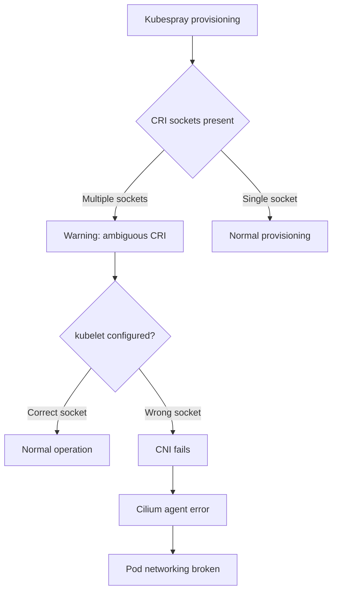

# How to Validate Cilium After Kubespray Reports Multiple CRI Sockets

Author: [nawazdhandala](https://github.com/nawazdhandala)

Tags: Cilium, Kubernetes, Kubespray, CRI, Validation, Troubleshooting

Description: Validate Cilium networking after Kubespray-provisioned clusters report multiple container runtime interface (CRI) sockets, which can cause CNI configuration conflicts.

---

## Introduction

Kubespray sometimes reports multiple CRI sockets when a node has residual configuration from a previous container runtime installation (e.g., both containerd and Docker sockets present). This can cause Cilium's CNI configuration to target the wrong runtime, resulting in failed pod networking.

Validating Cilium after this scenario requires confirming the active CRI, verifying Cilium CNI configuration, and ensuring pods can be created and communicate.

## Prerequisites

- Kubespray-provisioned Kubernetes cluster
- Cilium CNI installed
- `kubectl` and node access

## Identify the CRI Socket Conflict

On the affected node, check for multiple CRI sockets:

```bash
ls /var/run/ | grep -E "containerd|crio|dockershim"
ls /run/containerd/containerd.sock
ls /var/run/cri-dockerd.sock
```

Kubespray may also log warnings in:

```bash
journalctl -u kubelet | grep "CRI"
```

## Determine the Active CRI

```bash
# Check which socket kubelet is using
sudo cat /var/lib/kubelet/kubeadm-flags.env | grep "container-runtime-endpoint"

# Or check kubelet config
sudo cat /etc/kubernetes/kubelet.env | grep "container-runtime"
```

## Architecture



## Validate Cilium CNI Configuration

```bash
# Check CNI config file
cat /etc/cni/net.d/05-cilium.conf

# Verify Cilium is the active CNI
ls /etc/cni/net.d/ | head -5
```

The first file alphabetically is the active CNI.

## Check Cilium Agent Status

```bash
kubectl get pods -n kube-system -l k8s-app=cilium -o wide
kubectl logs -n kube-system <cilium-pod-on-affected-node>
```

Look for errors related to container runtime or socket connections.

## Validate Pod Networking

```bash
# Create a test pod
kubectl run cri-test --image=busybox --restart=Never -- sleep 3600

# Verify it has an IP
kubectl get pod cri-test -o wide

# Test connectivity
kubectl exec cri-test -- ping -c 3 8.8.8.8
```

## Fix Multiple CRI Sockets

Remove unused runtime sockets to resolve the conflict:

```bash
# Stop and remove docker if containerd is the active runtime
sudo systemctl stop docker
sudo apt-get remove docker-ce docker-ce-cli

# Restart kubelet
sudo systemctl restart kubelet
```

## Re-validate After Fix

```bash
kubectl get nodes
kubectl get pods -n kube-system | grep cilium
cilium status
```

## Conclusion

Validating Cilium after Kubespray reports multiple CRI sockets involves confirming which runtime is active, verifying the Cilium CNI configuration, and testing pod networking. Cleaning up unused CRI sockets and restarting kubelet typically resolves the conflict and restores normal Cilium operation.
