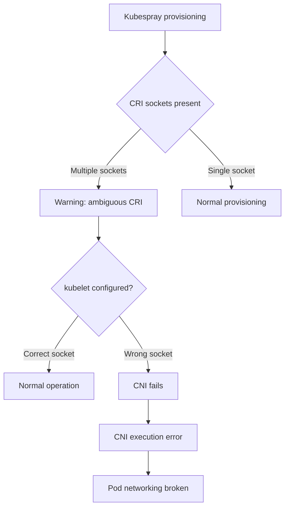

# How to Validate Cilium After Kubespray Reports Multiple CRI Sockets

Author: [nawazdhandala](https://github.com/nawazdhandala)

Tags: Cilium, Kubernetes, Kubespray, CRI, Validation, Troubleshooting

Description: Validate Cilium networking after Kubespray-provisioned clusters report multiple container runtime interface sockets, which can cause CNI configuration conflicts.

---

## Introduction

Kubespray sometimes reports multiple CRI sockets when a node has residual configuration from a previous container runtime installation (e.g., both containerd and cri-dockerd sockets present). kubeadm detects known CRI endpoints and errors when more than one runtime is available and no socket is selected. If kubelet is later pointed at the wrong runtime endpoint, pod sandbox creation and CNI execution can fail.

Validating Cilium after this scenario requires confirming the active CRI, verifying Cilium CNI configuration, and ensuring pods can be created and communicate.

## Prerequisites

- Kubespray-provisioned Kubernetes cluster
- Cilium CNI installed
- `kubectl` and node access

## Identify the CRI Socket Conflict

On the affected node, check for multiple CRI sockets:

```bash
sudo ls -l /var/run/containerd/containerd.sock 2>/dev/null
sudo ls -l /var/run/crio/crio.sock 2>/dev/null
sudo ls -l /var/run/cri-dockerd.sock 2>/dev/null
```

Kubespray may show the CRI socket conflict in the Ansible task output. On a node that already joined the cluster, kubelet logs can show runtime or CNI errors:

```bash
sudo journalctl -u kubelet | grep -Ei "CRI|runtime|CNI"
```

## Determine the Active CRI

```bash
# Check which socket kubelet is using

sudo grep "containerRuntimeEndpoint" /var/lib/kubelet/instance-config.yaml
sudo cat /var/lib/kubelet/kubeadm-flags.env | grep "container-runtime-endpoint"

# Or check Kubespray's kubelet environment file
sudo cat /etc/kubernetes/kubelet.env | grep "container-runtime"
```

## Architecture


```mermaid
flowchart TD
    A[Kubespray provisioning] --> B{CRI sockets present}
    B -->|Multiple sockets| C[Warning: ambiguous CRI]
    B -->|Single socket| D[Normal provisioning]
    C --> E{kubelet configured?}
    E -->|Correct socket| F[Normal operation]
    E -->|Wrong socket| G[CNI fails]
    G --> H[CNI execution error]
    H --> I[Pod networking broken]
```

## Validate Cilium CNI Configuration

```bash
# Check CNI config file
cat /etc/cni/net.d/05-cilium.conflist

# Verify Cilium is the active CNI
LC_ALL=C ls -1 /etc/cni/net.d/ | head -5
```

With standard CNI loading, the first configuration file in lexical order is used. Cilium normally writes `/etc/cni/net.d/05-cilium.conflist` and removes other CNI configuration files unless CNI exclusivity has been disabled.

## Check Cilium Agent Status

```bash
kubectl get pods -n kube-system -l k8s-app=cilium -o wide
kubectl logs -n kube-system <cilium-pod-on-affected-node>
```

Look for errors related to container runtime or socket connections.

## Validate Pod Networking

```bash
# Create a test pod
kubectl run cri-test --image=busybox:1.36 --restart=Never -- sleep 3600

# Verify it has an IP
kubectl wait --for=condition=Ready pod/cri-test --timeout=60s
kubectl get pod cri-test -o wide

# Test connectivity
kubectl exec cri-test -- nslookup kubernetes.default.svc.cluster.local
```

## Fix Multiple CRI Sockets

Configure Kubespray to use the intended runtime socket and remove or disable unused runtime services. Do not only delete socket files; they can be recreated by the running service.

```bash
# Example: stop cri-dockerd if containerd is the active runtime
sudo systemctl disable --now cri-docker.socket cri-docker.service

# Confirm kubelet is configured for containerd
sudo grep "containerRuntimeEndpoint" /var/lib/kubelet/instance-config.yaml
sudo grep "container-runtime-endpoint" /var/lib/kubelet/kubeadm-flags.env

# Restart kubelet
sudo systemctl restart kubelet
```

## Re-validate After Fix

```bash
kubectl get nodes
kubectl get pods -n kube-system | grep cilium
cilium status
```

## Conclusion

Validating Cilium after Kubespray reports multiple CRI sockets involves confirming which runtime is active, verifying the Cilium CNI configuration, and testing pod networking. Configuring a single intended CRI endpoint, disabling unused runtime services, and restarting kubelet typically resolves the conflict and restores normal Cilium operation.
