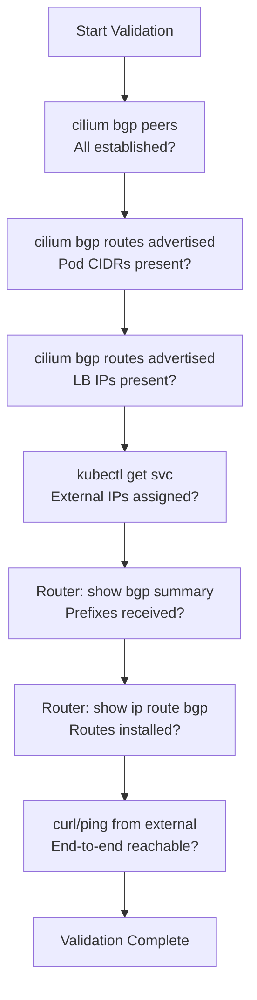

# Validating Cilium BGP Route Advertisement

Author: [nawazdhandala](https://github.com/nawazdhandala)

Tags: Cilium, Kubernetes, Networking, BGP, EBPF

Description: Validate that Cilium is correctly advertising pod CIDRs and service IPs via BGP by inspecting route tables, peer state, and upstream router routing tables.

---

## Introduction

Deploying Cilium BGP Control Plane is only half the battle - validating that routes are actually being advertised and accepted correctly is what ensures your services are reachable. A BGP session can be in `established` state while routes are silently filtered by either Cilium's service selector or the upstream router's inbound policy. Thorough validation catches these silent failures before they cause production incidents.

Validation should happen at three levels: Cilium's internal route state (what it intends to advertise), the BGP protocol level (what it actually sent to peers), and the network level (what is actually reachable and installed in routing tables). Each level can diverge from the others due to policy mismatches, and checking all three gives you confidence that end-to-end routing is working.

This guide provides a complete validation checklist for Cilium BGP route advertisement, with specific commands for each validation layer.

## Prerequisites

- Cilium BGP Control Plane configured with active sessions
- `cilium` CLI installed
- `kubectl` installed
- Access to upstream router CLI for cross-validation

## Step 1: Validate Session State

```bash
# All sessions should show 'established'
cilium bgp peers

# Check session uptime and prefix counts
cilium bgp peers --verbose
```

## Step 2: Validate Advertised Prefixes

```bash
# List all IPv4 routes being advertised
cilium bgp routes advertised ipv4 unicast

# Expected output includes:
# - Pod CIDR for each node (e.g., 10.244.0.0/24)
# - LoadBalancer IPs (e.g., 203.0.113.1/32)

# Validate IPv6 routes if applicable
cilium bgp routes advertised ipv6 unicast
```

## Step 3: Validate Available (Received) Routes

```bash
# Routes received from BGP peers and available for use
cilium bgp routes available ipv4 unicast

# Compare with kernel routing table
ip route show | grep bgp
# Or check via kubectl exec
kubectl exec -n kube-system cilium-xxxxx -- ip route show
```

## Step 4: Validate Service IP Advertisement

```bash
# Confirm the service has an external IP
kubectl get svc web-frontend -o jsonpath='{.status.loadBalancer.ingress[0].ip}'

# Check that specific IP appears in BGP advertisements
cilium bgp routes advertised ipv4 unicast | grep "203.0.113"
```

## Step 5: Validate IP Pool Assignment

```bash
# Check IP pool status and utilization
kubectl get ciliumulbippool -o yaml

# Sample output showing allocated IPs:
# status:
#   conditions:
#     - type: Ready
#   allocatedIPs:
#     - 203.0.113.1
#     - 203.0.113.2
```

## Step 6: Cross-Validate on Upstream Router

On an FRR-based router, verify the routes were received and installed:

```bash
# FRR vtysh commands
vtysh -c "show bgp ipv4 unicast summary"
vtysh -c "show bgp ipv4 unicast"
vtysh -c "show ip route bgp"

# Verify a specific prefix
vtysh -c "show bgp ipv4 unicast 203.0.113.1/32"
```

## Step 7: End-to-End Connectivity Test

```bash
# Test reachability from outside the cluster
curl -v http://203.0.113.1/health

# Trace the path to verify BGP routing
traceroute 203.0.113.1
```

## Validation Checklist



## Conclusion

BGP route advertisement validation in Cilium requires checking the full chain from Cilium's internal state through the BGP protocol to the upstream routing table. The `cilium bgp routes advertised` command is your primary tool for confirming what Cilium is sending, while router-side commands confirm what is being accepted. Always perform end-to-end connectivity tests as the final validation step - a route can exist in BGP tables without being reachable due to next-hop resolution or policy issues on the data plane.
