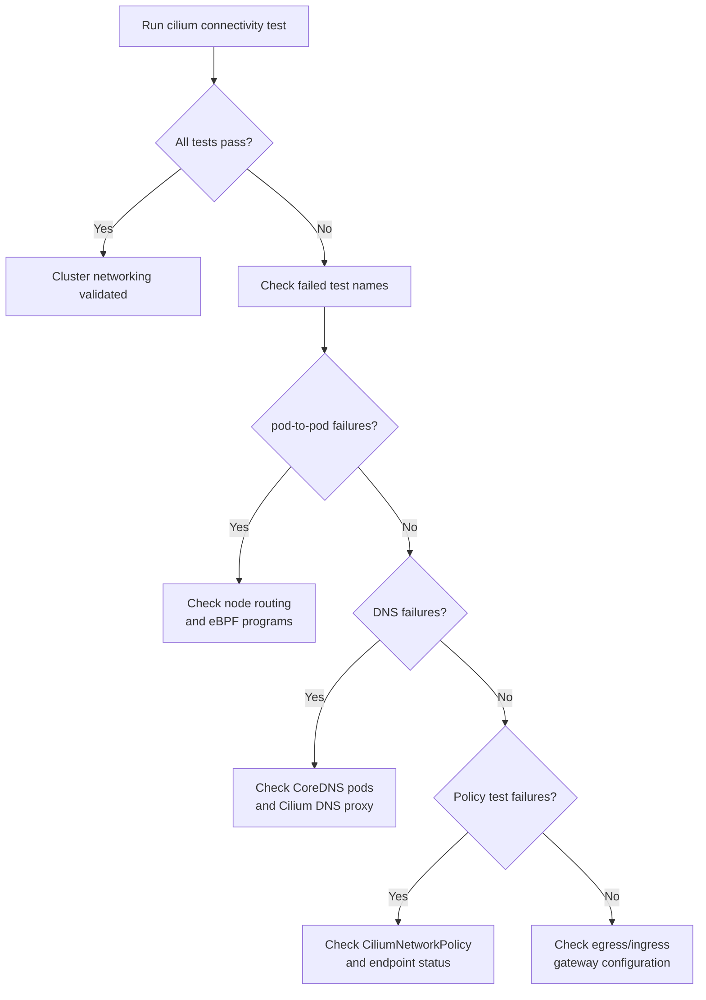

# Validate Cilium Connectivity Test

Author: [nawazdhandala](https://github.com/nawazdhandala)

Tags: Cilium, Kubernetes, Connectivity, Testing, eBPF

Description: A comprehensive guide to running and interpreting the Cilium connectivity test suite, covering test scenarios, failure diagnosis, and integrating tests into your CI/CD pipeline.

---

## Introduction

The `cilium connectivity test` command is Cilium's built-in end-to-end test suite that validates all aspects of cluster networking from a single command. It deploys test pods, runs dozens of connectivity scenarios covering pod-to-pod, pod-to-service, DNS, egress, and network policy enforcement, and reports pass/fail results with detailed diagnostics for any failures.

Running the connectivity test is the most comprehensive way to validate a Cilium installation and should be performed after every cluster provisioning, Cilium upgrade, or significant configuration change. The test suite catches issues that might not surface with basic health checks-such as asymmetric routing, DNS misconfigurations, and policy enforcement gaps.

This guide explains how to run the connectivity test suite, interpret results, diagnose failures, and automate testing.

## Prerequisites

- Kubernetes cluster with Cilium installed and agents running
- `cilium` CLI installed and connected to the cluster
- Sufficient cluster resources for test pod deployment (at least 2 nodes recommended)
- No restrictive network policies blocking test namespace traffic initially

## Step 1: Run the Full Connectivity Test Suite

Execute the complete test suite against your cluster.

```bash
# Run all connectivity tests (creates a 'cilium-test' namespace)
# This takes 5-15 minutes depending on cluster size
cilium connectivity test

# Specify a custom test namespace to avoid conflicts
cilium connectivity test --test-namespace my-cilium-test

# Run with verbose output to see each test scenario in detail
cilium connectivity test --verbose
```

## Step 2: Run Targeted Test Scenarios

For faster validation or focused troubleshooting, run specific test categories.

```bash
# Test only pod-to-pod connectivity
cilium connectivity test --test '/pod-to-pod'

# Test pod-to-service connectivity
cilium connectivity test --test '/pod-to-service'

# Test DNS resolution
cilium connectivity test --test '/dns-only'

# Test network policy enforcement
cilium connectivity test --test '/network-policy'

# Run multiple specific tests
cilium connectivity test \
  --test '/pod-to-pod' \
  --test '/pod-to-service' \
  --test '/to-entities-world'
```

## Step 3: Interpret Test Results

Understand the output format and what failures indicate.

```bash
# Successful output example shows all tests with [=] PASS markers
# Failed tests show [!] FAIL with diagnostic information

# If tests fail, collect detailed diagnostics
cilium connectivity test --verbose 2>&1 | tee connectivity-test-results.txt

# Check for specific failure patterns
grep "FAIL\|error\|timeout" connectivity-test-results.txt
```



## Step 4: Export Results for CI/CD

Generate machine-readable output for pipeline integration.

```bash
# Export results in JUnit XML format for CI system consumption
cilium connectivity test --junit-file connectivity-results.xml

# Export to JSON for custom reporting
cilium connectivity test --json-summary connectivity-results.json

# Example: fail the pipeline if tests fail (non-zero exit code)
cilium connectivity test || { echo "Connectivity tests FAILED"; exit 1; }
```

## Step 5: Clean Up After Testing

```bash
# Clean up test resources after validation
kubectl delete namespace cilium-test

# Or use the built-in cleanup flag
cilium connectivity test --cleanup-on-success
```

## Best Practices

- Run the full test suite after every Cilium upgrade or configuration change
- Include `cilium connectivity test` in your cluster provisioning CI/CD pipeline
- Use `--test-namespace` to avoid conflicts with existing workloads
- Save JUnit results as CI artifacts for historical comparison
- Run connectivity tests from multiple namespaces to validate cross-namespace policies

## Conclusion

The `cilium connectivity test` suite is an indispensable validation tool that provides confidence that all networking scenarios work correctly in your cluster. By running it regularly, integrating it into CI/CD, and understanding how to interpret results, you maintain a consistently validated networking foundation and can quickly identify regressions when they occur.
