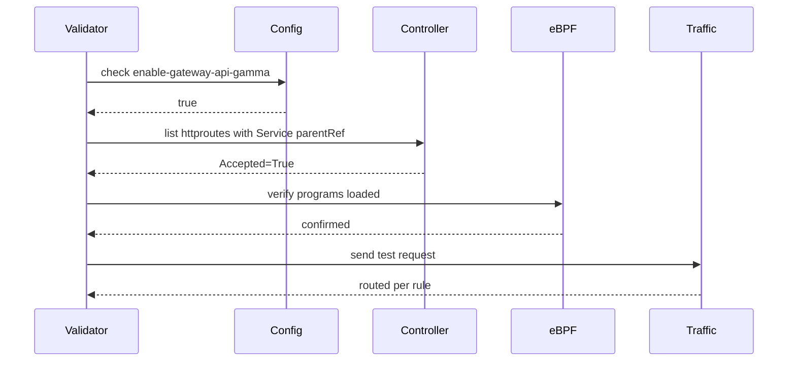

# How to Validate Cilium GAMMA Support in the Cilium Gateway API

Author: [nawazdhandala](https://github.com/nawazdhandala)

Tags: Cilium, Kubernetes, GAMMA, Gateway API, Validation

Description: Validate that Cilium's GAMMA controller is correctly processing HTTPRoutes and enforcing mesh routing rules in the eBPF datapath.

---

## Introduction

Validating Cilium GAMMA support in the Gateway API controller goes beyond checking route status conditions. True validation requires confirming that the eBPF programs compiled from GAMMA routes are loaded and actively enforcing the defined routing rules for real traffic.

This guide provides a systematic validation checklist: starting from the controller configuration level down to live traffic verification.

## Prerequisites

- Cilium with GAMMA enabled
- Experimental Gateway API CRDs installed
- Test HTTPRoutes with Service parentRefs deployed

## Step 1: Validate Feature Configuration

```bash
kubectl get cm -n kube-system cilium-config \
  -o jsonpath='{.data.enable-gateway-api-gamma}'
# Expected: true

kubectl get gatewayclass cilium \
  -o jsonpath='{.status.conditions[?(@.type=="Accepted")].status}'
# Expected: True
```

## Step 2: Validate CRD Availability

```bash
kubectl get crd | grep gateway.networking.k8s.io
```

Should include `httproutes.gateway.networking.k8s.io`.

## Step 3: Validate HTTPRoute Reconciliation

```bash
kubectl get httproute -A -o json | jq '
  .items[] |
  select(.spec.parentRefs[].kind == "Service") |
  {name: .metadata.name, ns: .metadata.namespace,
   accepted: (.status.parents[0].conditions[] |
     select(.type=="Accepted") | .status)}'
```

## Architecture



## Step 4: Send Test Traffic

```bash
kubectl run gamma-validate --image=curlimages/curl --rm -it \
  --restart=Never -n <namespace> -- \
  sh -c 'for i in $(seq 20); do curl -s http://<svc>:<port>/; done | sort | uniq -c'
```

If weights are 80/20, expect approximately 16/4 split.

## Step 5: Validate via Hubble

```bash
hubble observe --namespace <namespace> --follow --protocol http \
  --to-service <target-service>
```

Observe destination pod names to confirm traffic is distributed per route rules.

## Conclusion

Validating Cilium GAMMA support requires confirming feature flags, CRD availability, controller reconciliation, and live traffic distribution. This checklist can be incorporated into CI pipelines to prevent regressions after Cilium upgrades.
