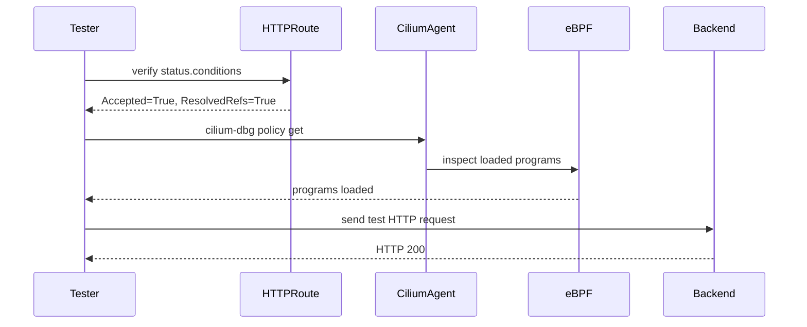

# How to Validate Cilium GAMMA Support

Author: [nawazdhandala](https://github.com/nawazdhandala)

Tags: Cilium, Kubernetes, GAMMA, Gateway API, Validation, Service Mesh

Description: Validation procedures to confirm that Cilium GAMMA support is correctly configured and routing east-west mesh traffic according to HTTPRoute rules.

---

## Introduction

Validating Cilium GAMMA ensures that service mesh routing rules defined through Gateway API HTTPRoutes are actively enforced in the eBPF datapath. Validation is distinct from troubleshooting: it is a systematic check that a working configuration continues to behave as expected.

GAMMA validation covers three layers: the Gateway API object status (Are routes accepted?), the Cilium datapath (Are eBPF programs loaded?), and live traffic (Does routing match the defined rules?). All three must pass for a production deployment to be considered healthy.

This guide provides a repeatable validation checklist you can use after initial setup or following configuration changes.

## Prerequisites

- Cilium 1.15+ with GAMMA enabled
- Gateway API CRDs experimental support installed
- HTTPRoutes deployed with Service parentRefs
- `kubectl`, `hubble` CLIs

## Validate Feature Enablement

```bash
kubectl get cm -n kube-system cilium-config -o jsonpath='{.data.enable-gateway-api-gamma}'
# Expected: true
```

## Validate GatewayClass

```bash
kubectl get gatewayclass cilium
# Expected: ACCEPTED = True
```

## Validate HTTPRoute Acceptance

```bash
kubectl get httproute -A -o custom-columns=\
NAME:.metadata.name,\
NAMESPACE:.metadata.namespace,\
ACCEPTED:.status.parents[0].conditions[0].status
```

All routes should show `True` in the ACCEPTED column.

## Architecture



## Test Traffic Matches Route Rules

Deploy a test client and send traffic that should match the defined routes:

```bash
kubectl run gamma-test --image=curlimages/curl --rm -it --restart=Never \
  -n <namespace> -- curl -v http://<service-name>:<port>/matched-path
```

Verify the response comes from the expected backend:

```bash
kubectl run gamma-test --image=curlimages/curl --rm -it --restart=Never \
  -n <namespace> -- curl -s http://<service-name>:<port>/matched-path | grep "hostname"
```

## Check Hubble for Route Enforcement

```bash
hubble observe --namespace <namespace> --verdict FORWARDED \
  --from-service <client> --to-service <target>
```

## Validate eBPF Program Load

```bash
kubectl exec -n kube-system ds/cilium -- \
  cilium-dbg bpf config list | grep -i gamma
```

## Conclusion

Validating Cilium GAMMA support involves confirming Gateway API object acceptance, eBPF program loading, and live traffic adherence to defined routes. Running this checklist after deployments ensures mesh routing continues to behave correctly.
