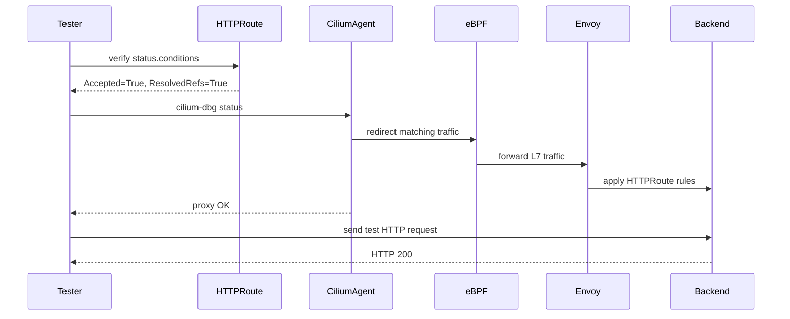

# How to Validate Cilium GAMMA Support

Author: [nawazdhandala](https://github.com/nawazdhandala)

Tags: Cilium, Kubernetes, GAMMA, Gateway API, Validation, Service Mesh

Description: Validation procedures to confirm that Cilium GAMMA support is correctly configured and routing east-west mesh traffic according to HTTPRoute rules.

---

## Introduction

Validating Cilium GAMMA ensures that service mesh routing rules defined through Gateway API HTTPRoutes are accepted by Cilium and applied to traffic that is redirected through Envoy by the Cilium datapath. Validation is distinct from troubleshooting: it is a systematic check that a working configuration continues to behave as expected.

GAMMA validation covers three layers: the Gateway API object status (Are routes accepted?), the Cilium proxy runtime (Is Envoy configured and active?), and live traffic (Does routing match the defined rules?). All three must pass for a production deployment to be considered healthy.

This guide provides a repeatable validation checklist you can use after initial setup or following configuration changes.

## Prerequisites

- Cilium 1.16+ with Gateway API enabled
- Gateway API CRDs installed
- HTTPRoutes deployed with Service parentRefs
- `kubectl`, `hubble` CLIs

## Validate Feature Enablement

```bash
kubectl get cm -n kube-system cilium-config -o jsonpath='{.data.enable-gateway-api}'
# Expected: true

```

## Validate GatewayClass

```bash
kubectl get gatewayclass cilium
# Expected: ACCEPTED = True
```

## Validate HTTPRoute Acceptance

```bash
kubectl get httproute -A -o custom-columns=\
NAME:.metadata.name,\
NAMESPACE:.metadata.namespace,\
ACCEPTED:.status.parents[*].conditions[?(@.type=="Accepted")].status,\
RESOLVED_REFS:.status.parents[*].conditions[?(@.type=="ResolvedRefs")].status
```

All routes should show `True` in the ACCEPTED and RESOLVED_REFS columns.

## Architecture


```mermaid
sequenceDiagram
    participant Tester
    participant HTTPRoute
    participant CiliumAgent
    participant eBPF
    participant Envoy
    participant Backend

    Tester->>HTTPRoute: verify status.conditions
    HTTPRoute-->>Tester: Accepted=True, ResolvedRefs=True
    Tester->>CiliumAgent: cilium-dbg status
    CiliumAgent->>eBPF: redirect matching traffic
    eBPF->>Envoy: forward L7 traffic
    Envoy->>Backend: apply HTTPRoute rules
    CiliumAgent-->>Tester: proxy OK
    Tester->>Backend: send test HTTP request
    Backend-->>Tester: HTTP 200
```

## Test Traffic Matches Route Rules

Deploy a test client and send traffic that should match the defined routes:

```bash
kubectl run gamma-test --image=curlimages/curl --rm -it --restart=Never \
  -n <namespace> -- curl -v http://<service-name>:<port>/matched-path
```

Verify the response comes from the expected backend:

```bash
kubectl run gamma-test --image=curlimages/curl --rm -it --restart=Never \
  -n <namespace> -- curl -s http://<service-name>:<port>/matched-path | grep "hostname"
```

## Check Hubble for Route Enforcement

```bash
hubble observe --pod <namespace>/<backend-pod> --protocol http \
  --verdict FORWARDED
```

## Validate Cilium Proxy Runtime

```bash
kubectl exec -n kube-system ds/cilium -- \
  cilium-dbg status | grep -E 'KubeProxyReplacement|Proxy Status'
```

## Conclusion

Validating Cilium GAMMA support involves confirming Gateway API object acceptance, Cilium proxy readiness, and live traffic adherence to defined routes. Running this checklist after deployments ensures mesh routing continues to behave correctly.
